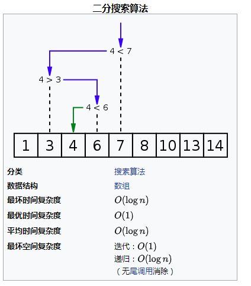
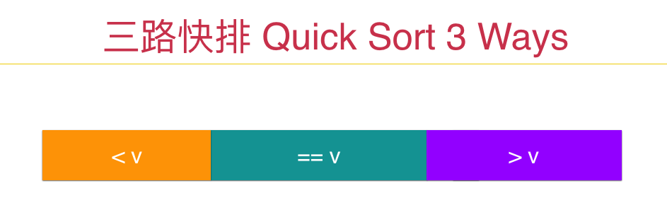

<!-- GFM-TOC -->
* [数组部分总结笔记](#数组部分总结笔记)
    * [二分查找](#二分查找)
    * [简单的面试题](#简单的面试题)
    * [三路快排思想的应用](#三路快排思想的应用)
    * [双指针](#双指针)
        * [对撞指针](#对撞指针)
        * [滑动窗口](#滑动窗口)
    * [字符数组（字符串）](#字符数组（字符串）)    
    * [二维数组](#二维数组)
    * [更多数组中的问题](#更多数组中的问题)
* [参考资料](#参考资料)
<!-- GFM-TOC -->
# 数组部分总结笔记
## 二分查找
二分搜索（英语：binary search），也称折半搜索（英语：half-interval search）、对数搜索（英语：logarithmic search），是一种在有序数组中查找某一**特定元素**的搜索算法。搜索过程从数组的中间元素开始，如果中间元素正好是要查找的元素，则搜索过程结束；如果某一特定元素大于或者小于中间元素，则在数组大于或小于中间元素的那一半中查找，而且跟开始一样从中间元素开始比较。如果在某一步骤数组为空，则代表找不到。这种搜索算法每一次比较都使搜索范围缩小一半。
<div align=center>



</div>

```java
public  int binarySearch(Comparable[] arr, int n, Comparable target){

        int l = 0, r = n - 1; // 在[l...r]的范围里寻找target
        while(l <= r){    // 当 l == r时,区间[l...r]依然是有效的
            int mid = l + (r - l) / 2;
            if(arr[mid].compareTo(target) == 0) return mid;
            if(target.compareTo(arr[mid]) > 0)
                l = mid + 1;  // target在[mid+1...r]中; [l...mid]一定没有target
            else    // target < arr[mid]
                r = mid - 1;  // target在[l...mid-1]中; [mid...r]一定没有target
        }

        return -1;
    }
```
相关题目：
 * [704.二分查找](#704)
 * [34.在排序数组中查找元素的第一个和最后一个位置](#34)
 
### 704
给定一个 n 个元素有序的（升序）整型数组 nums 和一个目标值 target  ，写一个函数搜索 nums 中的 target，如果目标值存在返回下标，否则返回 -1。


示例 1:

输入: nums = [-1,0,3,5,9,12], target = 9
输出: 4
解释: 9 出现在 nums 中并且下标为 4
示例 2:

输入: nums = [-1,0,3,5,9,12], target = 2
输出: -1
解释: 2 不存在 nums 中因此返回 -1
 

提示：

你可以假设 nums 中的所有元素是不重复的。
n 将在 [1, 10000]之间。
nums 的每个元素都将在 [-9999, 9999]之间。
- 分析：

二分查找的实现
- 实现：
```java
public int search(int[] nums, int target) {
        int l=0,h=nums.length-1;
        while (l<=h){
            int mid=(l+h)>>1;
            if (nums[mid]==target){
                return mid;
            }
            else if (nums[mid]<target){
                l=mid+1;
            }else {
                h=mid-1;
            }
        }
        return -1;
    }
```

### 34
给定一个按照升序排列的整数数组 nums，和一个目标值 target。找出给定目标值在数组中的开始位置和结束位置。

你的算法时间复杂度必须是 O(log n) 级别。

如果数组中不存在目标值，返回 [-1, -1]。

示例 1:

输入: nums = [5,7,7,8,8,10], target = 8
输出: [3,4]
示例 2:

输入: nums = [5,7,7,8,8,10], target = 6
输出: [-1,-1]
- 分析：
- 实现：
```java
public int[] searchRange(int[] nums, int target) {
        int[] res={-1,-1};
        if (nums.length==0||nums==null){
            return res;
        }
        int last = lastOccurance(nums, target);
        //当target比数组中的最小值还要小的时候
        if (last<0||nums[last]!=target){
            return res;
        }
        int first = firstOccurance(nums, target);
        res[0]=first;
        res[1]=last;
        return res;
    }
    //寻找target出现的第一个位置
    private int firstOccurance(int[] nums,int target){
        int l=0,h=nums.length-1;
        while (l<=h){
            int mid=l+(h-l)/2;
            if (nums[mid]<target){
                l=mid+1;
            }else {
                h=mid-1;
            }
        }
        return l;
    }
    //寻找target出现的最后一个位置
    //注意一点，如果target比数组最小值还小，那么返回-1
    private int lastOccurance(int[] nums,int target){
        int l=0,h=nums.length-1;
        while (l<=h){
            int mid=l+(h-l)/2;
            if (nums[mid]>target){
                h=mid-1;
            }else {
                l=mid+1;
            }
        }
        //注意返回的是h，此时h<l
        return h;
    }
```
## 简单的面试题

相关题目：
 * [283.移动零](#283)
 * [27.移除元素](#27)
 * [26.删除排序数组中的重复项](#26)
 * [80.删除排序数组中的重复项](#80)
 
 #### 283
 -  移动零
 
 给定一个数组 nums，编写一个函数将所有 0 移动到数组的末尾，同时保持非零元素的相对顺序。
 
 示例:
 
 输入: [0,1,0,3,12]
 输出: [1,3,12,0,0]
 说明:
 
 必须在原数组上操作，不能拷贝额外的数组。
 尽量减少操作次数。
 - 分析：
 
 1. 解法1：
  
  利用额外的空间，首先遍历一遍数组将数组中的非零元素放入list中，再次遍历数组将list（集合）中的数字依次放入数组中，最后将数组的剩余部分补充0即可。
  
 2. 解法2：
 
 利用一个k来记录非零元素的下标，数组nums[0,...,k)表示非零元素的范围，**注意区间为左闭右开。**
 先遍历一遍数组，将非零元素依次放入前k个位置，再从k开始遍历数组，此时只需要填充0即可。
 
 3. 解法3：
 
 与解法2类似，在遍历的时候遇到非零元素则将其与k位置的元素交换，遇到零元素则直接跳过。
 这样操作以后，将nums[0,k)保证为非零元素，保证[0,k)中所有的非零元素都按照顺序排列在[0,k)中。
 这种解法只需要一次遍历数组，即可。
 
 
 
 - 实现：
 解法1：
 ```java
    //时间复杂度：O(n)
    //空间复杂度：O(n)
    public void moveZeroes(int[] nums) {
        if (nums==null)
            return;
        List<Integer> temp=new ArrayList<>();
        for (int i=0;i<nums.length;i++){
            if (nums[i]!=0)
                temp.add(nums[i]);
        }
        for (int i=0;i<temp.size();i++){
            nums[i]=temp.get(i);
        }
        for (int i=temp.size();i<nums.length;i++){
            nums[i]=0;
        }

    }
```
解法2：
```java
    //时间复杂度：O(n)
    //空间复杂度：O(1)
    public void moveZeroes(int[] nums) {
        if (nums==null)
            return;
        int k=0;//k:表示[0,k)区间内均为非零元素
        //遍历数组，当遇到非零元素时，将其放入[0,k)期间
        //保证[0,k)中所有的非零元素都按照顺序排列在[0,k)中
        for (int i=0;i<nums.length;i++){
            if (nums[i]!=0)
                nums[k++]=nums[i];
        }
        for (int i=k;i<nums.length;i++){
            nums[i]=0;
        }


    }

```
解法3：
```java
    //时间复杂度：O(n)
    //空间复杂度：O(1)
    public void moveZeroes2(int[] nums) {
        if (nums==null)
            return;
        int k=0;//k:表示[0,k)区间内均为非零元素
        //遍历数组，当遇到非零元素时，将其放入[0,k)期间
        //保证[0,k)中所有的非零元素都按照顺序排列在[0,k)中
        //同时保证[k，i）为0
        for (int i=0;i<nums.length;i++){
            if (nums[i]!=0){
                if (k!=i){
                    int t=nums[i];
                    nums[i]=nums[k];
                    nums[k]=t;
                    k++;
                }else
                    k++;
            }

        }
    }

```
#### 27
- 移除元素

给定一个数组 nums 和一个值 val，你需要原地移除所有数值等于 val 的元素，返回移除后数组的新长度。

不要使用额外的数组空间，你必须在原地修改输入数组并在使用 O(1) 额外空间的条件下完成。

元素的顺序可以改变。你不需要考虑数组中超出新长度后面的元素。

示例 1:

给定 nums = [3,2,2,3], val = 3,

函数应该返回新的长度 2, 并且 nums 中的前两个元素均为 2。

你不需要考虑数组中超出新长度后面的元素。

- 分析：
1. 解法1：

首先遍历一遍数组统计出不等于val元素的个数记为count;

然后通过一个双重循环，当搜索到待删除的元素的时候，从这个元素后面开始寻找第一个不为val的元素，将这两个元素交换位置，即可。

例如：nums=[3,2,2,3],val =3
当搜索到nums[0],此时为3，则交换位置得到[2,3,2,3]

当搜素到nums[1],此时为3，则交换位置得到[2,2,3,3]

当搜索到nums[2],此时为3，则交换位置得到[2,2,3,3]

当搜索到nums[3],此时为3，后面没有元素可以搜索了，则遍历结束。得到结果为[2,2,3,3]

这种解法其实是伪删除，只是将待删除的元素移动到数组的最后。

2. 解法2：

设置一个计数器count来记录不等于val的元素，遍历数组，只有当搜索的元素不等于val的时候，记录该元素。
这样确保了nums[0,count]均为不等于val的元素，并且保持相对顺序。

- 实现：
解法1：
```java
    //时间复杂度：O(n^2)
    //空间复杂度：O(1)
    public int removeElement(int[] nums, int val) {
        if (nums==null||nums.length==0)
            return 0;
        int count=0;
        for (int i=0;i<nums.length;i++){
            if (nums[i]!=val)
                count++;
        }

        for (int i=0;i<nums.length;i++){
            if (nums[i]==val) {
                for (int j = i + 1; j < nums.length; j++) {
                    if (nums[j]!=val){
                        int t=nums[i];
                        nums[i]=nums[j];
                        nums[j]=t;
                    }

                }
            }
        }
        return count;

    }
```
解法2：
```java
    //时间复杂度：O(n)
    //空间复杂度：O(1)
    public int removeElement(int[] nums, int val) {
        if (nums==null||nums.length==0)
            return 0;
        int count=0;
        //遍历数组，只记录不等于val的元素
        for (int i=0;i<nums.length;i++){
            if (nums[i]!=val)
               nums[count++]=nums[i];
        }

        return count;

    }
```
 
 
## 三路快排思想的应用
当数组中有大量元素重复出现的时候，普通的快排算法会退化为O(n^2)，这样我们可以考虑使用三路快排算法。
三路快排要做的事情，其实就是将数组分成三部分：小于v，等于v和大于v，之后递归的对小于v和大于v部分进行排序就好了。

<div align=center>



<div>

相关题目：
 * [75.颜色分类](#75)
 * [88.合并两个有序数组](#88)
 * [215.数组中的第K个最大元素](#215)
 
 #### 75
 - 颜色分类
 
 给定一个包含红色、白色和蓝色，一共 n 个元素的数组，原地对它们进行排序，使得相同颜色的元素相邻，并按照红色、白色、蓝色顺序排列。
 
 此题中，我们使用整数 0、 1 和 2 分别表示红色、白色和蓝色。
 
 注意:
 不能使用代码库中的排序函数来解决这道题。
 
 示例:
 
 输入: [2,0,2,1,1,0]
 输出: [0,0,1,1,2,2]
 - 分析
 
 由于这道题目中需要排序的数字只有0、1和2三个数字，这说明待排序的数字中存在着大量
 重复的数字，这时可以考虑使用计数排序和三向快排。
 1. 计数排序
 首先，第一次遍历数组分别记录下三个数字的出现次数n0，n1和n2；接下来，就是用0 1 2这三个数字重新填充数组；
 [0,n0)填充0，[n0,n1+n0)填充1，[n1+n0，n0+n1+n2)填充2，即可。
  >注意：n0+n1+n2=n,n为数组长度
 2. 三向快排
 
 首先，设置三个指针分别来指向0 1 2这三个数字。注意其初始值的设置，zero设置为-1，one设置为0，two设置为n,
 因为nums[0,zero]=0，则不能将初始值nums[0]设为0，nums[two,n-1]=2,与上同理；
 接着，开始遍历数组，当遇到0时，将指向0的指针向前移动一位，并将这个0交换到该位置；当遇到
 1时，不做交换操作，继续遍历；当遇到2时，与0的时候同理，将指向2的指针后移一位，并将这个2交换到该位置，
 注意此时num[two-1]为未知元素，则交换以后指向1的指针不必向前移动。
 

 
 - 实现
 1. 计数排序
 ```java
    //时间复杂度：O(n)
    //空间复杂度：O(1)
    public void sortColors(int[] nums) {
        int[] colors=new int[3];
        for (int i=0;i<nums.length;i++){
            if (nums[i]==0)
                colors[0]++;
            else if (nums[i]==1)
                colors[1]++;
            else if (nums[i]==2)
                colors[2]++;

        }
        for (int i=0;i<nums.length;i++){
            if (i<colors[0])
                nums[i]=0;
            else if (i>=colors[0]&&i<colors[0]+colors[1])
                nums[i]=1;
            else nums[i]=2;
        }

    }
```
 2. 三向快排
 ```java
    //使用三向快排的思想来实现
    public void sortColors(int[] nums) {
        int zero=-1,n=nums.length;            //nums[0,zero]=0,则不能将初始值nums[0]设为0
        int two=n;                            //nums[two,n-1]=2,与上同理
        int one=0;
        while (one<two){
            if (nums[one]==0&&zero<n-1){
                zero++;
                swap(nums,one++,zero);//**num[zero+1]=0,one从下一个位置开始
            }
            else if (nums[one]==1){
                one++;
            }else {
                two--;
                swap(nums,two,one);//由于num[two-1]元素未知
            }

        }

    }

    private void swap(int[] a,int i,int j){
        int t=a[i];
        a[i]=a[j];
        a[j]=t;

    }
```
 
 
 #### 88
 - 合并两个有序数组
 
 给定两个有序整数数组 nums1 和 nums2，将 nums2 合并到 nums1 中，使得 num1 成为一个有序数组。
 
 说明:
 
 初始化 nums1 和 nums2 的元素数量分别为 m 和 n。
 你可以假设 nums1 有足够的空间（空间大小大于或等于 m + n）来保存 nums2 中的元素。
 示例:
 
 输入:
 nums1 = [1,2,3,0,0,0], m = 3
 nums2 = [2,5,6],       n = 3
 
 输出: [1,2,2,3,5,6]
 
 - 分析：
 
 因为nums1有足够的空间来保存nums1和nums2中的所有元素，那么可以从nums1的n1+n2-1的位置开始
 填充元素；从后开始遍历两个数组，设置两个指针index1和index2分别指向nums1和nums2的元素尾部,num2取出较大的元素放入nums1的尾部，循环结束后，
 如果index1和index2同时为0，则已经将全部元素排序好；
 
 如果index1为0，说明nums1中的元素已经排序完成，那么
 需要继续将num2的剩余元素填充到num1的相应位置中；
 
 如果index2为0，说明num2中的元素已经排序完成，那么剩余的nums1的元素保存初始位置即可。
 
 - 实现：
 ```java
public void merge(int[] nums1, int m, int[] nums2, int n) {
        if (nums2.length==0||nums1.length==0)
            return;
        if (nums1.length==1)
            nums1[0]=nums2[0];

        int index1=m-1,index2=n-1;
        int last=m+n-1;


        while (index1>=0&&index2>=0){
            if (nums1[index1]<nums2[index2])
                nums1[last--]=nums2[index2--];
            else
                nums1[last--]=nums1[index1--];
        }
        //当index2<0时，说明nums2数组已经排序结束，剩余的nums1数组元素保持初始位置

        //当index1<0,则说明num1的元素都取完了，那剩下的num2的元素可一次全部写进nums1。
        while (index2>=0){
            nums1[last--]=nums2[index2--];
        }
    }
```
 #### 215
 在未排序的数组中找到第 k 个最大的元素。请注意，你需要找的是数组排序后的第 k 个最大的元素，而不是第 k 个不同的元素。
 
 示例 1:
 
 输入: [3,2,1,5,6,4] 和 k = 2
 输出: 5
 示例 2:
 
 输入: [3,2,3,1,2,4,5,5,6] 和 k = 4
 输出: 4
 说明:
 
 你可以假设 k 总是有效的，且 1 ≤ k ≤ 数组的长度。
 - 实现：
 ```java
public int findKthLargest(int[] nums, int k) {
        k=nums.length-k;
        int l=0,h=nums.length-1;
        while (l<h){
            int pos = partition(nums, l, h);
            if (pos>k)
                h=pos-1;
            else if (pos<k)
                l=pos+1;
            else break;

        }
        return nums[k];

    }

    private int partition(int[] nums,int l,int h){
        int i=l+1,j=h;
        int pivot=nums[l];
        while (true){
            while (nums[i]<pivot&&i!=h)
                i++;
            while (nums[j]>=pivot&&j!=l)
                j--;
            if (i>=j)
                break;
            swap(nums,i,j);

        }
        swap(nums,l,j);
        return j;

    }

    private void swap(int[] nums,int i,int j){
        int t=nums[i];
        nums[i]=nums[j];
        nums[j]=t;
    }
```
### 26
给定一个排序数组，你需要在原地删除重复出现的元素，使得每个元素只出现一次，返回移除后数组的新长度。

不要使用额外的数组空间，你必须在原地修改输入数组并在使用 O(1) 额外空间的条件下完成。

示例 1:

给定数组 nums = [1,1,2], 

函数应该返回新的长度 2, 并且原数组 nums 的前两个元素被修改为 1, 2。 

你不需要考虑数组中超出新长度后面的元素。
示例 2:

给定 nums = [0,0,1,1,1,2,2,3,3,4],

函数应该返回新的长度 5, 并且原数组 nums 的前五个元素被修改为 0, 1, 2, 3, 4。

你不需要考虑数组中超出新长度后面的元素。
说明:

为什么返回数值是整数，但输出的答案是数组呢?

请注意，输入数组是以“引用”方式传递的，这意味着在函数里修改输入数组对于调用者是可见的。

你可以想象内部操作如下:
```java
// nums 是以“引用”方式传递的。也就是说，不对实参做任何拷贝
int len = removeDuplicates(nums);

// 在函数里修改输入数组对于调用者是可见的。
// 根据你的函数返回的长度, 它会打印出数组中该长度范围内的所有元素。
for (int i = 0; i < len; i++) {
    print(nums[i]);
}
```
- 实现：
```java
public int removeDuplicates(int[] nums) {
        if (nums == null || nums.length == 0)
            return 0;
        int count = 0;
        for (int i = 1; i < nums.length; i++) {
            if (nums[i - 1] != nums[i])
                nums[count++] = nums[i - 1];


        }
        nums[count]=nums[nums.length-1];
        return count+1;

    }

    public int removeDuplicates1(int[] nums){
        if (nums!=null&&nums.length!=0){
            int cur=0;
            for (int i=1;i<nums.length;i++){
                if (nums[i]!=nums[cur]){
                    cur++;
                    nums[cur]=nums[i];
                }

            }
            return cur+1;
        }else
            return 0;

    }
```
### 80
给定一个排序数组，你需要在原地删除重复出现的元素，使得每个元素最多出现两次，返回移除后数组的新长度。

不要使用额外的数组空间，你必须在原地修改输入数组并在使用 O(1) 额外空间的条件下完成。

示例 1:

给定 nums = [1,1,1,2,2,3],

函数应返回新长度 length = 5, 并且原数组的前五个元素被修改为 1, 1, 2, 2, 3 。

你不需要考虑数组中超出新长度后面的元素。
示例 2:

给定 nums = [0,0,1,1,1,1,2,3,3],

函数应返回新长度 length = 7, 并且原数组的前五个元素被修改为 0, 0, 1, 1, 2, 3, 3 。

你不需要考虑数组中超出新长度后面的元素。
- 实现：
```java
public int removeDuplicates(int[] nums) {
        if (nums!=null&&nums.length!=0){
            int cur=0,count=1;
            for (int i=1;i<nums.length;i++){
                if (nums[cur]==nums[i]){
                    count++;
                }else {
                    count=1;
                }
                if (count<=2){
                    cur++;
                    nums[cur]=nums[i];
                }
            }
            return cur+1;


        }
        else
            return 0;

    }

    //利用增强for循环
    public int removeDuplicates1(int[] nums) {
        if (nums!=null&&nums.length!=0){
            int count=0;
            for (int num:nums){
                if (count<2||num>nums[count-2])
                    nums[count++]=num;

            }
            return count;


        }
        else
            return 0;

    }
```
 
## 双指针
双指针主要用于遍历数组，两个指针指向不同的元素，从而协同完成任务。
### 对撞指针
使用对撞指针的前提是数组的有序的，分别设置一个头指针和一个尾指针来遍历数组，当满足一定条件来分别移动两个指针的位置，最终完成任务。

相关题目：
 * [167.两数之和 II - 输入有序数组](#167)
 * [125.验证回文串](#125)
 * [344.反转字符串](#344)
 * [345.反转字符串中的元音字母](#345)
 * [11.盛最多水的容器](#11)
 
 #### 167
 - 两数之和 II - 输入有序数组
 
 给定一个已按照升序排列 的有序数组，找到两个数使得它们相加之和等于目标数。
 
 函数应该返回这两个下标值 index1 和 index2，其中 index1 必须小于 index2。
 
 说明:
 
 返回的下标值（index1 和 index2）不是从零开始的。
 你可以假设每个输入只对应唯一的答案，而且你不可以重复使用相同的元素。
 示例:
 
 输入: numbers = [2, 7, 11, 15], target = 9
 输出: [1,2]
 解释: 2 与 7 之和等于目标数 9 。因此 index1 = 1, index2 = 2 。
 
 - 分析：
 
 本题是经典的对撞指针的思想，由于数组有序，所以设置头尾指针。
 遍历数组，如果头尾指针的和等于target则记录下标；如果大于，这时需要减小，则将尾指针向前移动；如果小于，这时需要增加，则将头指针向后移动。
 
 
 
 - 实现：
 ```java
public int[] twoSum(int[] numbers, int target) {
        int l=0,h=numbers.length-1;
        int[] res = new int[2];
        while (l<h){
            if (numbers[l]+numbers[h]==target)
            {
                res[0]=l+1;
                res[1]=h+1;
            }
            if (numbers[l]+numbers[h]<target)
                l++;
            else h--;
        }
        return res;

    }

```
 
 #### 125
 - 验证回文串
 
 给定一个字符串，验证它是否是回文串，只考虑字母和数字字符，可以忽略字母的大小写。
 
 说明：本题中，我们将空字符串定义为有效的回文串。
 
 示例 1:
 
 输入: "A man, a plan, a canal: Panama"
 输出: true
 - 分析：
 
 本可以使用对撞指针的思想，设置两个指针，一个头指针和一个尾指针。遍历字符串，若头尾指针相等的时候，则将头指针向后移动一位，将尾指针向前移动一位。若不相等则返回false,
 当头尾指针指向同一个位置的时候，则为true。
 
 **注意：**
 > 由于只考虑字母和数字字符，所以指针的值需要做判断
 
 > 大小写字符的转化差值为32，如果用差值来判断会有bug  
 
 - 实现：
 ```java
public boolean isPalindrome(String s) {
        if (s==null||s.length()==0){
            return true;
        }
        char[] chars = s.toLowerCase().toCharArray();
        int l=0,h=chars.length-1;
        while (l<h){
            while (l<h&&!isNumApl(chars[l])) l++;
            while (l<h&&!isNumApl(chars[h])) h--;

            if (chars[l]==chars[h]){
                l++;
                h--;
            }else {
                return false;
            }
        }
        return true;
    }
    private boolean isNumApl(char c){
        if (c>='a'&&c<='z'){
            return true;
        }
        if (c>='A'&&c<='Z'){
            return true;
        }
        if (c>='0'&&c<='9'){
            return true;
        }
        return false;
    }

```
#### 344
- 反转字符串

编写一个函数，其作用是将输入的字符串反转过来。
- 分析：

设置头尾指针，遍历的时候，将头尾指针两两交换，即可。
- 实现
```java
public String reverseString(String s) {
        if (s==null){
            return null;
        }
        char[] chars = s.toCharArray();
        int l=0,h=chars.length-1;
        while (l<h){
            char t=chars[l];
            chars[l]=chars[h];
            chars[h]=t;
            l++;
            h--;
        }
        return new String(chars);
    }
```
#### 345
- 反转字符串中的元音字母

编写一个函数，以字符串作为输入，反转该字符串中的元音字母。
- 分析：

思路和125题有些类似，同样设置对撞指针，一个头指针和一个尾指针，关键在于搜索的时候，**判断待搜索的字符是否为元音字母，**
如果为元音字母则交换头尾指针的值，与344题中同理；如果不为元音字母，则继续遍历——头指针后移和尾指针前移。
>判断待搜索字符是否为元音，可以使用额外的空间，用一个频率数组存放元音字母的频率。搜索的时候，查询字符的下标对应的频率数组的数值，如果为1则表示为元音，反之则不是。


- 实现：
```java
//时间复杂度O(n)
//空间复杂度O(1)
public String reverseVowels(String s) {
        char[] vowels={'a','e','i','o','u','A','E','I','O','U'};
        int[] freq=new int[256];
        for (char c:vowels) {
            freq[c]=1;
        }
        char[] chars = s.toCharArray();
        int l=0,h=chars.length-1;
        while (l<h){
            while (l<h&&freq[chars[l]]!=1)l++;
            while (l<h&&freq[chars[h]]!=1)h--;
            if (l<h){
                char t=chars[l];
                chars[l]=chars[h];
                chars[h]=t;
                l++;
                h--;
            }
        }
        return new String(chars);
    }
```
#### 11
- 盛最多水的容器
给定 n 个非负整数 a1，a2，...，an，每个数代表坐标中的一个点 (i, ai) 。在坐标内画 n 条垂直线，垂直线 i 的两个端点分别为 (i, ai) 和 (i, 0)。找出其中的两条线，使得它们与 x 轴共同构成的容器可以容纳最多的水。

说明：你不能倾斜容器，且 n 的值至少为 2。
<div align=center>


</div>

图中垂直线代表输入数组 [1,8,6,2,5,4,8,3,7]。在此情况下，容器能够容纳水（表示为蓝色部分）的最大值为 49。

- 分析：

同样使用对撞指针，设置头尾指针和一个存放最大值的max，遍历数组,搜索范围的面积为头尾指针值的较小值乘以头尾指针下标的差值记作s。

每次遍历的时候，将数组较小的指针继续遍历，因为指针的值相当于长方形的高，因为宽度在不断减小，那么尽量要让高尽量大才能取到最大值。
每一次遍历记录当前搜索到的最大值，遍历结束便得到最大值。

- 实现：
```java
//时间复杂度O（n）
//空间复杂度O（1）
public int maxArea(int[] height) {
        int l=0,h=height.length-1;
        int max=0;
        while (l<h){
            int s=Math.min(height[l],height[h])*(h-l);
            if (height[l]<height[h])
            {
                l++;
            }else {
                h--;
            }
            max=Math.max(max,s);
        }
        return max;
    }
```
### 滑动窗口
当求解的时候，需要获得数组或者字符串的连续子部分的时候，就可以考虑使用滑动窗口的思想。
num[l,h]为滑动窗口，根据具体的要求，通过遍历的时候，来改变l和h的大小，从而完成任务。
相关题目：
 * [209.长度最小的子数组](#209)
 * [3.无重复字符的最长子串](#3)
 * [438.找到字符串中所有字母异位词](#438)
 * [76.最小覆盖子串](#76)
 * [713.乘积小于K的子数组](#713)
 
#### 209
- 长度最小的子数组

给定一个含有 n 个正整数的数组和一个正整数 s ，找出该数组中满足其和 ≥ s 的长度最小的连续子数组。如果不存在符合条件的连续子数组，返回 0。

示例: 

输入: s = 7, nums = [2,3,1,2,4,3]
输出: 2
解释: 子数组 [4,3] 是该条件下的长度最小的连续子数组。
进阶:

如果你已经完成了O(n) 时间复杂度的解法, 请尝试 O(n log n) 时间复杂度的解法。

- 分析：
本题需要求解满足一定条件的连续子数组，那么可以使用滑动窗口的思想；

首先，定义一个滑动窗口num[l,h],由于可能存在不符合条件的结果，那么初始化的时候该滑动窗口的大小为0.
因为该数组的元素都是正整数，所以当不满足大于或等于s的时候，则需要扩大滑动窗口的大小；当满足条件的时候，则尽量减小滑动窗口的大小。直到遍历完该数组，则可以获得最小长度的滑动窗口。

**注意在遍历过程中记录滑动窗口的最小值**

- 实现：
```java
public int minSubArrayLen(int s, int[] nums) {
        int i=0,j=-1;//滑动窗口num[i,j]，由于初始化的时候没有数值，所以j=-1
        int sum=0;
        int minCount=nums.length+1;
        while (i<nums.length){
            if (sum<s&&j<nums.length-1){
                sum+=nums[++j];
            }else {
                sum-=nums[i++];
            }
            if (sum>=s){
                if (j-i+1<minCount)//由于是nums[i,j]，前闭后闭区间
                    minCount=j-i+1;
            }
        }
        if (minCount==nums.length+1)
            return 0;
        return minCount;

    }
```
时间复杂度：O(n)

空间复杂度：O(1)

#### 3
- 无重复字符的最长子串

给定一个字符串，找出不含有重复字符的最长子串的长度。

示例 1:

输入: "abcabcbb"
输出: 3 
解释: 无重复字符的最长子串是 "abc"，其长度为 3。
- 分析：
因为要确保子串无重复的字符，那么需要一个额外的空间来记录每个字符出现的频率。这道题同样可以使用滑动窗口的方法来求解，当待搜索的字符未出现的时候，将其加入滑动窗口。
当该字符已经出现的时候，则将滑动窗口的第一个字符从中移除，移除以后将频率数组中该字符的频率-1。每次遍历的时候，记录滑动窗口的最大值。

判断一个字符是否出现在之前的滑动窗口中，利用一个频率数组记录每个字符出现的次数，当其值为0则表示没有出现，加入滑动窗口后需要将其频率+1。
>补充：ASCII码占用一个字节，可以有0～255共256个取值。
- 实现：
```java
public int lengthOfLongestSubstring(String s) {
        int l=0,h=-1;//s[l,h]为滑动窗口
        int[] freq=new int[256];//用于记录字符出现的频率
        int count=0;//子字符串的长度
        while (l<s.length()){
            if (h<s.length()-1&&freq[s.charAt(h+1)]==0){
                h++;
                freq[s.charAt(h)]++;
            }else {
                freq[s.charAt(l++)]--;
            }
            count=Math.max(count,h-l+1);
        }
        return count;

    }
```
时间复杂度：O(n)

空间复杂度：O(1)

#### 438
- 找到字符串中所有字母异位词

给定一个字符串 s 和一个非空字符串 p，找到 s 中所有是 p 的字母异位词的子串，返回这些子串的起始索引。

字符串只包含小写英文字母，并且字符串 s 和 p 的长度都不超过 20100。

说明：

字母异位词指字母相同，但排列不同的字符串。
不考虑答案输出的顺序。
示例 1:

输入:
s: "cbaebabacd" p: "abc"

输出:
[0, 6]

解释:
起始索引等于 0 的子串是 "cba", 它是 "abc" 的字母异位词。
起始索引等于 6 的子串是 "bac", 它是 "abc" 的字母异位词。

- 分析：

字母异位词表示该字符串中出现的**字符的次数相同。** 由于字符串中只包含小写英文字母，那么同样需要额外的空间来记录字符出现的频率。

首先，遍历字符串p来统计其中的字符频率。再开始遍历字符串s,此时的滑动窗口大小是**固定**的为p的长度，由于字母异位词的长度必定相等。
当滑动窗口中的频率数组与p的频率数组相同的时候则寻找到字母异位词，记录其起始下标即可。
>注意：当比较两个数组中的值是否对应相等的时候，可以通过 Arrays.equals() 方法比较数组中元素值是否相等。
- 实现：
```java
public List<Integer> findAnagrams(String s, String p) {
        int[] pFreq=new int[26];
        int[] sFreq=new int[26];
        List<Integer> res=new ArrayList<Integer>();
        //首先统计p中出现的字符频率
        int pLen = p.length();
        for (int i=0;i<pLen;i++){
            pFreq[p.charAt(i)-'a']++;
        }
        for (int i=0;i<s.length();i++){
            sFreq[s.charAt(i)-'a']++;
            if (i>=pLen){
                sFreq[s.charAt(i-pLen)-'a']--;
            }
            if (Arrays.equals(sFreq,pFreq)){
                res.add(i-pLen+1);
            }

        }
        return res;

    }
```
时间复杂度：O(n)

空间复杂度：O(1)

#### 76
- 最小覆盖子串

给定一个字符串 S 和一个字符串 T，请在 S 中找出包含 T 所有字母的最小子串。

示例：

输入: S = "ADOBECODEBANC", T = "ABC"
输出: "BANC"
说明：

如果 S 中不存这样的子串，则返回空字符串 ""。
如果 S 中存在这样的子串，我们保证它是唯一的答案。
- 分析：

本题求解的是最小子串，可以使用滑动窗口的思想来求解。此时的滑动窗口大小至少为T的长度，因为需要覆盖T。

设置一个total来记录搜索的自创中包含T中字符的数量，当total等于T的长度的时候，则确保了此时的子串一定包含了T的所有字符。

设置一个l为记录子串的起始位置，每次尽量减小滑动窗口的大小，从滑动窗口的头开始移除字符，当移除的字符是T中所包含的字符的时候，则将total大小减小，并更新l的值。

由于此时的频率数组中，T中未包含的字符对应的值为非正数，当数组的值大于0的时候，则表示T中包含的字符。
- 实现：
```java
public String minWindow(String s, String t) {
        int[] freq=new int[128];
        int sLen = s.length();
        int tLen = t.length();
        if (sLen==0||tLen==0)
            return "";
        int minLen=Integer.MAX_VALUE;
        //首先统计t中出现的字符的频率
        for (int i=0;i<t.length();i++){
            freq[t.charAt(i)]++;
        }
        int l=0;//起始位置
        int total=0;//记录当前包含的字符数量
        for (int i=0,j=0;i<sLen;i++){
            //当t中的字符出现的时候
            if (freq[s.charAt(i)]-->0)
                total++;
            //此时说明已经包含了t
            while (total==tLen){
                if (i-j+1<minLen){
                    minLen=i-j+1;
                    l=j;
                }
                //此时移除的是T包含中的字符
                if (++freq[s.charAt(j++)]>0)
                    total--;
            }

        }
        if (minLen==Integer.MAX_VALUE)
            return "";
        else
            return s.substring(l,l+minLen);

    }
```
时间复杂度：O(n)

空间复杂度：O(1)
### 713
给定一个正整数数组 nums。

找出该数组内乘积小于 k 的连续的子数组的个数。

示例 1:

输入: nums = [10,5,2,6], k = 100
输出: 8
解释: 8个乘积小于100的子数组分别为: [10], [5], [2], [6], [10,5], [5,2], [2,6], [5,2,6]。
需要注意的是 [10,5,2] 并不是乘积小于100的子数组。
说明:

0 < nums.length <= 50000
0 < nums[i] < 1000
0 <= k < 10^6
- 实现：
```java
public int numSubarrayProductLessThanK(int[] nums, int k) {
        if (nums==null||nums.length==0){
            return 0;
        }
        //滑动窗口是nums[l,r),初始情况为0
        int l=0,r=0;
        int n=nums.length;
        int count=0;
        int p=1;
        while (l<n&&l<=r){
            if (r<n&&p*nums[r]<k){
                p*=nums[r];
                r++;
            }else if (l==r){
                l++;
                r++;
            }else {
                //统计满足条件子数组
                count+=r-l;
                p/=nums[l];
                l++;
            }
        }
        return count;

    }
    private boolean isLessThanK(int[] nums,int l,int r,int k){
        int res=1;
        for (int i = l; i <= r; i++) {
            res*=nums[i];
            if (res>=k){
                return false;
            }
        }
        return true;
    }
```
## 二维数组
相关题目：
* [54.螺旋矩阵](#54)
* [59.螺旋矩阵（2）](#59)
* [48.旋转图像](#48)
### 54
给定一个包含 m x n 个元素的矩阵（m 行, n 列），请按照顺时针螺旋顺序，返回矩阵中的所有元素。

示例 1:

输入:
[
 [ 1, 2, 3 ],
 [ 4, 5, 6 ],
 [ 7, 8, 9 ]
]
输出: [1,2,3,6,9,8,7,4,5]
示例 2:

输入:
[
  [1, 2, 3, 4],
  [5, 6, 7, 8],
  [9,10,11,12]
]
输出: [1,2,3,4,8,12,11,10,9,5,6,7]
- 分析：

按照顺时针的顺序，构造一个方向数组来创建新的坐标（newX，newY），当这个新的坐标没有被遍历并且
是有效的就将该坐标下的数值记录到填放结果的集合中，就这样不断循环，知道结果的集合的大小为m*n的时候跳出循环，
此时表明矩阵已经遍历结束了。

- 实现：
```java
int[][] d={{0,1},{1,0},{0,-1},{-1,0}};
    private int N,M;
    public List<Integer> spiralOrder(int[][] matrix) {
        List<Integer> res=new ArrayList<>();
        int m=matrix.length;
        if (m==0){
            return res;
        }
        int n=matrix[0].length;
        M=m;
        N=n;
        boolean[][] visited=new boolean[m][n];
        int curX=0,curY=0,curD=0;
        while (res.size()<m*n){
            if (!visited[curX][curY]){
                res.add(matrix[curX][curY]);
                visited[curX][curY]=true;
            }
            int newX = curX + d[curD][0];
            int newY = curY + d[curD][1];
            if (inArea(newX,newY)&&!visited[newX][newY]){
                curX=newX;
                curY=newY;
            }else {
                curD=(curD+1)%4;
            }

        }
        return res;

    }

    private boolean inArea(int x,int y){
        return 0<=x&&x<M&&0<=y&&y<N;
    }
```
### 59
给定一个正整数 n，生成一个包含 1 到 n2 所有元素，且元素按顺时针顺序螺旋排列的正方形矩阵。

示例:

输入: 3
输出:
[
 [ 1, 2, 3 ],
 [ 8, 9, 4 ],
 [ 7, 6, 5 ]
]
- 分析：

和54题，是相同的思路，不再赘述。

- 实现：
```java
int[][] d={{0,1},{1,0},{0,-1},{-1,0}};
    private int M,N;
    public int[][] generateMatrix(int n) {
        int[][] matrix=new int[n][n];
        int curX=0,curY=0,curD=0;
        int i=1;
        M=n;
        N=n;
        while (i<=n*n){
            if (matrix[curX][curY]==0){
                matrix[curX][curY]=i++;
            }
            int newX = curX + d[curD][0];
            int newY = curY + d[curD][1];
            if (inArea(newX,newY)&&matrix[newX][newY]==0){
                curX=newX;
                curY=newY;
            }else {
                curD=(curD+1)%4;
            }
        }
        return matrix;

    }

    private boolean inArea(int x,int y){
        return 0<=x&&x<M&&0<=y&&y<N;
    }
```

### 48
给定一个 n × n 的二维矩阵表示一个图像。

将图像顺时针旋转 90 度。

说明：

你必须在原地旋转图像，这意味着你需要直接修改输入的二维矩阵。请不要使用另一个矩阵来旋转图像。

示例 1:

给定 matrix = 
[
  [1,2,3],
  [4,5,6],
  [7,8,9]
],

原地旋转输入矩阵，使其变为:
[
  [7,4,1],
  [8,5,2],
  [9,6,3]
]
示例 2:

给定 matrix =
[
  [ 5, 1, 9,11],
  [ 2, 4, 8,10],
  [13, 3, 6, 7],
  [15,14,12,16]
], 

原地旋转输入矩阵，使其变为:
[
  [15,13, 2, 5],
  [14, 3, 4, 1],
  [12, 6, 8, 9],
  [16, 7,10,11]
]
- 分析：

首先上下旋转；然后在按对角线交换

例如：

```java
  1 2 3     7 8 9     7 4 1
  4 5 6  => 4 5 6  => 8 5 2
  7 8 9     1 2 3     9 6 3
```
- 实现：
```java
public void rotate(Integer[][] matrix) {
        int n=matrix.length;
        //先上下交换
        for (int i = 0; i < n/2; i++) {
            for (int j = 0; j < n; j++) {
                int t=matrix[i][j];
                matrix[i][j]=matrix[n-1-i][j];
                matrix[n-1-i][j]=t;
            }
        }

        //按对角线对称交换
        for (int i = 0; i < n; i++) {
            for (int j = i+1; j< n; j++) {
                int t=matrix[i][j];
                matrix[i][j]=matrix[j][i];
                matrix[j][i]=t;
            }
        }
    }
```
## 字符数组（字符串）
相关题目：
* [151.翻转字符串里的单词](#151)
* [541.翻转字符串里的单词](#541)
* [557.翻转字符串里的单词](#557)
### 151
给定一个字符串，逐个翻转字符串中的每个单词。

示例:  

输入: "the sky is blue",
输出: "blue is sky the".
说明:

无空格字符构成一个单词。
输入字符串可以在前面或者后面包含多余的空格，但是反转后的字符不能包括。

如果两个单词间有多余的空格，将反转后单词间的空格减少到只含一个。

进阶: 请选用C语言的用户尝试使用 O(1) 空间复杂度的原地解法。

- 分析：

遍历一遍字符串，将该字符串中的单词记录在一个集合中，最后再将集合从后向前重新构建一个新的字符串

- 实现：
```java
public String reverseWords(String s) {
        //为了去除字符串首尾两边的空格
        String trim = s.trim();
        int n = trim.length();
        if (n==0){
            return "";
        }
        char[] chars = trim.toCharArray();
        //定义一个起始位置，为了方便后面截取字符串
        int start=0;
        //存放单词的集合
        List<String> list = new ArrayList<>();
        //*这里需要注意subString的起始位置和终止位置的细节！
        for (int i = start; i < n; ) {
            //当遍历到尾部的时候，直接截取
            if (i==n-1){
                String substring = trim.substring(start, i+1);
                list.add(substring);
            }
            //当不为空格的时候，继续向前移动
            if (chars[i]!=' '){
                i++;
            }else   //当前位置为空格的时候，此时需要截取字符串
                {
                    //subString：trim[start,i),前闭后开
                String substring = trim.substring(start, i);
                list.add(substring);
                start=i+1;
                //为了处理连续空格，确保下次循环的起始位置为字符
                while (chars[start]==' '){
                    start++;
                }
                i=start;
            }

        }
        //将集合从后向前重新构建新的字符串
        StringBuilder sb= new StringBuilder();
        for (int i = list.size()-1; i >=0; i--) {
            if (i!=0){
                sb.append(list.get(i)+" ");
            }else {
                sb.append(list.get(i));
            }
        }
        return sb.toString();
    }
```
### 541
给定一个字符串和一个整数 k，你需要对从字符串开头算起的每个 2k 个字符的前k个字符进行反转。如果剩余少于 k 个字符，则将剩余的所有全部反转。如果有小于 2k 但大于或等于 k 个字符，则反转前 k 个字符，并将剩余的字符保持原样。

示例:

输入: s = "abcdefg", k = 2
输出: "bacdfeg"
要求:

该字符串只包含小写的英文字母。
给定字符串的长度和 k 在[1, 10000]范围内。

- 分析：

直接使用一个循环，而循环的增量为2k，每次翻转从i到开始的k个字符。

- 实现：
```java
public String reverseStr(String s, int k) {
        char[] chars = s.toCharArray();
        int n = s.length();
        if (n==0){
            return "";
        }
        //每个 2k 个字符, 翻转前k个字符
        for (int i = 0; i <n ; i+=(2*k)) {
            reverse(chars,i,i+k-1);
        }
        return new String(chars);
    }

    /**
     * 翻转字符数组
     *
     * @param chars
     * @param l 起始坐标
     * @param r 终止坐标
     */
    private void reverse(char[] chars,int l,int r){
        //为了避免传进来的r可能会大于数组长度,最后一个i+k-1可能>=n-1
        r=Math.min(r,chars.length-1);
        while (l<r){
            char c = chars[l];
            chars[l]=chars[r];
            chars[r]=c;
            l++;
            r--;
        }
    }
```

### 557

## 更多数组中的问题
相关题目：
* [717.1比特与2比特字符](#717)
* [674.最长连续递增序列](#674)
* [268.缺失数字](#268)
* [56.合并区间](#56)
* [485.最大连续1的个数](#485)

### 717
有两种特殊字符。第一种字符可以用一比特0来表示。第二种字符可以用两比特(10 或 11)来表示。

现给一个由若干比特组成的字符串。问最后一个字符是否必定为一个一比特字符。给定的字符串总是由0结束。

示例 1:

输入: 
bits = [1, 0, 0]
输出: True
解释: 
唯一的编码方式是一个两比特字符和一个一比特字符。所以最后一个字符是一比特字符。
示例 2:

输入: 
bits = [1, 1, 1, 0]
输出: False
解释: 
唯一的编码方式是两比特字符和两比特字符。所以最后一个字符不是一比特字符。
注意:

1 <= len(bits) <= 1000.
bits[i] 总是0 或 1.
- 实现：
```java
//使用贪心策略：如果遇到1就将其当做2比特，若最后一位也当做2比特的话，i=n
    public boolean isOneBitCharacter(int[] bits) {
        int n = bits.length;
        int i = 0;
        for (; i < n-1; ) {
            if (bits[i]==1){
                i+=2;
            }else {
                i++;
            }
        }
        return i==n-1;
    }

    //从倒数第二个位置开始看连续1的数量，如果为奇数个表明最后一位0要和倒数第二位组成2比特（10）
    //如果是偶数个，则前面的这些1可以组成若干个2比特，最后一位组成1比特
    public boolean isOneBitCharacter1(int[] bits){
        int n = bits.length;
        int count=0;
        for (int i = n-2; i >=0; i--) {
            if (bits[i]==1){
                count++;
            }else {
                break;
            }
        }
        return count%2==0;
    }
```
### 674
给定一个未经排序的整数数组，找到最长且连续的的递增序列。

示例 1:

输入: [1,3,5,4,7]
输出: 3
解释: 最长连续递增序列是 [1,3,5], 长度为3。
尽管 [1,3,5,7] 也是升序的子序列, 但它不是连续的，因为5和7在原数组里被4隔开。 
示例 2:

输入: [2,2,2,2,2]
输出: 1
解释: 最长连续递增序列是 [2], 长度为1。
注意：数组长度不会超过10000。
- 实现：
```java
public int findLengthOfLCIS(int[] nums){
        if (nums==null||nums.length==0||nums.length==1){
            return nums.length;
        }
        int count=1;
        int max=0;
        for (int i = 1; i < nums.length; i++) {
            if (nums[i]>nums[i-1]){
                count++;
            }else {
                count=1;
            }
            max=Math.max(max,count);
        }
        return max;

    }
```
### 268
给定一个包含 0, 1, 2, ..., n 中 n 个数的序列，找出 0 .. n 中没有出现在序列中的那个数。

示例 1:

输入: [3,0,1]
输出: 2
示例 2:

输入: [9,6,4,2,3,5,7,0,1]
输出: 8
- 实现：
```java
public int missingNumber(int[] nums) {
        int n = nums.length;
        boolean[] flag=new boolean[n+1];
        for (int i = 0; i < n; i++) {
            flag[nums[i]]=true;
        }
        for (int i = 0; i <= n; i++) {
            if (!flag[i]){
                return i;
            }
        }
        return 0;
    }
```
### 56
给出一个区间的集合，请合并所有重叠的区间。

示例 1:

输入: [[1,3],[2,6],[8,10],[15,18]]
输出: [[1,6],[8,10],[15,18]]
解释: 区间 [1,3] 和 [2,6] 重叠, 将它们合并为 [1,6].
示例 2:

输入: [[1,4],[4,5]]
输出: [[1,5]]
解释: 区间 [1,4] 和 [4,5] 可被视为重叠区间。
- 实现：
```java
public class Interval {
        int start;
        int end;
        Interval() { start = 0; end = 0; }
        Interval(int s, int e) { start = s; end = e; }
    }


    private class myComparable implements Comparator<Interval> {
        @Override
        public int compare(Interval i1, Interval i2) {
            if (i1.start!=i2.start){
                return i1.start-i2.start;
            }else {
                return i1.end-i2.end;
            }
        }
    }

    public List<Interval> merge(List<Interval> intervals) {
        List<Interval> res=new LinkedList<>();
        int n =intervals.size();
        if (n==0){
            return res;
        }
        //将区间集合按照起始点升序排列
        Collections.sort(intervals,new  myComparable());
        res.add(intervals.get(0));
        for (Interval i:intervals){
            if (isCross(i,((LinkedList<Interval>) res).getLast())){
                Interval newInterval = merge(i, ((LinkedList<Interval>) res).getLast());
                //先删除旧的区间
                ((LinkedList<Interval>) res).removeLast();
                //再插入新的区间
                res.add(newInterval);
            }else {
                res.add(i);
            }
        }
        return res;
    }

    //判断两个区间是否重叠
    private boolean isCross(Interval i1,Interval i2){
        return i1.start<=i2.end;
    }

    //合并两个区间，起始点取最小值，终点取最大值
    private Interval merge(Interval i1,Interval i2){
        return new Interval(Math.min(i1.start,i2.start),Math.max(i1.end,i2.end));
    }
```
### 485
给定一个二进制数组， 计算其中最大连续1的个数。

示例 1:

输入: [1,1,0,1,1,1]
输出: 3
解释: 开头的两位和最后的三位都是连续1，所以最大连续1的个数是 3.
注意：

输入的数组只包含 0 和1。
输入数组的长度是正整数，且不超过 10,000。
- 实现：
```java
public int findMaxConsecutiveOnes(int[] nums){
        int n =nums.length;
        if (n==0){
            return 0;
        }
        int count=0;
        int max=0;
        for (int i = 0; i < n; i++) {
            if (nums[i]==1){
                count++;
            }else {
                max=Math.max(max,count);
                count=0;
            }
        }
        return max>count?max:count;
    }
```
# 参考资料

[玩儿转算法面试 - 课程官方代码仓](https://github.com/liuyubobobo/Play-with-Algorithm-Interview)


