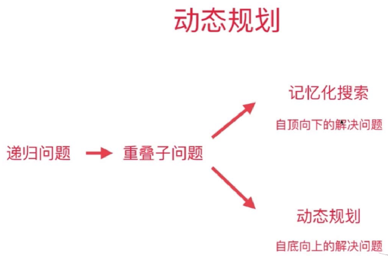

# 常规动态规划问题
相关题目：
* [70.爬楼梯](#70)
## 70

爬楼梯

### 描述

假设你正在爬楼梯。需要 *n* 阶你才能到达楼顶。

每次你可以爬 1 或 2 个台阶。你有多少种不同的方法可以爬到楼顶呢？

**注意：**给定 *n* 是一个正整数。

**示例 1：**

```
输入： 2
输出： 2
解释： 有两种方法可以爬到楼顶。
1.  1 阶 + 1 阶
2.  2 阶
```

**示例 2：**

```
输入： 3
输出： 3
解释： 有三种方法可以爬到楼顶。
1.  1 阶 + 1 阶 + 1 阶
2.  1 阶 + 2 阶
3.  2 阶 + 1 阶
```

### 分析

当n=0，F(n)=0；当n=1，F(n)=1；当n=2，F(n)=2；

当n>=3时，对于到达这个高度有两种选择：1.从n-1处爬1阶；2.从n-2处爬2阶，

所以F(n)=F(n-1)+F(n-2)。

### 实现

```java
public int climbStairs(int n) {
        if(n<=2){
            return n;
        }
        int[] memo=new int[n+1];
        memo[1]=1;
        memo[2]=2;
        for(int i =3;i<=n;i++){
            memo[i]=memo[i-1]+memo[i-2];
        }
        return memo[n];
    }
```

# 发现重叠子问题
相关题目：
* [343.整数拆分](#343)
* [279.完全平方数](#279)
* [91.解码方法](#91)
* [62.不同路径](#62)
* [63.不同路径（2）](#63)

## 343

整数拆分

### 描述

给定一个正整数 *n*，将其拆分为**至少**两个正整数的和，并使这些整数的乘积最大化。 返回你可以获得的**最大乘积**。

**示例 1:**

```
输入: 2
输出: 1
解释: 2 = 1 + 1, 1 × 1 = 1。
```

**示例 2:**

```
输入: 10
输出: 36
解释: 10 = 3 + 3 + 4, 3 × 3 × 4 = 36。
```

**说明:** 你可以假设 *n* 不小于 2 且不大于 58。

### 分析

F（0）=0，F（1）=1，F（2）=1，F(3)=2

i>3：

F（i）=max{F（i），j*F（i-j）,j * (i-j) }

### 实现

记忆化搜索：

```java
    //记忆化搜索
    private int[] memo;
    public int integerBreak(int n) {
        assert n>=2;
        memo=new int[n+1];
        return breakInteger(n);
    }


    private int breakInteger(int n){
        if (n==1){
            return 1;
        }
        //记录分割结果的最大值
        int res=-1;
        if (memo[n]!=0){
            res=memo[n];
        }else {
            //从1到n-1计算分割结果
            for (int i = 1; i <= n - 1; i++) {
                res = max3(res, i * (n - i), i * breakInteger(n - i));
            }
            memo[n]=res;
        }
        return res;
    }
    private int max3(int a,int b,int c){
        return Math.max(a,Math.max(b,c));
    }
```
DP：

```java
public int integerBreak(int n) {
        assert n>=2;
        memo=new int[n+1];
        return breakInteger2(n);

    }

    private int breakInteger(int n){
        memo[1]=1;
        for (int i = 2; i <=n ; i++) {
            for (int j = 1; j <=i ; j++) {
                //将i分割成j+(i-j)
                memo[i]= max3(memo[i],j*(i-j),j*memo[i-j]);
            }
        }
        return memo[n];
    }
```

## 279

完全平方数

### 描述

给定正整数 *n*，找到若干个完全平方数（比如 `1, 4, 9, 16, ...`）使得它们的和等于 *n*。你需要让组成和的完全平方数的**个数最少**。

**示例 1:**

```
输入: n = 12
输出: 3 
解释: 12 = 4 + 4 + 4.
```

**示例 2:**

```
输入: n = 13
输出: 2
解释: 13 = 4 + 9.
```

### 分析

```
定义一个函数f(n)表示我们要求的解。f(n)的求解过程为：
f(n) = 1 + 
min{
  f(n-1^2), f(n-2^2), f(n-3^2), f(n-4^2), ... , f(n-k^2) //(k为满足k^2<=n的最大的k)
}
```

### 实现

```java
public int numSquares(int n){
        if (n==0){
            return 0;
        }
        memo=new int[n+1];
        Arrays.fill(memo,Integer.MAX_VALUE);
        memo[0]=0;
        for (int i = 1; i <= n; i++) {
            for (int j = 1; i-j*j>=0 ; j++) {
                memo[i]=Math.min(memo[i],1+memo[i-j*j]);
            }
        }
        return memo[n];
    }
```
## 91**

解码方法

### 描述

一条包含字母 `A-Z` 的消息通过以下方式进行了编码：

```
'A' -> 1
'B' -> 2
...
'Z' -> 26
```

给定一个只包含数字的**非空**字符串，请计算解码方法的总数。

**示例 1:**

```
输入: "12"
输出: 2
解释: 它可以解码为 "AB"（1 2）或者 "L"（12）。
```

**示例 2:**

```
输入: "226"
输出: 3
解释: 它可以解码为 "BZ" (2 26), "VF" (22 6), 或者 "BBF" (2 2 6) 。
```

### 分析

思路()：

1. s[i]是编码、s[i-1,i]是编码。nums[i] = nums[i-1] + nums[i-2]
2. s[i]是编码、s[i-1,i]不是编码。nums[i] = nums[i-1]
3. s[i]不是编码、s[i-1,i]是编码。nums[i] = nums[i-2]
4. 都不是编码。nums[i] = 0

### 实现

```java
public int numDecodings(String s) {
        int n = s.length();
        if (n==0){
            return 0;
        }
        //memo[i]表示前(i-1)位字符串的解码方法次数
        int[] memo=new int[n+1];
        memo[0]=1;
        if (s.charAt(0)>'0'){
            memo[1]=1;
        }
        char[] chars = s.toCharArray();
        for (int i = 2; i <= n; i++) {
            int one = chars[i-1]-'0';
            //如果一个字符满足(1-9)则记录
            if (one>0){
                memo[i]+=memo[i-1];
            }
            int two = 10*(chars[i-2]-'0')+(chars[i-1]-'0');
            //如果两个字符满足(10-26)则记录
            if (two <= 26 && two >= 10) {
                    memo[i] += memo[i - 2];
            }

        }
        return memo[n];
    }
```

## 62

不同路径

### 描述

一个机器人位于一个 *m x n* 网格的左上角 （起始点在下图中标记为“Start” ）。

机器人每次只能向下或者向右移动一步。机器人试图达到网格的右下角（在下图中标记为“Finish”）。

问总共有多少条不同的路径？


例如，上图是一个3 x 7 的网格。有多少可能的路径？

**说明：***m* 和 *n* 的值均不超过 100。

**示例 1:**

```
输入: m = 3, n = 2
输出: 3
解释:
从左上角开始，总共有 3 条路径可以到达右下角。
1. 向右 -> 向右 -> 向下
2. 向右 -> 向下 -> 向右
3. 向下 -> 向右 -> 向右
```

**示例 2:**

```
输入: m = 7, n = 3
输出: 28
```

### 分析

F(i , j)：到达位置为(i,j)有F(i , j)条路径。

对于上边界的所有点，只有可能从其左边移动过来，那么F(i , j)均为1；同理对于左边界上的所有点，

F(i , j)也均为1。

对于其他的点，都有两种可能：一是从上方移动过来的，二是从左边移动过来的。那么到达该位置的路径数为上方和左方位置之和，因为上方和左方均可到达当前位置，那么路径数是可以累加的。那么F(i , j)=F(I-1,j)+F(i,j-1)。

### 实现

```java
 public int uniquePaths(int m, int n) {
        int[][] memo=new int[m][n];
     	//初始化左边界   
     	for(int i=0;i<m;i++){
            memo[i][0]=1;
        }
     	//初始化上边界
        for(int i=0;i<n;i++){
            memo[0][i]=1;
        }
        for(int i=1;i<m;i++){
            for(int j=1;j<n;j++){
                //累加上方和左方的路径数
                memo[i][j]=memo[i-1][j]+memo[i][j-1];
            }
        }
        return memo[m-1][n-1];
    }
```

## 63

不同路径(2)

### 描述

一个机器人位于一个 *m x n* 网格的左上角 （起始点在下图中标记为“Start” ）。

机器人每次只能向下或者向右移动一步。机器人试图达到网格的右下角（在下图中标记为“Finish”）。

现在考虑网格中有障碍物。那么从左上角到右下角将会有多少条不同的路径？


网格中的障碍物和空位置分别用 `1` 和 `0` 来表示。

**说明：***m* 和 *n* 的值均不超过 100。

**示例 1:**

```
输入:
[
  [0,0,0],
  [0,1,0],
  [0,0,0]
]
输出: 2
解释:
3x3 网格的正中间有一个障碍物。
从左上角到右下角一共有 2 条不同的路径：
1. 向右 -> 向右 -> 向下 -> 向下
2. 向下 -> 向下 -> 向右 -> 向右
```

### 分析

这一题和上一题的不同在于**存在障碍物**，那么对于障碍物的处理是关键：

对于上边界的点，若当前位置不是障碍物则置为1，若是障碍物，从当前位置到结尾均为0。因为起点无法到达该位置以及以后的位置。

对于左边界，也是同理，同样地处理障碍物。

对于其他位置，若当前位置不是障碍物，则和上题同样是左边位置和上边位置之和；若是障碍物，则直接置为0，**因为不可达**。

### 实现

```java
public int uniquePathsWithObstacles(int[][] obstacleGrid) {
        int m=obstacleGrid.length;
        if(m==0){
            return 0;
        }
        int n = obstacleGrid[0].length;
        int[][] memo=new int[m][n];
    	//初始化左边界
        for(int i=0;i<m;i++){
            if(obstacleGrid[i][0]!=1){
                memo[i][0]=1;
            }else{
                //直接跳出，其后的值则均为0
                break;
            }
        }
    	//初始化上边界
        for(int i=0;i<n;i++){
            if(obstacleGrid[0][i]!=1){
                memo[0][i]=1;
            }else{
                break;
            }
        }
        for(int i=1;i<m;i++){
            for(int j=1;j<n;j++){
                //对于当前位置不是障碍物时
                if(obstacleGrid[i][j]!=1){
                    memo[i][j]=memo[i-1][j]+memo[i][j-1];
                }
            }
        }
        return memo[m-1][n-1];
    }
```


# 状态的定义和状态转移

相关题目：
* [198.打家劫舍](#198)
* [213.打家劫舍（2）](#213)
## 198

打家劫舍

### 描述

你是一个专业的小偷，计划偷窃沿街的房屋。每间房内都藏有一定的现金，影响你偷窃的唯一制约因素就是相邻的房屋装有相互连通的防盗系统，**如果两间相邻的房屋在同一晚上被小偷闯入，系统会自动报警**。

给定一个代表每个房屋存放金额的非负整数数组，计算你**在不触动警报装置的情况下，**能够偷窃到的最高金额。

**示例 1:**

```
输入: [1,2,3,1]
输出: 4
解释: 偷窃 1 号房屋 (金额 = 1) ，然后偷窃 3 号房屋 (金额 = 3)。
     偷窃到的最高金额 = 1 + 3 = 4 。
```

**示例 2:**

```
输入: [2,7,9,3,1]
输出: 12
解释: 偷窃 1 号房屋 (金额 = 2), 偷窃 3 号房屋 (金额 = 9)，接着偷窃 5 号房屋 (金额 = 1)。
     偷窃到的最高金额 = 2 + 9 + 1 = 12 。
```

### 分析

状态转移方程：F(i)表示在**位置i的最大收益**。由于不能在相邻房屋同时进行偷盗，所以对于每个位置有两种选择，要么偷，要么不偷。

i=0, F(0)=v[0];

i=1,F(1)=max{v[0],v[1]};

那么对于i>=2, F(i)=max{F(i-1),F(i-2)+v[i]}；

### 实现

```java
public int rob(int[] nums) {
        int n = nums.length;
        if(n==0){
            return 0;
        }
        if(n==1){
            return nums[0];
        }
        if(n==2){
            return Math.max(nums[0],nums[1]);
        }
        int[] memo = new int[n];
        memo[0]=nums[0];
        memo[1]=Math.max(nums[0],nums[1]);
        for(int i=2;i<n;i++){
            memo[i]=Math.max(memo[i-1],nums[i]+memo[i-2]);
        }
        return memo[n-1];
    }
```

## 213

打家劫舍（2）

### 描述

你是一个专业的小偷，计划偷窃沿街的房屋，每间房内都藏有一定的现金。**这个地方所有的房屋都围成一圈，这意味着第一个房屋和最后一个房屋是紧挨着的**。同时，相邻的房屋装有相互连通的防盗系统，如果两间相邻的房屋在同一晚上被小偷闯入，系统会自动报警。

给定一个代表每个房屋存放金额的非负整数数组，计算你在不触动警报装置的情况下，能够偷窃到的最高金额。

示例 1:

输入: [2,3,2]
输出: 3
解释: 你不能先偷窃 1 号房屋（金额 = 2），然后偷窃 3 号房屋（金额 = 2）, 因为他们是相邻的。
示例 2:

输入: [1,2,3,1]
输出: 4
解释: 你可以先偷窃 1 号房屋（金额 = 1），然后偷窃 3 号房屋（金额 = 3）。
     偷窃到的最高金额 = 1 + 3 = 4 。

### 分析

与[198题](#198)类似，相当于做两次抢劫，一次的范围是[0,n-2]，另一次的范围是[1,n-1]，取两次抢劫的最大值即可。

### 实现

```java
public int rob(int[] nums) {
        if(nums==null||nums.length==0)
            return 0;
        int n=nums.length;
        if(n==1)
            return nums[0];
        if(n==2)
            return Math.max(nums[0],nums[1]);
        int res=Math.max(rob(nums,0,n-2),rob(nums,1,n-1));
        return res;
    }
    //抢劫：起始点为l,终点为h的最大收益
    private int rob(int[] nums,int l,int h){
        int[] memo=new int[h-l+1];
        memo[0]=nums[l];
        memo[1]=Math.max(nums[l],nums[l+1]);
        for(int i=2;i<=h-l;i++){
            memo[i]=Math.max(nums[i+l]+memo[i-2],memo[i-1]);
        }
        return memo[h-l];
    }
```

## 337

打家劫舍（3）

### 描述

在上次打劫完一条街道之后和一圈房屋后，小偷又发现了一个新的可行窃的地区。这个地区只有一个入口，我们称之为“根”。 除了“根”之外，每栋房子有且只有一个“父“房子与之相连。一番侦察之后，**聪明的小偷意识到“这个地方的所有房屋的排列类似于一棵二叉树”**。 如果两个直接相连的房子在同一天晚上被打劫，房屋将自动报警。

计算在不触动警报的情况下，小偷一晚能够盗取的最高金额。

示例 1:

输入: [3,2,3,null,3,null,1]

     3
    / \
    2   3
      \   \ 
       3   1


输出: 7 
解释: 小偷一晚能够盗取的最高金额 = 3 + 3 + 1 = 7.
示例 2:

输入: [3,4,5,1,3,null,1]

     	 3
    	/ \
    	4   5
       / \   \ 
      1    3   1


输出: 9
解释: 小偷一晚能够盗取的最高金额 = 4 + 5 = 9.

### 分析

能盗取的最高金额为 抢劫该节点+抢劫该节点的左孩子的左右子树+抢劫该节点的右孩子的左右子树 与 抢劫该节点的左子树+抢劫该节点的右子树的和  的最大值。

### 实现

```java
public int rob(TreeNode root) {
        int[] res = tryRob(root);
        return Math.max(res[0],res[1]);

    }
    //res[0]:不选择根节点的最大收益，res[1]:选择根节点的最大收益
    private int[] tryRob(TreeNode root){
        if (root==null){
            return new int[2];
        }
        int[] leftResult = tryRob(root.left);
        int[] rightResult = tryRob(root.right);
        int[] res=new int[2];

        //下标为0，表示不选当前结点的最大收益
        res[0]=Math.max(leftResult[1],leftResult[0])+Math.max(rightResult[1],rightResult[0]);
        //下标为1，表示选择当前结点的最大收益
        res[1]=root.val+leftResult[0]+rightResult[0];
        return res;
    }
```

# 0-1背包问题 *

### 描述

有一个容量为 C 的背包，要用这个背包装下物品的价值最大，这些物品有两个属性：体积 w和价值 v。

数组w中各元素表示每个物品的重量为w[i]，数组v中各元素表示每个物品的价值为v[i]。

示例：

```
v={60,100,120};
w={10,20,30};
C=50;

结果为：220
解释：20+30<=50,100+120=220
```

### 分析

状态转移方程：F（i,j）表示**拥有前i个物品，容量为j的背包的价值最大值**。

对于第i件物品：

```
能够放入：在不放入当前物品和放入当前物品（当前背包容量会减少）中选择最大值 

F(i,j)=max{F(i-1,j),v[i] + F(i-1,j-w[i])}

不能够放入:F(i,j)=F(i-1,j)
```

例如：

有一个容量为5的背包，物品如下所示：

|     id     |  0   |  1   |  2   |
| :--------: | :--: | :--: | :--: |
| **weight** |  1   |  2   |  3   |
| **value**  |  6   |  10  |  12  |

表格中的值表示F（i，j）

| id（i）\capcaity（j） |  0   |  1   |  2   | 3    | 4    | 5     |
| :-------------------: | :--: | :--: | :--: | ---- | ---- | ----- |
|           0           |  0   |  6   |  6   | 6    | 6    | 6     |
|           1           |  0   |  6   |  10  | 6+10 | 6+10 | 6+10  |
|           2           |  0   |  6   |  10  | 6+10 | 6+12 | 10+12 |

那么结果为22

### 实现

```java
//时间复杂度O(N*C)
//空间复杂度O(N*C)
public int knapsack(int[] w, int[] v, int C){
        int n = w.length;
        if (n==0||C==0){
            return 0;
        }
       int[][] memo=new int[n][C+1];

        //先初始化
        for (int i = 0; i <= C; i++) {
            if (i>=w[0]){
                memo[0][i]=v[0];
            }
        }
        for (int i = 1; i < n; i++) {
            for (int j = 0; j <= C; j++) {
                //0：不放入该物品
                memo[i][j]=memo[i-1][j];
                if (j>=w[i]){
                    //1：放入该物品
                    memo[i][j]=Math.max(memo[i-1][j],v[i]+memo[i-1][j-w[i]]);
                }
            }
        }
        return memo[n-1][C];
    }
```

空间优化：

观察状态转移方程：F(i,j)=max{F(i-1,j),v[i] + F(i-1,j-w[i])}，第i行元素只依赖于第i-1行元素。理论上，只需要保持两行元素，只需要使用上边和左边的元素，使用前后一对奇偶数即可。

```java
	//优化空间复杂度
	//空间复杂度：O(2*C)
    public int knapsack(int[] w, int[] v, int C){
        int n = w.length;
        if (n==0||C==0){
            return 0;
        }
        memo=new int[2][C+1];

        //先初始化
        for (int i = 0; i <= C; i++) {
            if (i>=w[0]){
                memo[0][i]=v[0];
            }
        }
        for (int i = 1; i < n; i++) {
            for (int j = 0; j <= C; j++) {
                //0：不放入该物品
                memo[i%2][j]=memo[(i-1)%2][j];
                if (j>=w[i]){
                    //1：放入该物品
                    memo[i%2][j]=Math.max(memo[i%2][j],v[i]+memo[(i-1)%2][j-w[i]]);
                }
            }
        }
        return memo[(n-1)%2][C];
    }
```

进一步优化空间：

因为 dp[j-w] 表示 dp[i-1] [j-w]，因此不能先求 dp[i] [j-w]，以防将 dp[i-1] [j-w] 覆盖。也就是说要先计算 dp[i] [j] 再计算 dp[i] [j-w[i]]，在程序实现时需要按**倒序**来循环求解。

```java
	private int[] dp;
    //进一步优化空间复杂度
	//空间复杂度：O(C)
    public int knapsack2(int[] w, int[] v, int C){
        int n = w.length;
        if (n==0||C==0){
            return 0;
        }
        dp=new int[C+1];

        //先初始化，将第一个元素放入背包中
        for (int i = 0; i <= C; i++) {
            if (i>=w[0]){
                dp[i]=v[0];
            }
        }
        
        for (int i = 1; i < n; i++) {
            //从右向左
            for (int j = C; j >=w[i] ; j--) {
                dp[j]=Math.max(dp[j],v[i]+dp[j-w[i]]);
            }
        }
        return dp[C];
    }
```

## 416*

分割等和子集

### 描述

给定一个只包含正整数的非空数组。是否可以将这个数组分割成两个子集，使得两个子集的元素和相等。

注意:

每个数组中的元素不会超过 100
数组的大小不会超过 200
示例 1:

```
输入: [1, 5, 11, 5]

输出: true

解释: 数组可以分割成 [1, 5, 5] 和 [11].

示例 2:

输入: [1, 2, 3, 5]

输出: false

解释: 数组不能分割成两个元素和相等的子集.
```

### 分析

这道题其实可以变成是**0-1背包问题**，申请二维数组dp[i] [j]（0<=i<=nums.size()，0<=j<=(sum/2)，sum是数组的和），要划分成两半且和相等，即sum(left)=sum(right)，那么原数组和必须是偶数，否则无法划分。其中dp[i] [j]**表示从第一个元素到第i个元素是否存在能组成和为j的子集，如果可以为true，否则为false**。

接下来我们来看递推公式，看看dp[i][j]可以怎么由子问题推导而来，先给出公式：

dp[i] [j] = dp[i - 1] [j] || dp[i - 1] [j - nums[i]];

1. 如果考虑第i个元素，那么情况等于前i-1个元素的子集和加上第i个元素的和可以组成和j，j-nums[i]表示前i-1个元素可以组成和为j-nums[i]，那么加上第i个元素nums[i]，和即为j，可以组成子集。
2. 如果不考虑第i个元素，那么情况等于前i-1个元素的情况即dp[i-1] [j]（前i-1个元素如果已经可以划分子集左，那么剩下的元素直接划分到另外一边即子集右即可）

所以是这两种情况的或构成递推公式，我一直觉得这道题和背包问题的理解有点出入，因为0-1背包问题是背或者不背，但一定所有的元素最后都会有结果（背或者不背），而这道题元素的背指的在左半边子集，不背指的在右半边子集，我们的目标是使得**左半边子集的和等于总和的一半**。这样思考才会和背包问题对应上。

### 实现

二维数组：

```java
public boolean canPartition(int[] nums) {
        int n = nums.length;
        int sum=0;
        for(int i:nums){
            sum+=i;
        }
        if(sum%2!=0){
            return false;
        }
        sum/=2;
        boolean[][] memo=new boolean[n+1][sum+1];
        
        for(int i=1;i<n+1;i++){
            memo[i][0]=true;
        }
        
        for(int i=1;i<n+1;i++){
            for(int j=1;j<sum+1;j++){
                if(j>=nums[i-1]){
                    memo[i][j]=memo[i-1][j]||memo[i-1][j-nums[i-1]];
                }else{
                    memo[i][j]=memo[i-1][j];
                }
            }
        }
        return memo[n][sum];
    }
```

一维数组：

```java
 public boolean canPartition(int[] nums){
        int n = nums.length;
        if (nums==null||n==0){
            return false;
        }
        int sum=0;
        for (int i = 0; i <n ; i++) {
            sum+=nums[i];
        }
        if (sum%2!=0){
            return false;
        }
        int c=sum/2;
        int[] dp=new boolean[c+1];
        for (int i = 0; i <= c; i++) {
                dp[i]=(nums[0]==i);
        }
        for (int i = 1; i < n; i++) {
            for (int j = c; j >=nums[i] ; j--) {
                dp[j]=dp[j]||dp[j-nums[i]];
            }
        }
        return dp[c];

    }
```

# 0-1背包问题的变种

- 完全背包问题：每个物品可以无限使用
- 多维费用背包问题：要考虑物品的体积和重量两个维度？三维数组实现
- 物品之间可以有互相排斥；也可以互相依赖

相关题目：

- [474.一和零](#474)
- [494.目标和](#494)

## 474*

一和零

### 描述

在计算机界中，我们总是追求用有限的资源获取最大的收益。

现在，假设你分别支配着 m 个 0 和 n 个 1。另外，还有一个仅包含 0 和 1 字符串的数组。

你的任务是使用给定的 m 个 0 和 n 个 1 ，找到能拼出存在于数组中的字符串的最大数量。每个 0 和 1 至多被使用一次。

注意:

给定 0 和 1 的数量都不会超过 100。
给定字符串数组的长度不会超过 600。

示例 1:

```
输入: Array = {"10", "0001", "111001", "1", "0"}, m = 5, n = 3
输出: 4
```

解释: 总共 4 个字符串可以通过 5 个 0 和 3 个 1 拼出，即 "10","0001","1","0" 。

示例 2:

```
输入: Array = {"10", "0", "1"}, m = 1, n = 1
输出: 2
```


解释: 你可以拼出 "10"，但之后就没有剩余数字了。更好的选择是拼出 "0" 和 "1" 。

### 分析

二维背包，1和0的数量相当于背包容量。memo[i] [j]表示0的个数为i，1的个数为j能拼出字符串的最大数量。

考虑两种情况：

1. **使用当前字符串（背上该物品）**，在0的数量为i-count0(count0:当前字符串0的个数)，1的数量为j-count1(count1:当前字符串1的个数)的基础上再加一。
2. 不使用当前字符串（不背该物品）

### 实现

```java
private int[][] memo;
    public int findMaxForm(String[] strs, int m, int n) {
        memo=new int[m+1][n+1];
        for (String str:strs){
            int count0=0;
            int count1=0;
            char[] chars = str.toCharArray();
            for (int i = 0; i <chars.length ; i++) {
                if (chars[i]=='0'){
                    count0++;
                }
                if (chars[i]=='1'){
                    count1++;
                }
            }
            //从右向左
            for (int i = m; i >=count0 ; i--) {
                for (int j = n; j >=count1 ; j--) {
                    memo[i][j]=Math.max(memo[i][j],memo[i-count0][j-count1]+1);
                }
            }
        }
        return memo[m][n];
    }
```

## 494

目标和

### 描述

给定一个非负整数数组，a1, a2, ..., an, 和一个目标数，S。现在你有两个符号 + 和 -。对于数组中的任意一个整数，你都可以从 + 或 -中选择一个符号添加在前面。

返回可以使最终数组和为目标数 S 的所有添加符号的方法数。

示例 1:

输入: nums: [1, 1, 1, 1, 1], S: 3
输出: 5
解释: 

-1+1+1+1+1 = 3
+1-1+1+1+1 = 3
+1+1-1+1+1 = 3
+1+1+1-1+1 = 3
+1+1+1+1-1 = 3

一共有5种方法让最终目标和为3。
注意:

数组的长度不会超过20，并且数组中的值全为正数。
初始的数组的和不会超过1000。
保证返回的最终结果为32位整数。

### 分析

sum(P)表示所有正数的和，sum(N)表示所有负数的绝对值之和。

sum(P)-sum(N)=S

sum(nums)=sum(P)+sum(N)

-->S+sum(nums)=2sum(P)

​	-->sum(P)=(S+sum(nums))/2

这样就在该数组中寻找和为sum(P)的最大方式数，即有多少种方式使得元素之和为sum(P)。

因为对于数组中的每个元素，都有两种选择，要么取，要么不取。这样就转化成为了0-1背包问题，其中背包的容量为sum(P)。

### 实现

```java
public int findTargetSumWays(int[] nums, int S) {
        int n = nums.length;
        if (n==0){
            return 0;
        }
        int sum=0;
        for (int i = 0; i < n; i++) {
            sum+=nums[i];
        }
        if (sum < S || (sum + S) % 2 != 0) {
            return 0;
        }
        int p=(sum+S)/2;
        //memo[i]:和为i最多有多少种方式
        int[] memo=new int[p+1];
        //和为0的情况只有一种，那就是所有元素均不取
        memo[0]=1;
        //对于每一个元素都有不取和取两种选择
    	//从右向左
        for(int num:nums){
            for(int i=p;i>=num;i--){
                memo[i]+=memo[i-num];
            }
        }
        return memo[p];
    }
```

# 完全背包问题

完全背包问题：每个物品可以**无限使用**

相关题目：

- [377.组合总和（4）](#377)
- [139.单词拆分](#139)
- [322.零钱兑换](#322)

## 377

组合总和（4）

### 描述

给定一个由正整数组成且不存在重复数字的数组，找出和为给定目标正整数的组合的个数。

示例:

```
nums = [1, 2, 3]
target = 4

所有可能的组合为：
(1, 1, 1, 1)
(1, 1, 2)
(1, 2, 1)
(1, 3)
(2, 1, 1)
(2, 2)
(3, 1)
```

请注意，顺序不同的序列被视作不同的组合。

因此输出为 7。

进阶：
如果给定的数组中含有负数会怎么样？
问题会产生什么变化？
我们需要在题目中添加什么限制来允许负数的出现？

### 分析

由于数组中的每个元素可以选择多次，所以该题为完全背包问题，其中target为容量。

dp[i]：表示**和为i从数组nums中选择的组合数**

举例：nums=[1,2,3], target=4

dp[1]=dp[0]=1

dp[2]=dp[1]+dp[0]=2

dp[3]=dp[2]+dp[1]+dp[0]=4

dp[4]=dp[3]+dp[2]+dp[1]=7

### 实现

```java
	private int[] dp;
    public int combinationSum4(int[] nums, int target){
        int c=target;
        int n=nums.length;
        if (n==0){
            return 0;
        }
        //dp[i]:表示和为i的组合次数
        dp=new int[c+1];
        //和为0的组合次数只有一种
        dp[0]=1;
		//dp[i]=dp[i-nums[0]]+dp[i-nums[1]]+...
        for (int i = 1; i <=c ; i++) {
            for (int j = 0; j < n; j++) {
                if (i>=nums[j]){
                    dp[i]+=dp[i-nums[j]];
                }
            }
        }

        return dp[c];

    }
```

## 139

单词拆分

### 描述

给定一个非空字符串 s 和一个包含非空单词列表的字典 wordDict，判定 s 是否可以被空格拆分为一个或多个在字典中出现的单词。

说明：

拆分时可以**重复使用字典中的单词**。
你可以假设字典中没有重复的单词。

```
示例 1：

输入: s = "leetcode", wordDict = ["leet", "code"]
输出: true
解释: 返回 true 因为 "leetcode" 可以被拆分成 "leet code"。
示例 2：

输入: s = "applepenapple", wordDict = ["apple", "pen"]
输出: true
解释: 返回 true 因为 "applepenapple" 可以被拆分成 "apple pen apple"。
     注意你可以重复使用字典中的单词。
示例 3：

输入: s = "catsandog", wordDict = ["cats", "dog", "sand", "and", "cat"]
输出: false
```

### 分析

由于字典中的元素的使用次数不限制，那么这是一个完全背包问题。

dp[i]表示字符串s[0...i)是否存在于字典中。
如果S能够被“字典集合”（dict）中的单词拼接而成，所以满足下列方程：

状态转移方程：
f(0)=true,表示空
f(i)=f(j)&&dict.contains(s[j,i))，0<j<i，确保了s[0,j)和s[j,i)均存在于字典中

### 实现

```java
public boolean wordBreak(String s, List<String> wordDict) {
        int n = s.length();
        if (n==0){
            return false;
        }
        memo=new boolean[n+1];
        memo[0]=true;
        for (int i = 1; i <= n; i++) {
            for (int j = 0; j < i; j++) {
                String tStr = s.substring(j, i);
                if (memo[j]&&wordDict.contains(tStr)){
                    memo[i]=true;
                    break;
                }
            }
        }
        return memo[n];
    }
```

## 322**

零钱兑换

### 描述

给定不同面额的硬币 coins 和一个总金额 amount。编写一个函数来计算可以凑成总金额所需的最少的硬币个数。如果没有任何一种硬币组合能组成总金额，返回 -1。

示例 1:

输入: coins = [1, 2, 5], amount = 11
输出: 3 
解释: 11 = 5 + 5 + 1

示例 2:

输入: coins = [2], amount = 3
输出: -1

说明:
你可以认为每种硬币的数量是无限的。

### 分析

由于每种硬币的数量是**无限的**，那么这一题就是一道完全背包问题。

状态转移方程：

F(i,j)表示使用从下标为0到(i-1)的元素累计总金额为j时的**最少硬币数量**

```
F(i,j)=min{F(i-1,j),F(i,j-coins[i])+1}
```

### 实现

二维数组：

```java
public int coinChange(int[] coins, int amount) {
        int n = coins.length;
        if(n==0){
            return 0;
        }
        /*F(i,j)=min{F(i-1,j),F(i,j-coins[i])+1}*/
        //memo[i][j]：表示使用从下标为0到(i-1)的元素累加和为j时的最少硬币数量
        int[][] memo=new int[n+1][amount+1];

        //初始化
        for (int i = 0; i < amount+1; i++) {
            memo[0][i] = amount+1;
        }
        for (int i = 0; i < n; i++) {
            memo[i][0] = 0;
        }

        for(int i=1;i<n+1;i++){
            for(int j=1;j<amount+1;j++){
                if(j>=coins[i-1]){
                    //memo[i][j-coins[i-1]]+1中i体现出了每个硬币可以使用多次，即完全背包特性
                    memo[i][j]=Math.min(memo[i-1][j],memo[i][j-coins[i-1]]+1);
                }else{
                    memo[i][j]=memo[i-1][j];
                }
            }
        }
        int res=memo[n][amount]==(amount+1)?-1:memo[n][amount];
        return res;
    }
```

一维数组：

```java
public int coinChange(int[] coins, int amount) {
        //memo[i]：累加金额为i使用的最少硬币数量
    	int[] memo=new int[amount+1];
        Arrays.fill(memo,amount+1);
        memo[0]=0;
        for(int i=1;i<=amount;i++){
            for(int coin:coins){
                if(i>=coin){
                    memo[i]=Math.min(memo[i],memo[i-coin]+1);
                }
            }
        }
        if (memo[amount]==amount+1){
            memo[amount]=-1;
        }
        return memo[amount];
    }
```

# LIC(最长上升子序列)

相关问题：

* [674.最长连续递增子序列](#674)
* [300.最长上升子序列](#300)
* [376.摆动序列](#376)
* [354.俄罗斯套娃信封问题](#354)
## 674.最长连续递增子序列

### 描述

给定一个未经排序的整数数组，找到最长且**连续**的的递增序列。

示例 1:

输入: [1,3,5,4,7]
输出: 3

解释: 最长连续递增序列是 [1,3,5], 长度为3。
尽管 [1,3,5,7] 也是升序的子序列, 但它不是连续的，因为5和7在原数组里被4隔开。 

示例 2:

输入: [2,2,2,2,2]
输出: 1

解释: 最长连续递增序列是 [2], 长度为1。
注意：数组长度不会超过10000。

### 分析

由于是连续递增子序列，所以只需要检查相邻的元素之间的大小关系即可。利用一个len记录以当前元素结尾的连续递增子序列的长度，maxLen记录最长连续递增子序列的长度，即取len中的最大值。

### 实现

```java
public int findLengthOfLCIS(int[] nums) {
        int n = nums.length;
        if(n==0){
            return 0;
        }
        int maxLen=1;
        int len=1;
        for(int i=1;i<n;i++){
            if(nums[i]>nums[i-1]){
                len++;
                maxLen=Math.max(maxLen,len);
            }else{
                len=1;
            }
        }
        return maxLen;
    }
```
## 300.最长上升子序列

### 描述

给定一个无序的整数数组，找到其中最长**上升子序列**的长度。

示例:

输入: [10,9,2,5,3,7,101,18]
输出: 4 

解释: 最长的上升子序列是 [2,3,7,101]，它的长度是 4。

说明:

可能会有多种最长上升子序列的组合，你只需要输出对应的长度即可，**子序列不要求连续。**

你算法的时间复杂度应该为 O(n2) 。

进阶: 你能将算法的时间复杂度降低到 O(n log n) 吗?

### 分析

- DP：

LIS(i)表示以第i个数字为结尾的最长上升子序列的长度，即[0,..,i]的范围内，选择数字nums[i]可以获得的最长上升子序列的长度。

LIS(i) = max(1+LIS(j) if nums[i]>nums[j])，j<i

- 二分搜索：

```java
memo[i]: 所有长度为i+1的递增子序列中, 最小的那个序列尾数.
        由定义知memo数组必然是一个递增数组, 可以用 max 来表示最长递增子序列的长度. 
        对数组进行迭代, 依次判断每个数num将其插入memo数组相应的位置:
        1. num > memo[maxL], 表示num比所有已知递增序列的尾数都大, 将num添加入数组
           数组尾部, 并将最长递增序列长度max加1
        2. memo[i-1] < num <= memo[i], 只更新相应的memo[i]
```

### 实现

DP解法：
```java
public int lengthOfLIS(int[] nums) {
        int n = nums.length;
        if (n==0){
            return 0;
        }
        //memo[i]:表示数组nums中以下标为i的元素为结尾的上升序列的长度
        int[] memo=new int[n];
        Arrays.fill(memo,1);
        for (int i = 1; i < n; i++) {
            for (int j = 0; j < i; j++) {
                if (nums[j]<nums[i]){
                    memo[i]=Math.max(memo[i],memo[j]+1);
                }
            }
        }
        int max=1;
        for (int i = 0; i < n; i++) {
            max=Math.max(max,memo[i]);
        }
        return max;
    }
```
二分查找解法：
```java
public int lengthOfLIS(int[] nums){
        int maxLen=0;
        //存储着所有长度为i+1的递增子序列中, 最小的那个序列尾数
        //memo[]必然为递增数组
        int[] memo=new int[nums.length];
        for (int num:nums){
            int l=0,h=maxLen;
            while (l<h){
                int mid=l+(h-l)/2;
                if (memo[mid]<num) l=mid+1;
                else h=mid;
            }
            //将对应的数字放入相应的位置上
            memo[l]=num;
            //表示num比所有已知递增序列的尾数都大，则数组拓展的时候
            if (l==maxLen){
                maxLen++;
            }
        }
        return maxLen;
    }
```
## 354.俄罗斯套娃问题

### 描述

给定一些标记了宽度和高度的信封，宽度和高度以整数对形式 (w, h) 出现。当另一个信封的宽度和高度都比这个信封大的时候，

 这个信封就可以放进另一个信封里，如同俄罗斯套娃一样。

 请计算最多能有多少个信封能组成一组“俄罗斯套娃”信封（即可以把一个信封放到另一个信封里面）。

 说明:
 不允许旋转信封。

 示例:

 输入: envelopes = [[5,4],[6,4],[6,7],[2,3]]

 输出: 3

 解释: 最多信封的个数为 3, 组合为: [2,3] => [5,4] => [6,7]。

### 分析

- 动态规划：

首先将所有信封按照width和height的升序排列，即先按照width升序，若width相等则按照height的升序排列。这样就转化成为了LIC（最长上升子序列）问题。

memo[i]，表示以第i个元素结尾的信封的最大套娃（即width和height均递增的序列）的长度。

- 二分搜索：

首先**先按照width升序排列，如果width相等就按照height降序排列，这样可以保证依次遍历数组的时候，保证若height大于前面的元素的height，width必定大于该元素的width，这样就一定可以包含前面的这个元素**。这样就转化成了一位数组的LIS问题,即寻找height的最长上升子序列。

### 实现

 DP解法（效率蛮低的）：
 ```java
public int maxEnvelopes(int[][] envelopes) {
        int n = envelopes.length;
        if (n==0){
            return 0;
        }
        int[] memo=new int[n];
        Arrays.fill(memo,1);
        Arrays.sort(envelopes, new Comparator<int[]>() {
            @Override
            public int compare(int[] o1, int[] o2) {
                if (o1[0]!=o2[0]){
                    return o1[0]-o2[0];
                }else {
                    return o1[1]-o2[1];
                }
            }
        });
        int max=1;
        for (int i = 1; i < n; i++) {
            for (int j = 0; j < i; j++) {
                if (envelopes[i][0]>envelopes[j][0]&&envelopes[i][1]>envelopes[j][1]){
                    memo[i]=Math.max(memo[i],memo[j]+1);
                }
                max=Math.max(memo[i],max);
            }
        }
        return max;
    }
 ```
二分查找解法：
```java
public int maxEnvelopes(int[][] envelopes){
        int n = envelopes.length;
        if (n==0){
            return 0;
        }
        int len=0;
        int[] memo=new int[n];
        Arrays.sort(envelopes, new Comparator<int[]>() {
            @Override
            public int compare(int[] o1, int[] o2) {
                if (o1[0]==o2[0]){
                    return o2[1]-o1[1];
                }
                return o1[0]-o2[0];
            }
        });
        for (int[] envelope:envelopes){
            int l=0,h=len-1;
            while (l<=h){
                int mid=l+(h-l)/2;
                if (envelope[1]>memo[mid])  l=mid+1;
                else h=mid-1;
            }
            memo[l]=envelope[1];
            if (l==len){
                len++;
            }
        }
        return len;
    }
```
## 376.摆动序列

### 描述

如果连续数字之间的差严格地在正数和负数之间交替，则数字序列称为摆动序列。第一个差（如果存在的话）可能是正数或负数。少于两个元素的序列也是摆动序列。

例如， [1,7,4,9,2,5] 是一个摆动序列，因为差值 (6,-3,5,-7,3) 是正负交替出现的。相反, [1,4,7,2,5] 和 [1,7,4,5,5] 不是摆动序列，第一个序列是因为它的前两个差值都是正数，第二个序列是因为它的最后一个差值为零。

给定一个整数序列，返回作为摆动序列的最长子序列的长度。 通过从原始序列中删除一些（也可以不删除）元素来获得子序列，剩下的元素保持其原始顺序。

示例 1:

输入: [1,7,4,9,2,5]
输出: 6 
解释: 整个序列均为摆动序列。

示例 2:

输入: [1,17,5,10,13,15,10,5,16,8]
输出: 7
解释: 这个序列包含几个长度为 7 摆动序列，其中一个可为[1,17,10,13,10,16,8]。

示例 3:

输入: [1,2,3,4,5,6,7,8,9]
输出: 2

进阶:
你能否用 O(n) 时间复杂度完成此题?

### 分析

使用用up[i]和down[i]分别记录以第i个元素为结尾为上升沿和下降沿结束的最长摆动序列长度

### 实现

```java
public int wiggleMaxLength(int[] nums) {
        int n = nums.length;
        if (n==0||n==1){
            return n;
        }
        int[] up=new int[n];
        int[] down=new int[n];
        up[0]=1;
        down[0]=1;
        for (int i = 1; i < n; i++) {
            if (nums[i]>nums[i-1]){
                //上升的时候，因为是摆动序列，所以up[i]可以在上一个下降沿的基础上增加，当前位置的下降沿保持不变
                up[i]=down[i-1]+1;
                down[i]=down[i-1];
            }else if (nums[i]<nums[i-1]){
                //下降的时候
                down[i]=up[i-1]+1;
                up[i]=up[i-1];
            }else {
                down[i]=down[i-1];
                up[i]=up[i-1];
            }
        }
        return Math.max(up[n-1],down[n-1]);
    }
```

# LCS（最长公共子序列）

### 描述

给出两个字符串S1和S2，求这两个字符串的最长公共子序列的长度？

### 分析

LCS(m,n)表示S1[0...m]和S2[0...n]的最长公共子序列的长度，对于每个元素有以下两种情况：

1. S1[m]==S2[n]：LCS(m,n)=1+LCS(m-1,n-1)
2. S1[m]!=S2[n]：LCS(m,n)=max{LCS(m,n-1),LCS(m,n-1)}

### 实现

```java
public int lengthOfLCS(String s1,String s2){
    int m = s1.length();
    int n = s2.length();
    if(m==0||n==0){
        return 0;
    }
    int[][] memo = new int[m+1][n+1];
    char[] chars1 = s1.toCharArray();
    char[] chars2 = s2.toCharArray();
    for(int i=1;i<=m;i++){
        for(int j=1;j<=n;j++){
            if(chars1[i-1]==chars2[j-1]){
                memo[i][j]=1+memo[i-1][j-1];
            }else{
                memo[i][j]=Math.max(memo[i-1][j],memo[i][j-1]);
            }
        }
    }
    int len = memo[m][n];
    return len;
}
```

# 股票交易问题
## 121.买卖股票的最佳时机

### 描述

给定一个数组，它的第 i 个元素是一支给定股票第 i 天的价格。

**如果你最多只允许完成一笔交易（即买入和卖出一支股票）**，设计一个算法来计算你所能获取的最大利润。

注意你不能在买入股票前卖出股票。

示例 1:

输入: [7,1,5,3,6,4]
输出: 5
解释: 在第 2 天（股票价格 = 1）的时候买入，在第 5 天（股票价格 = 6）的时候卖出，最大利润 = 6-1 = 5 。
     注意利润不能是 7-1 = 6, 因为卖出价格需要大于买入价格。

示例 2:

输入: [7,6,4,3,1]
输出: 0
解释: 在这种情况下, 没有交易完成, 所以最大利润为 0。

### 分析

由于本题目中限制最多只能做一笔交易，那么只需要设置两个变量：

- hold：若持有当前股票时候的最大利润（由于只能做一笔交易，所以在本题中hold一定为负数，即最小成本）
- unhold：若抛售当前股票时候的最大利润

### 实现

```java
    public int maxProfit(int[] prices) {
                int n = prices.length;
               if (n==0){
                   return 0;
               }
               //持有股票
               int hold=Integer.MIN_VALUE;
               //抛售股票
               int unhold=0;
               for (int i = 0; i < n; i++) {
                   hold=Math.max(hold,-prices[i]);
                   unhold=Math.max(unhold,hold+prices[i]);
               }
               return unhold;
    }
```
## 122.买卖股票的最佳时机(2)
### 描述

给定一个数组，它的第 i 个元素是一支给定股票第 i 天的价格。

设计一个算法来计算你所能获取的最大利润。**你可以尽可能地完成更多的交易（多次买卖一支股票）**。

注意：你不能同时参与多笔交易（你必须在再次购买前出售掉之前的股票）。

示例 1:

输入: [7,1,5,3,6,4]
输出: 7

解释: 在第 2 天（股票价格 = 1）的时候买入，在第 3 天（股票价格 = 5）的时候卖出, 这笔交易所能获得利润 = 5-1 = 4 。
     随后，在第 4 天（股票价格 = 3）的时候买入，在第 5 天（股票价格 = 6）的时候卖出, 这笔交易所能获得利润 = 6-3 = 3 。

示例 2:

输入: [1,2,3,4,5]
输出: 4

解释: 在第 1 天（股票价格 = 1）的时候买入，在第 5 天 （股票价格 = 5）的时候卖出, 这笔交易所能获得利润 = 5-1 = 4 。
     注意你不能在第 1 天和第 2 天接连购买股票，之后再将它们卖出。
     因为这样属于同时参与了多笔交易，你必须在再次购买前出售掉之前的股票。

示例 3:

输入: [7,6,4,3,1]
输出: 0

解释: 在这种情况下, 没有交易完成, 所以最大利润为 0。

### 分析

由于可以尽可能多地做交易，那么可以看作交易次数不限制的股票交易问题。

这里可以使用贪心算法，每当有股票上升就进行交易。

### 实现

```java
	//贪心策略：只要有上升就进行交易
    public int maxProfit(int[] prices) {
        int n = prices.length;
        if (n==0||n==1){
            return 0;
        }
        int max=0;
        for (int i = 1; i < n; i++) {
            if (prices[i]>prices[i-1]){
                max+=prices[i]-prices[i-1];
            }
        }
        return max;
    }
```
## 123.买卖股票的最佳时机(3)

### 描述

给定一个数组，它的第 i 个元素是一支给定的股票在第 i 天的价格。

设计一个算法来计算你所能获取的最大利润。**你最多可以完成 两笔 交易。**

注意: 你不能同时参与多笔交易（你必须在再次购买前出售掉之前的股票）。

示例 1:

输入: [3,3,5,0,0,3,1,4]
输出: 6

解释: 在第 4 天（股票价格 = 0）的时候买入，在第 6 天（股票价格 = 3）的时候卖出，这笔交易所能获得利润 = 3-0 = 3 。
     随后，在第 7 天（股票价格 = 1）的时候买入，在第 8 天 （股票价格 = 4）的时候卖出，这笔交易所能获得利润 = 4-1 = 3 。

示例 2:

输入: [1,2,3,4,5]
输出: 4

解释: 在第 1 天（股票价格 = 1）的时候买入，在第 5 天 （股票价格 = 5）的时候卖出, 这笔交易所能获得利润 = 5-1 = 4 。   
     注意你不能在第 1 天和第 2 天接连购买股票，之后再将它们卖出。   
     因为这样属于同时参与了多笔交易，你必须在再次购买前出售掉之前的股票。

示例 3:

输入: [7,6,4,3,1] 
输出: 0 

解释: 在这个情况下, 没有交易完成, 所以最大利润为 0。

### 分析

由于本题最多只能做两次交易，那么需要设置两对变量：

- hold1,unhold1：第一次的交易；
- hold2,unhold2：第二次的交易，在第一次的基础上。

### 实现

```java
public int maxProfit(int[] prices) {
        int n=prices.length;
        if (n==0||n==1){
            return 0;
        }
        //第一次交易
        int hold1=Integer.MIN_VALUE;
        int unhold1=0;
        //第二次交易
        int hold2=Integer.MIN_VALUE;
        int unhold2=0;
        for (int i = 0; i < n; i++) {
            hold1=Math.max(hold1,-prices[i]);
            unhold1=Math.max(unhold1,hold1+prices[i]);
            hold2=Math.max(hold2,unhold1-prices[i]);
            unhold2=Math.max(unhold2,hold2+prices[i]);
        }
        return unhold2;
    }
```
## 188.买卖股票的最佳时机(4)

### 描述

给定一个数组，它的第 i 个元素是一支给定的股票在第 i 天的价格。

设计一个算法来计算你所能获取的最大利润。**你最多可以完成 k 笔交易。**

注意: 你不能同时参与多笔交易（**你必须在再次购买前出售掉之前的股票**）。

示例 1:

输入: [2,4,1], k = 2
输出: 2

解释: 在第 1 天 (股票价格 = 2) 的时候买入，在第 2 天 (股票价格 = 4) 的时候卖出，这笔交易所能获得利润 = 4-2 = 2 。

示例 2:

输入: [3,2,6,5,0,3], k = 2
输出: 7

解释: 在第 2 天 (股票价格 = 2) 的时候买入，在第 3 天 (股票价格 = 6) 的时候卖出, 这笔交易所能获得利润 = 6-2 = 4 。
     随后，在第 5 天 (股票价格 = 0) 的时候买入，在第 6 天 (股票价格 = 3) 的时候卖出, 这笔交易所能获得利润 = 3-0 = 3 。

### 分析

由于本题目中最多可以做k次交易，那么对于k的大小应该分情况讨论：

- 当k>=n/2,那么相当于可以做**无限次交易**，即转化为[121题](#121.买卖股票的最佳时机)n为股票的总数即总天数；
- 当k<n/2，设置两个数组用来分别记录这k次交易的hold和unhold

### 实现

```java
	//122题+123题
    public int maxProfit(int k, int[] prices) {
        int n=prices.length;
        if (n==0||n==1||k==0){
            return 0;
        }
        //当2k>n,相当于可以进行不限次数的交易
        //退化为122题
        if (k>n/2){
            return maxProfit(prices);
        }
        int[] holds=new int[k];
        int[] unholds=new int[k];
        Arrays.fill(holds,Integer.MIN_VALUE);
        Arrays.fill(unholds,0);
        for (int i = 0; i < n; i++) {
            //做K次交易，注意第一次交易hold的初始值为0
            for (int j = 0; j < k; j++) {
                unholds[j] = Math.max(unholds[j], holds[j] + prices[i]);
                if (j==0){
                    holds[j]=Math.max(holds[j],-prices[i]);
                }else {
                    holds[j] = Math.max(holds[j], unholds[j-1] - prices[i]);
                }
            }
        }
        return Math.max(unholds[k-1],holds[k-1]);
    }

    private int maxProfit(int[] prices){
        int n=prices.length;
        if (n==0||n==1){
            return 0;
        }
        int res=0;
        for (int i = 1; i <n ; i++) {
            if (prices[i]>prices[i-1]){
                res+=prices[i]-prices[i-1];
            }
        }
        return res;
    }
```
## 309.买卖股票时机含冷冻期

### 描述

给定一个整数数组，其中第 i 个元素代表了第 i 天的股票价格 。​

设计一个算法计算出最大利润。在满足以下约束条件下，你可以尽可能地完成更多的交易（多次买卖一支股票）:

你不能同时参与多笔交易（**你必须在再次购买前出售掉之前的股票**）。

**卖出股票后，你无法在第二天买入股票 (即冷冻期为 1 天)。**

示例:

输入: [1,2,3,0,2]
输出: 3 

解释: 对应的交易状态为: [买入, 卖出, 冷冻期, 买入, 卖出]
### 分析

交易次数没有限制，由于由冷却期的限制，那么在每次持有股票的时候可以是没有买入或买入两种状态，每当买入的时候前面一定有个冷却期,对于i>2的时候：

hold(i)=max{hold(i-1),unhold(i-2)-prices[i]}

对于不持有股票的时候可以是没有卖出和卖出两种状态：

unhold(i)=max{unhold(i-1),hold(i-1)+prices[i]}

### 实现

```java
public int maxProfit(int[] prices) {
        int n=prices.length;
        if (n<=1){
            return 0;
        }
        int[] hold=new int[n];  //hold[i]:第i天持有股票的最大收益
        int[] unhold=new int[n];    //unhold[i]:第i天不持有股票的最大收益


        hold[0]=-prices[0];
        hold[1]=Math.max(hold[0],-prices[1]);
    	unhold[0]=0;	//第一天不能抛售股票
        unhold[1]=Math.max(unhold[0],hold[0]+prices[1]);
        for (int i = 2; i < n; i++) {
            //没有买入和买入
            hold[i] = Math.max(hold[i-1], unhold[i-2] - prices[i]);
            //没有卖出和卖出
            unhold[i] = Math.max(unhold[i-1], hold[i-1] + prices[i]);

        }
        return unhold[n-1];
    }
```
## 714.买卖股票时机含手续费
### 描述

给定一个整数数组 prices，其中第 i 个元素代表了第 i 天的股票价格 ；非负整数 fee 代表了交易股票的手续费用。

**你可以无限次地完成交易，但是你每次交易都需要付手续费。如果你已经购买了一个股票，在卖出它之前你就不能再继续购买股票了。**

返回获得利润的最大值。

示例 1:

输入: prices = [1, 3, 2, 8, 4, 9], fee = 2
输出: 8

解释: 能够达到的最大利润:  

在此处买入 prices[0] = 1

在此处卖出 prices[3] = 8

在此处买入 prices[4] = 4

在此处卖出 prices[5] = 9

总利润: ((8 - 1) - 2) + ((9 - 4) - 2) = 8.

注意:

0 < prices.length <= 50000.

0 < prices[i] < 50000.

0 <= fee < 50000.

### 分析

本题**交易次数没有限制**，多了一个限制在于交易费，其操作和[309题](.买卖股票的最佳时机含冷冻期)中操作是类似的，但是没有冷却期，并且**每次抛售的时候需要扣除交易费用**。

### 实现

```java
public int maxProfit(int[] prices, int fee) {
        int n=prices.length;
        if (n==0||n==1){
            return 0;
        }
        int[] hold=new int[n];
        int[] unhold=new int[n];
        hold[0]=-prices[0];
        hold[1]=Math.max(-prices[0],-prices[1]);
        for (int i = 1; i <n ; i++) {
            hold[i]=Math.max(unhold[i-1]-prices[i],hold[i-1]);
            //抛售的时候扣除交易费用
            unhold[i]=Math.max(hold[i-1]+prices[i]-fee,unhold[i-1]);
        }
        return Math.max(hold[n-1],unhold[n-1]);
    }
```
# 更多动态规划的问题
## 5.最长回文子串

### 描述

给定一个字符串 s，找到 s 中最长的回文子串。你可以假设 s 的最大长度为 1000。

示例 1：

输入: "babad"
输出: "bab"
注意: "aba" 也是一个有效答案。

示例 2：

输入: "cbbd"
输出: "bb"

### 分析

- DP：状态转移方程为F(i,j)表示下标为i和j之间的字符是否能够组成回文串，

若s[i]==s[j]并且F(i+1,j-1)，表示能够构成新的回文串，这时F(i,j)=true

否则，均不能构成回文串

- 中心拓展法：回文串分为两种，一种为奇数个，另一种为偶数个。把每个字母当成回文串的中心

  这里要考虑两种情况，回文串的长度为奇数或者偶数情况。

### 实现

解法1：动态规划

```java
public String longestPalindrome(String s) {
        int n = s.length();
        if (n==0){
            return "";
        }
        //记录最长的回文串的起始下标
        int start=0;
        //记录最长回文串的长度
        int maxLen=1;
        //memo[i][j] i:起始下标，j：结束下标，表示是否为回文串
        boolean[][] memo=new  boolean[n][n];
        char[] chars = s.toCharArray();
        //初始化，需要将相邻位置初始化
        for (int i = 0; i < n; i++) {
            memo[i][i]=true;
                if (i+1<n&&chars[i]==chars[i+1]){
                    memo[i][i+1]=true;
                    maxLen=2;
                    start=i;
                }
        }
        //若s[i]和s[j]相等，并且memo[i+1][j-1]为true，此时可以构建新的回文串s[i,j],这时只能构建偶数回文串，从后向前地搜索
        for (int i = n-1; i >= 0; i--) {
            for (int j = i+2; j <n ; j++) {
                if (chars[i]==chars[j]&&memo[i+1][j-1]){
                    memo[i][j]=true;
                    if (j-i+1>maxLen){
                        maxLen=j-i+1;
                        start=i;
                    }
                }
            }
        }
        return s.substring(start,start+maxLen);
    }
```

解法2：

```java
	String res="";
    public String longestPalindrome(String s){
        if (s==null||s.length()==0){
            return "";
        }
        for (int i = 0; i < s.length(); i++) {
            expand(s, i, i);            //回文串长度为奇数
            expand(s, i, i + 1);     //回文串长度为偶数
        }
        return res;
    }

    //从中间开始拓展
    private void expand(String s, int l , int r){
        while (l>=0&&r<s.length()&&s.charAt(l)==s.charAt(r)){
            l--;
            r++;
        }
        //由于跳出循环的时候, l--和r++各多执行了一次 所以需要 l + 1回来 r - 1 回来，  然后r 需要+ 1 所以不用变
        String cur=s.substring(l+1,r);
        if (cur.length()>res.length()){
            res=cur;
        }
    }
```

## 53.最大子序和

### 描述

给定一个整数数组 nums ，找到一个具有最大和的连续子数组（子数组最少包含一个元素），返回其最大和。

示例:

输入: [-2,1,-3,4,-1,2,1,-5,4],
输出: 6

解释: 连续子数组 [4,-1,2,1] 的和最大，为 6。

进阶:

如果你已经实现复杂度为 O(n) 的解法，尝试使用更为精妙的分治法求解。

### 实现

```java
public int maxSubArray(int[] nums){
        //全局最大值
        int max=nums[0];
        //局部最大值:当前的连续子序和
        int curMax=nums[0];
        for (int i = 1; i < nums.length; i++) {
            //继续累加
            if (curMax>=0){
                curMax+=nums[i];
            }else//curMax<0:重新在i位置选择连续子数组
                {
                curMax=nums[i];
            }
            //从局部最大值中选择出全局最大值
            max=Math.max(max,curMax);
        }
        return max;
    }
```
## 120.三角形最小路径和

### 描述

给定一个三角形，找出自顶向下的最小路径和。每一步只能移动到下一行中相邻的结点上。

例如，给定三角形：

```java
[
     [2],
    [3,4],
   [6,5,7],
  [4,1,8,3]
]
```
自顶向下的最小路径和为 11（即，2 + 3 + 5 + 1 = 11）。

说明：

如果你可以只使用 O(n) 的额外空间（n 为三角形的总行数）来解决这个问题，那么你的算法会很加分

### 分析

状态转移方程为：

```
 f(0,0)=t[0][0]

- f(i,0)=t[i][0]+f(i-1,0)
- f(i,i)=t[i][i]+f(i-1,i-1)
- f(i,j)=t[i][j]+min{f(i-1,j-1),f(i-1,j)}
```

### 实现

```java
    public int minimumTotal(List<List<Integer>> triangle) {
        int n = triangle.size();
        if (n==0){
            return 0;
        }
        for (int i = 1; i < n; i++) {
            triangle.get(i).set(0,triangle.get(i-1).get(0)+triangle.get(i).get(0));
            triangle.get(i).set(i,triangle.get(i).get(i)+triangle.get(i-1).get(i-1));
            for (int j = 1; j <i ; j++) {
                triangle.get(i).set(j,triangle.get(i).get(j)+Math.min(triangle.get(i-1).get(j-1),triangle.get(i-1).get(j)));
            }
        }
        int min=Integer.MAX_VALUE;
        for(int i:triangle.get(n-1)){
            min=Math.min(min,i);
        }
        
        return min;
    }
```
```java
public int minimumTotal(List<List<Integer>> triangle){
        int n = triangle.size();
        if (n==0){
            return 0;
        }
        int[] memo=new int[n];
        for (int i = 0; i < n; i++) {
            for (int j = i; j >= 0; j--) {
                if (j==0){
                    memo[j]+=triangle.get(i).get(0);
                }else if (i==j){
                    memo[j]=triangle.get(i).get(i)+memo[i-1];
                }else {
                    memo[j]=triangle.get(i).get(j)+Math.min(memo[j],memo[j-1]);
                }
            }
        }
        for (int i = 0; i < n; i++) {
            System.out.print(memo[i]+" ");
        }
        int min=memo[0];
        for (int i = 0; i < n; i++) {
            min=Math.min(min,memo[i]);
        }
        return min;
        
    }
```


## 221.最大的正方形

### 描述

在一个由 0 和 1 组成的二维矩阵内，找到只包含 1 的最大正方形，并返回其面积。

示例:

输入: 

```java
1 0 1 0 0
1 0 1 1 1
1 1 1 1 1
1 0 0 1 0
```
输出: 4

### 实现

```java
    public int maximalSquare(char[][] matrix) {
        int m = matrix.length;
        if (m==0){
            return 0;
        }
        int n = matrix[0].length;
        //记录当前位置最大正方形的边长
        int[][] memo = new int[m][n];
        //最大正方形的边长
        int res=0;
        //初始化上边缘
        for (int i = 0; i < m; i++) {
            if (matrix[i][0]=='1'){
                memo[i][0]=1;
                res=1;
            }
        }
        //初始化左边缘
        for (int i = 0; i < n; i++) {
            if (matrix[0][i]=='1'){
                memo[0][i]=1;
                res=1;
            }

        }
        //状态转移方程：F（i,j）=Min{F(i,j-1),F(i-1,j),F(i-1,j-1)}+1
        //如果当前位置为1，那么当前位置的最大正方形的边长最多比它的上方，左方和左上方的位置多1
        for (int i = 1; i < m; i++) {
            for (int j = 1; j < n; j++) {
                if (matrix[i][j]=='1'){
                    memo[i][j]=min3(memo[i-1][j],memo[i][j-1],memo[i-1][j-1])+1;
                    //记录最大的边长
                    res=Math.max(res,memo[i][j]);
                }
                //else --> matrix[0][i]!='1' { memo[i][j]=0 }
            }
        }
        return res*res;
    }
    //从三个数中获得最小值
    private int min3(int a,int b,int c){
        return Math.min(a,Math.min(b,c));
    }
```
# 参考资料

[玩儿转算法面试 - 课程官方代码仓](https://github.com/liuyubobobo/Play-with-Algorithm-Interview)
