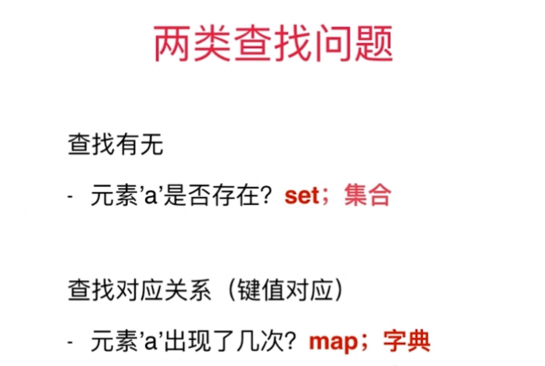
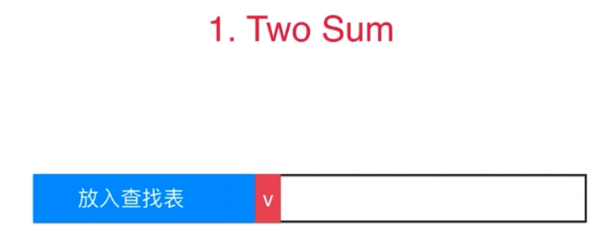
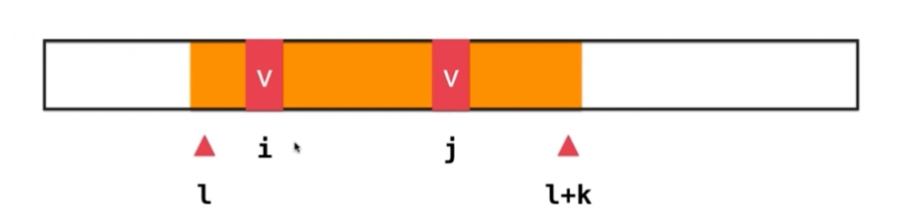

<!-- GFM-TOC -->
* [查找部分笔记总结](#查找表部分笔记总结)
    * [set的使用](#set的使用)
    * [map的使用](#map的使用)
    * [使用查找表(map)的经典问题](#使用查找表(map)的经典问题)
    * [灵活选择键值 ](#灵活选择键值)
    * [查找表和滑动窗口](#查找表和滑动窗口)
    * [二分搜索树底层实现的顺序性 ](#二分搜索树底层实现的顺序性)
* [参考资料](#参考资料)
<!-- GFM-TOC -->


# set的使用
相关题目：
* [349.两个数组的交集](#349)
* [202.快乐数](#202)

## 349

两个数组的交集

### 描述

给定两个数组，编写一个函数来计算它们的交集。

示例 1:

输入: nums1 = [1,2,2,1], nums2 = [2,2]
输出: [2]
示例 2:

输入: nums1 = [4,9,5], nums2 = [9,4,9,8,4]
输出: [9,4]
说明:

输出结果中的每个元素一定是唯一的。
我们可以不考虑输出结果的顺序。
### 分析

利用Set的性质：每个元素都是**唯一的**。
分别设置两个set，一个用来存放nums1的元素，另一个用来存放nums2的元素；
由于结果要求输出的是int数组,所以最后需要做一个转化。

### 实现

```java
public int[] intersection(int[] nums1, int[] nums2) {
        Set<Integer> set=new HashSet<>();
        Set<Integer> res=new HashSet<Integer>();
        for (int i:nums1){
            set.add(i);
        }
        for (int i:nums2){
           if ( set.contains(i)){
               res.add(i);
           }
        }
        
        int[] reslut = new int[res.size()];
        int j=0;
        for (Integer i:res){
            reslut[j++]=i;
        }
        return reslut;

    }
```
## 202

快乐数

### 描述

编写一个算法来判断一个数是不是“快乐数”。

一个“快乐数”定义为：对于一个正整数，**每一次将该数替换为它每个位置上的数字的平方和**，然后重复这个过程直到这个数变为 1，也可能是无限循环但始终变不到 1。如果可以变为 1，那么这个数就是快乐数。

示例: 

输入: 19
输出: true
解释: 
1^2 + 9^2 = 82
8^2 + 2^2 = 68
6^2 + 8^2 = 100
1^2 + 0^2 + 0^2 = 1

### 分析

- 使用set来避免死循环的出现，当n重复出现的时候表明出现了环路（死循环），这就表明n不可能转化为1了。
- 使用快慢指针，若快慢指针指向同一个数，只有两种情况：
  - 此时指针均指向1，则说明此时为快乐数；
  - 此时指针不是指向1，则说明存在环路，那么不是快乐数。

### 实现

使用set：

```java
public boolean isHappy(int n) {
        if (n<1){
            return false;
        }
        Set<Integer> set=new HashSet<>();
        while (!set.contains(n)){
            if (n==1){
                return true;
            }
            set.add(n);
            n=getHappy(n);
        }
        return false;
    }

    private int getHappy(int n) {
        int t,sum=0;
        while (n>0){
            t=n%10;
            n/=10;
            sum+=t*t;
        }
        return sum;
    }
```
快慢指针：

```java
public boolean isHappy(int n) {
        if(n<1){
            return false;
        }
        int slow=n;
        int fast=n;
        do{
            slow=getHappy(slow);
            fast=getHappy(getHappy(fast));
        }while(fast!=slow);
        if(fast==1){
            return true;
        }
        return false;
    }
    private int getHappy(int n){
        int res=0;
        while(n!=0){
            int num=n%10;
            res+=num*num;
            n/=10;
        }
        return res;
    }
```

# map的使用

相关题目：
* [350. 两个数组的交集（2）](#350)
* [290.单词模式](#290)
* [205.同构字符串](#205)
* [451.根据字符出现的频率排序](#451)
## 350

两个数组的交集（2）

### 描述

给定两个数组，编写一个函数来计算它们的交集。

示例 1:

输入: nums1 = [1,2,2,1], nums2 = [2,2]
输出: [2,2]

示例 2:

输入: nums1 = [4,9,5], nums2 = [9,4,9,8,4]
输出: [4,9]
说明：

**输出结果中每个元素出现的次数，应与元素在两个数组中出现的次数一致**。
我们可以不考虑输出结果的顺序。
进阶:

如果给定的数组已经排好序呢？你将如何优化你的算法？

如果 nums1 的大小比 nums2 小很多，哪种方法更优？

如果 nums2 的元素存储在磁盘上，磁盘内存是有限的，并且你不能一次加载所有的元素到内存中，你该怎么办？

### 分析

因为题目中要求出现次数和原数组中一致，那么这是一个键值对（K-V）查找问题。

创建一个map来统计nums1中元素出现的频次，然后再遍历一遍nums2，当元素频次大于0便记录下来并且使得频次减一。

### 实现

```java
public int[] intersect(int[] nums1, int[] nums2) {
        //K:数组元素；V：出现次数
        Map<Integer,Integer> record=new HashMap<>();
        for (int i:nums1){
            Integer count = record.get(i);
            record.put(i,count==null?1:count+1);
        }
        List<Integer> res=new ArrayList<>();
        for (int i:nums2){
            int c=record.get(i)==null?0:record.get(i);
            if (c>0){
                res.add(i);
                record.put(i,record.get(i)-1);
            }
        }
        int[] reslut = new int[res.size()];
        for (int i=0;i<reslut.length;i++){
            reslut[i]=res.get(i);
        }
        return reslut;
    }
```
## 290

单词模式

### 描述

给定一种 pattern(模式) 和一个字符串 str ，判断 str 是否遵循相同的模式。

这里的遵循指完全匹配，例如， pattern 里的每个字母和字符串 str 中的每个非空单词之间存在着双向连接的对应模式。

示例1:

输入: pattern = "abba", str = "dog cat cat dog"
输出: true
示例 2:

输入:pattern = "abba", str = "dog cat cat fish"
输出: false
示例 3:

输入: pattern = "aaaa", str = "dog cat cat dog"
输出: false
示例 4:

输入: pattern = "abba", str = "dog dog dog dog"
输出: false
说明:
你可以假设 pattern 只包含小写字母， str 包含了由单个空格分隔的小写字母。    
### 分析

模式和单词的关系是**一对一**的关系，那么有两种方法：
1. 利用两个map，相互指向即可。

如果发现pMap（pattern-word）不存在当前的字符，这种情况下，如果
sMap(word-pattern)存在当前的word则表明它们的关系不是一对一的，则直接返回false；如果不存在的话，则分别将当前的字符和单词放入两个map中。

- 如果发现pMap中存在当前的字符，取出其对应的word和当前的word进行比较如果不同，则表明不是一对一的关系，返回false；
- 循环正常结束的话，表明pattern和word能够一一对应，则返回true；

2. 利用一个map

与上面同理，只是在判断如果发现pMap（pattern-word）不存在当前的字符的情况下，在value中发现word存在的话，则说明不是一对一的关系，直接返回false；
其它的操作与法1是类似的，就不赘述。

### 实现

```java
public boolean wordPattern(String pattern, String str) {
        String[] strs = str.split(" ");
        if (strs.length!=pattern.length()){
            return false;
        }
        Map<Character,String> pMap=new HashMap<>();
        Map<String,Character> sMap=new HashMap<>();
        for (int i = 0; i < pattern.length(); i++) {
            char c = pattern.charAt(i);
            if (!pMap.containsKey(c)){
                if (sMap.containsKey(strs[i])){
                    return false;
                }
                pMap.put(c,strs[i]);
                sMap.put(strs[i],c);
            }else {
                String s = pMap.get(c);
                if (!s.equals(strs[i])){
                    return false;
                }
            }
        }
        return true;
    }

    public boolean wordPattern1(String pattern, String str){
        String[] strs = str.split(" ");
        if (strs.length!=pattern.length()){
            return false;
        }
        Map<Character,String> pMap=new HashMap<>();
        for (int i = 0; i < pattern.length(); i++) {
            char c = pattern.charAt(i);
            if (!pMap.containsKey(c)){
                if (pMap.containsValue(strs[i])){
                    return false;
                }
                pMap.put(c,strs[i]);
            }else {
                if (!pMap.get(c).equals(strs[i])){
                    return false;
                }
            }
        }
        return true;
    }
```
## 205

同构字符串

### 描述

给定两个字符串 s 和 t，判断它们是否是同构的。

如果 s 中的字符可以被替换得到 t ，那么这两个字符串是同构的。

所有出现的字符都必须用另一个字符替换，同时保留字符的顺序。两个字符不能映射到同一个字符上，但字符可以映射自己本身。

示例 1:

输入: s = "egg", t = "add"
输出: true

示例 2:

输入: s = "foo", t = "bar"
输出: false
示例 3:

输入: s = "paper", t = "title"
输出: true
说明:
你可以假设 s 和 t 具有相同的长度。
### 分析

这道题目与上面（290题）的解法几乎如出一辙，需要找出一对一的关系，不再赘述。
### 实现

```java
public boolean isIsomorphic(String s, String t) {
        if (s.length()!=t.length()){
            return false;
        }
        Map<Character,Character> sMap=new HashMap<>();
        for (int i = 0; i < s.length(); i++) {
            char sChar = s.charAt(i);
            char tChar = t.charAt(i);
            if (!sMap.containsKey(sChar)){
                if (sMap.containsValue(tChar)){
                    return false;
                }
                sMap.put(sChar,tChar);
            }else {
                if (!sMap.get(sChar).equals(tChar)){
                    return false;
                }
            }
        }
        return true;
    }
```
## 451

根据字符出现的频率排序

### 描述

给定一个字符串，请将字符串里的字符按照出现的频率降序排列。

示例 1:

输入:
"tree"

输出:
"eert"

解释:
'e'出现两次，'r'和't'都只出现一次。
因此'e'必须出现在'r'和't'之前。此外，"eetr"也是一个有效的答案。
示例 2:

输入:
"cccaaa"

输出:
"cccaaa"

解释:
'c'和'a'都出现三次。此外，"aaaccc"也是有效的答案。
注意"cacaca"是不正确的，因为相同的字母必须放在一起。
示例 3:

输入:
"Aabb"

输出:
"bbAa"

解释:
此外，"bbaA"也是一个有效的答案，但"Aabb"是不正确的。
注意'A'和'a'被认为是两种不同的字符。
### 分析

统计字符出现的频数可以使用辅助数组来做记录，这题中的关键是根据字符的出现频数来重新构建一个新的字符串，在于**怎么选择map中的键值对（K-V）, 那么map的键可以用频数，则值就用字符的集合；**

在重新构建新的字符串的时候，由于字符串中的某个字符出现的频次的范围是在1-n（n：字符串的长度），所以可以从频次的**高到低遍历查询map**，若存在则将其构建新的字符串，这里**需要注意每次字符出现的次数是频数。**

### 实现

```java
public String frequencySort(String s) {
        int[] freq=new int[256];
        for (int i = 0; i < s.length(); i++) {
            freq[s.charAt(i)]++;
        }
        Map<Integer,List<Character>> map=new HashMap<>();
        for (int i = 0; i < 256; i++) {
            if (freq[i]==0)
                continue;
            if (!map.containsKey(freq[i]))
             {
                map.put(freq[i],new ArrayList<>());
            }
            map.get(freq[i]).add((char)i);
        }
        StringBuilder sb=new StringBuilder();
        for (int i = s.length(); i > 0; i--) {
            if (map.containsKey(i)){
                List<Character> characters = map.get(i);
                for (Character c:characters) {
                    for (int j = 0; j < i; j++) {
                        sb.append(c);
                    }
                }
            }
        }
        return sb.toString();
    }
```
# n数之和
相关题目：
* [1.两数之和](#1)
* [15.三数之和](#15)
* [18.四数之和](#18)
* [16.最接近的三数之和](#16)
## 1

两数之和

### 描述

给定一个整数数组 nums 和一个目标值 target，请你在该数组中找出和为目标值的那 两个 整数，并返回他们的数组下标。

你可以假设每种输入只会对应一个答案。但是，你不能重复利用这个数组中同样的元素。

示例:

给定 nums = [2, 7, 11, 15], target = 9

因为 nums[0] + nums[1] = 2 + 7 = 9
所以返回 [0, 1]

### 分析

查找的过程中，**不需要一次性将数组中的所有元素全部放入map中**，这样可能会造成数值相同的元素下标丢失的问题。

而是在查找的过程中，每次都**查找当前元素对应的另一半元素（target-nums[i]）**,
如果不存在则将当前的元素放入map中；如果存在则查找结束，将其放入结果的集合中并返回。

### 实现

```java
public int[] twoSum(int[] nums, int target) {
        int[] res = new int[2];
        if (nums==null||nums.length==0){
            return res;
        }
        //Key：nums[i]数值中的数值，Value:i,下标
        Map<Integer, Integer> map = new HashMap<>();
        for (int i = 0; i < nums.length; i++) {
            int com = target - nums[i];
            //每次搜索当前的情况，避免了一次性放入所有的元素，导致覆盖了相同元素的下标
            if (map.containsKey(com)) {
                //获取到目标下标
                res[0] = map.get(com);
                res[1] = i;
                return res;
            }
            map.put(nums[i], i);
        }
        return res;
    }
```

## 15

三数之和

### 描述

给定一个包含 n 个整数的数组 nums，判断 nums 中是否存在三个元素 a，b，c ，使得 a + b + c = 0 ？找出所有满足条件且不重复的三元组。

注意：答案中不可以包含重复的三元组。

例如, 给定数组 nums = [-1, 0, 1, 2, -1, -4]，

满足要求的三元组集合为：
[
  [-1, 0, 1],
  [-1, -1, 2]
]
### 分析

1. 使用对撞指针：将3 sum转化成2 sum

2. 使用map：

创建一个map存储数组中的元素和频数（K：元素；V：频次）


遍历map，分别按照3个重复的数字，2个重复的数字和没有重复数字的情况来考虑 **（注意过程中的去重）**。

### 实现

```java
	//使用对撞指针的方法
    public List<List<Integer>> threeSum(int[] nums) {
        List<List<Integer>> res=new ArrayList<>();
        //首先做排序处理
        Arrays.sort(nums);
        for (int i = 0; i < nums.length-2; i++) {
            //去重操作
            if (i>0&&nums[i]==nums[i-1]) continue;
            int l=i+1,h=nums.length-1,target=-nums[i];
            //转化为了2sum
            while (l<h){
                if (nums[l]+nums[h]==target){
                   res.add(Arrays.asList(nums[l],nums[h],nums[i]));
                   ////去重操作
                   while (l<h&&nums[l]==nums[l+1]) l++;
                   while (l<h&&nums[h]==nums[h-1]) h--;
                   //继续搜索
                   l++;
                   h--;
                }else if (nums[l]+nums[h]>target){
                    h--;
                }else {
                    l++;
                }
            }
        }
        return res;
    }

    
```

```java
//使用Map的方式
    public List<List<Integer>> threeSum(int[] nums){
        List<List<Integer>> res=new ArrayList<>();
        //用于记录nums数组中各元素出现的次数
        Map<Integer,Integer> countMap=new HashMap<>();
        for (int i:nums){
            countMap.put(i,countMap.getOrDefault(i,0)+1);
        }
        for (Map.Entry<Integer, Integer> entry : countMap.entrySet()) {
            Integer v0 = entry.getKey();
            Integer count0 = entry.getValue();
            //如果出现次数超过3次，那么结果只能为0
            if (count0>=3){
                if (v0==0){
                    res.add(Arrays.asList(0,0,0));
                }
            }
            //如果出现次数超过2次
            if (count0>=2){
                int v2=0-2*v0;
                if (v2!=v0) {
                    if (countMap.containsKey(v2)) {
                        res.add(Arrays.asList(v0, v0, v2));
                    }
                }
            }
            //剩余的就是只出现一次的元素
            for (int v1:countMap.keySet()){
                int v2=0-v0-v1;
                //确保[[v0,v1,v2]...]内部有序，去重
                if (v0<v1&&v1<v2&&countMap.containsKey(v2))
                    res.add(Arrays.asList(v0,v1,v2));
            }
        }
        return res;
    }
```

## 18

四数之和

### 描述

给定一个包含 n 个整数的数组 nums 和一个目标值 target，判断 nums 中是否存在四个元素 a，b，c 和 d ，使得 a + b + c + d 的值与 target 相等？找出所有满足条件且不重复的四元组。

注意：

答案中**不可以包含重复的四元组**。

示例：

给定数组 nums = [1, 0, -1, 0, -2, 2]，和 target = 0。

满足要求的四元组集合为：
[
  [-1,  0, 0, 1],
  [-2, -1, 1, 2],
  [-2,  0, 0, 2]
]
### 分析

使用对撞指针，将4 sum转化为3 sum 进一步转化成2 sum。

### 实现

```java
//对撞指针法，将问题简化为4->3->2
    public List<List<Integer>> fourSum(int[] nums, int target){
        List<List<Integer>> res = new ArrayList<>();
        if (nums == null || nums.length < 4) {
            return res;
        }
        Arrays.sort(nums);
        for (int i = 0; i < nums.length - 3; i++) {
            //去重
            if (i > 0 && nums[i] == nums[i - 1]) continue;
            //转化为three sum
            for (int j = i + 1; j < nums.length - 2; j++) {
                //去重
                if (j > i + 1 && nums[j] == nums[j - 1]) continue;
                //设置对撞指针
                int l = j + 1, h = nums.length - 1;
                //设置新的搜索目标
                int newTarget = target - nums[i] - nums[j];
                //转化为two sum
                while (l < h) {
                    if (nums[l] + nums[h] == newTarget) {
                        res.add(Arrays.asList(nums[i], nums[j], nums[l], nums[h]));
                        //去重操作
                        while (l < h && nums[l] == nums[l + 1]) l++;
                        while (l < h && nums[h] == nums[h - 1]) h--;
                        l++;
                        h--;
                    } else if (nums[l] + nums[h] < newTarget) {
                        //增大
                        l++;
                    } else {
                        //减小
                        h--;
                    }
                }

            }
        }
        return res;

    }
```

## 16

最接近的三数之和

### 描述

给定一个包括 n 个整数的数组 nums 和 一个目标值 target。找出 nums 中的三个整数，使得它们的和与 target 最接近。返回这三个数的和。假定每组输入只存在唯一答案。

例如，给定数组 nums = [-1，2，1，-4], 和 target = 1.

与 target **最接近**的三个数的和为 2. (-1 + 2 + 1 = 2).
### 分析

这里可以使用对撞指针的方法，首先将数组做排序处理，然后将3 sum转化为2 sum问题。

这里的对撞指针解法和3 sum的对撞指针解法是类似的，但是需要注意的就是这里需要找到的是3 sum最接近的数，那么可以分为两种情况来考虑：
3 sum和target的距离是0和距离大于0的两种情况，这里需要设置一个min来记录距离的最小值并且记录3 sum的数值。

### 实现

```java
public int threeSumClosest(int[] nums, int target) {
        int min=Integer.MAX_VALUE;
        int res=Integer.MAX_VALUE;
        Arrays.sort(nums);
        for (int i = 0; i < nums.length; i++) {
            int l=i+1,h=nums.length-1;
            int v1=nums[i];
            while (l<h){
                if (nums[l]+nums[h]+v1==target){
                    return nums[l]+nums[h]+v1;
                }else {
                    int d = Math.abs(target - v1 - nums[l] - nums[h]);
                    if (d < min) {
                        res = v1 + nums[l] + nums[h];
                        min = d;
                    }
                    if (nums[l]+nums[h]+v1>target){
                        h--;
                    }
                    else
                    l++;
                }
            }
        }
        return res;
    }
```

# 灵活选择键值
相关题目：
* [454.四数之和（2）](#454)
* [49.字母异位词分组](#49)
* [447.回旋镖的数量](#447)
* [149.直线上最多的点数](#149)
* [719.找出第k小的距离对](#719)

## 454

四数之和（2）

### 描述

给定四个包含整数的数组列表 A , B , C , D ,计算有多少个元组 (i, j, k, l) ，使得 A[i] + B[j] + C[k] + D[l] = 0。

为了使问题简单化，所有的 A, B, C, D 具有相同的长度 N，且 0 ≤ N ≤ 500 。所有整数的范围在 -2^28 到 2^28 - 1 之间，最终结果不会超过 2^31 - 1 。

例如:

输入:
A = [ 1, 2]
B = [-2,-1]
C = [-1, 2]
D = [ 0, 2]

输出:
2

解释:
两个元组如下:
1. (0, 0, 0, 1) -> A[0] + B[0] + C[0] + D[1] = 1 + (-2) + (-1) + 2 = 0
2. (1, 1, 0, 0) -> A[1] + B[1] + C[0] + D[0] = 2 + (-1) + (-1) + 0 = 0
### 分析

由于题目中给出了明确的数据规模，那么我们可以根据数据规模来推测出求解的时间复杂度的要求。
因为0<=N<=500,所以O（n^2）的时间复杂度是完全可以接受的。

从这个角度出发，我们可以想到利用一个双重循环将**两个数组**的和存在一个查找表（map）中，然后再**另外两个数组**中的和去查找表中去查找。

对于查找表的使用，**需要查找什么是十分重要的**

### 实现

```java
//使用查找表的方式
    public int fourSumCount(int[] A, int[] B, int[] C, int[] D) {
        //首先初始化map
        //K：sum；V：count
        Map<Integer,Integer> record=new HashMap<>();
        for (int i = 0; i <C.length ; i++) {
            for (int j = 0; j < D.length; j++) {
                int sumCD = C[i] + D[j];
                record.put(sumCD,record.getOrDefault(sumCD,0)+1);
            }
        }
        //统计符合要求的元组个数
        int res=0;
        for (int i = 0; i < A.length; i++) {
            for (int j = 0; j < B.length; j++) {
                int target=0-A[i]-B[j];
                if (record.containsKey(target)){
                    res+=record.get(target);
                }
            }
        }
        return res;
    }
```

## 49

字母异位词分组

### 描述

给定一个字符串数组，将字母异位词组合在一起。字母异位词指字母相同，但排列不同的字符串。

示例:

输入: ["eat", "tea", "tan", "ate", "nat", "bat"],
输出:
[
  ["ate","eat","tea"],
  ["nat","tan"],
  ["bat"]
]
说明：

所有输入均为小写字母。
不考虑答案输出的顺序。
### 分析

这里的关键是怎么使用查找表，字母异位词有一个性质就是每个单词的所有字母是相同的，
那么这里只需要将这些字母作为键，字母异位词作为值就可以将这些单词做分类了。

其中这里有一个小技巧就是将每个单词做**排序**处理重新构建一个新的字符串，这样就可以保证字母异位词能够被映射到一起。

### 实现

```java
	//使用查找表的方式，搞明白需要找出的是什么--字符串
    public List<List<String>> groupAnagrams(String[] strs) {
        List<List<String>> res=new ArrayList<>();
        if (strs==null||strs.length==0){
            return res;
        }
        //用于记录字母异位词集合的map
        Map<String,List<String>> record=new HashMap<>();
        for (String s:strs){
            char[] chars = s.toCharArray();
            //将字符串做排序处理后，字母异位词就可以映射到一起
            Arrays.sort(chars);
            String sortedStr = String.valueOf(chars);
            if (record.containsKey(sortedStr)){
                record.get(sortedStr).add(s);
            }else {
                List<String> list=new ArrayList<>();
                list.add(s);
                record.put(sortedStr,list);
            }
        }
        res.addAll(record.values());
        return res;

    }
```
## 447

回旋镖的数量

### 描述

给定平面上 n 对不同的点，“回旋镖” 是由点表示的元组 (i, j, k) ，其中 i 和 j 之间的距离和 i 和 k 之间的距离相等（**需要考虑元组的顺序**）。

找到所有回旋镖的数量。你可以假设 n 最大为 500，所有点的坐标在闭区间 [-10000, 10000] 中。

示例:

输入:
[[0,0],[1,0],[2,0]]

输出:
2

解释:
两个回旋镖为 [[1,0],[0,0],[2,0]] 和 [[1,0],[2,0],[0,0]]

### 分析

由于题目中要求“考虑元组的顺序”，那么这个就可以看作排列问题。在遍历的过程中，每个点都需要和其它点进行排列。每次挑选出一个点，都使用一个Map来统计不同距离的出现次数。在每个距离相同的点中挑选出其中的2个即可。每次遍历过程中累计这个排列数，最终就可以计算出所有回旋镖的数量。

### 实现

```java
public int numberOfBoomerangs(int[][] points) {
        int res = 0;
        for (int i = 0; i < points.length; i++) {
            //记录元组i到其他所有点的距离对应的次数
            Map<Double, Integer> record = new HashMap<>();
            for (int j = 0; j < points.length; j++) {
                if (i != j) {
                    //欧式距离
                    double distance = Math.pow((points[i][0] - points[j][0]), 2) + Math.pow((points[i][1] - points[j][1]), 2);
                    record.put(distance, record.getOrDefault(distance, 0) + 1);
                }
            }
            //从c个方案里面挑选出2个，即Cn2的排列
            for (Integer c : record.values()) {
                if (c >= 2) {
                    res += c * (c - 1);
                }
            }

        }

        return res;

    }
```

## 719

找出第k小的距离对

### 描述

给定一个整数数组，返回所有数对之间的第 k 个最小距离。一对 (A, B) 的距离被定义为 A 和 B 之间的绝对差值。

示例 1:

输入：
nums = [1,3,1]
k = 1
输出：0 

解释：
所有数对如下：
(1,3) -> 2
(1,1) -> 0
(3,1) -> 2
因此第 1 个最小距离的数对是 (1,1)，它们之间的距离为 0。
提示:

2 <= len(nums) <= 10000.
0 <= nums[i] < 1000000.
1 <= k <= len(nums) * (len(nums) - 1) / 2.

### 分析

我们首先对nums进行**排序**，这样就可以得到distance的**最小值low和最大值high**了。

然后二分查找：对于一个介于low和high之间的数mid，我们统计差值小于mid的一共有多少对，如果小于k，那么说明说明mid的取值偏小，所以修改low的值；否则修改high的值。这样不断迭代，最终当low > high的时候，low即为所求。

### 实现

```java
public int smallestDistancePair(int[] nums, int k){
        Arrays.sort(nums);
        int n=nums.length;
        int l=0,h=nums[n-1]-nums[0];
        while (l<=h){
            int mid=l+(h-l)/2,j=0,count=0;
            for (int i = 0; i < n; i++) {
                //统计差值小于mid一共有多少对，由于此时数组是递增的
                while (j<n&&nums[j]-nums[i]<=mid){
                    j++;
                }
                count+=j-i-1;
            }
            if (count<k){
                l=mid+1;
            }else {
                h=mid-1;
            }
        }
        return l;
    }
```


# 查找表和滑动窗口
相关题目：
* [217.存在重复元素](#217)
* [219.存在重复元素(2)](#219)
## 217

存在重复元素

### 描述

给定一个整数数组，判断是否存在重复元素。

如果任何值在数组中出现至少两次，函数返回 true。如果数组中每个元素都不相同，则返回 false。

示例 1:

输入: [1,2,3,1]
输出: true
示例 2:

输入: [1,2,3,4]
输出: false
示例 3:

输入: [1,1,1,3,3,4,3,2,4,2]
输出: true
### 分析

1.  使用set：
使用set，遍历数组的过程中，不断判断当前的元素是否在set中，如果在则直接返回true，如果不在的话就将当前元素加入set中继续遍历；
直到遍历结束，如果循环正常结束则表明数组中没有重复的元素，返回false。
2.  使用排序：
首先将数组进行排序，再遍历数组，遍历过程中如果发现前后元素相等则表明数组中存在重复的元素。

### 实现

```java
//使用set
public boolean containsDuplicate(int[] nums) {
        Set<Integer> record=new HashSet<>();
        for (int i = 0; i < nums.length; i++) {
            if (record.contains(nums[i])){
                return true;
            }else {
                record.add(nums[i]);
            }
        }
        return false;
    }
```
```java
 		//通过排序的方法
        public boolean containsDuplicate2(int[] nums){
            Arrays.sort(nums);
            for (int i = 1; i < nums.length; i++) {
                if (nums[i]==nums[i-1]){
                    return true;
                }
            }
            return false;
        }
```

## 219

存在重复元素(2)

### 描述

给定一个整数数组和一个整数 k，判断数组中是否存在两个不同的索引 i 和 j，使得 nums [i] = nums [j]，**并且 i 和 j 的差的绝对值最大为 k**。

示例 1:

输入: nums = [1,2,3,1], k = 3
输出: true
示例 2:

输入: nums = [1,0,1,1], k = 1
输出: true
示例 3:

输入: nums = [1,2,3,1,2,3], k = 2
输出: false
### 分析

使用set+滑动窗口的解法：

搜索的过程中只要确保set的大小是**滑动窗口的大小**，滑动窗口的大小为k+1（滑动窗口中的元素为：i-j+1=k+1）


### 实现

```java
public boolean containsNearbyDuplicate1(int[] nums, int k){
        Set<Integer> record=new HashSet<>();
        for (int i = 0; i < nums.length; i++) {
            if (record.contains(nums[i])){
                return true;
            }else {
                record.add(nums[i]);
            }
            //确保查找表的长度为k+1，[i,j]之间是有k+1的元素
            if (record.size()==k+1){
                record.remove(nums[i-k]);
            }

        }
        return false;

    }
```
# 二分搜索树底层实现的顺序性
相关题目：
* [220.存在重复元素（3）](#220)
## 220

存在重复元素（3）

### 描述

给定一个整数数组，判断数组中是否有两个不同的索引 i 和 j，**使得 nums [i] 和 nums [j] 的差的绝对值最大为 t，并且 i 和 j 之间的差的绝对值最大为 ķ。**

示例 1:

输入: nums = [1,2,3,1], k = 3, t = 0
输出: true

示例 2:

输入: nums = [1,0,1,1], k = 1, t = 2
输出: true
示例 3:

输入: nums = [1,5,9,1,5,9], k = 2, t = 3
输出: false
### 分析

在set中寻找大于等于v-t和小于等于v+t的元素：


### 实现

```java
public boolean containsNearbyAlmostDuplicate(int[] nums, int k, int t) {

        TreeSet<Long> record=new TreeSet<>();
        for (int i = 0; i < nums.length; i++) {
            long n=nums[i];
            //n-t<=x<=n+t
            //ceiling：返回大于或等于e的最小元素
            //floor:返回小于或等于e的最大元素
            if (record.ceiling(n)!=null&&record.ceiling(n)<=(long)(n+t)||
                    record.floor(n)!=null&&record.floor(n)>=(long)(n-t)){
                return true;
            }else {
                record.add((long)nums[i]);
            }
            //确保查找表的长度为k
            if (record.size()==k+1){
                record.remove((long)nums[i-k]);
            }

        }
        return false;
    }
```


# 参考资料

[玩儿转算法面试 - 课程官方代码仓](https://github.com/liuyubobobo/Play-with-Algorithm-Interview)

