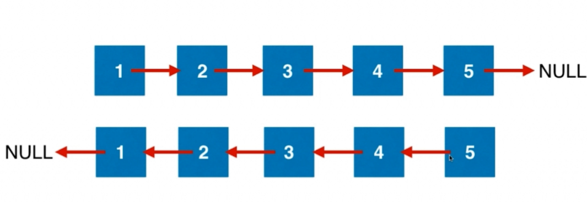
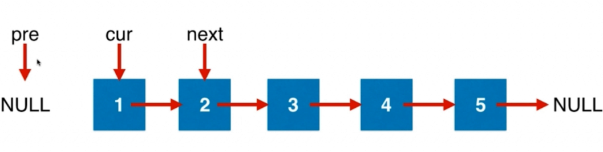
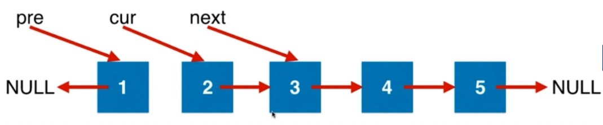

<!-- GFM-TOC -->
* [链表部分的笔记总结](#链表部分的笔记总结)
    * [链表，在节点间穿针引线](#链表，在节点间穿针引线)
    * [设立链表的虚拟头结点](#设立链表的虚拟头结点)
    * [复杂的穿针引线](#复杂的穿针引线)
    * [不仅仅是穿针引线](#不仅仅是穿针引线)
    * [链表与双指针](#链表与双指针)
    * [Floyd环检测算法](#Floyd环检测算法)
* [参考资料](#参考资料)
<!-- GFM-TOC -->
# 链表部分的笔记总结
## 链表，在节点间穿针引线
相关题目：
* [206.反转链表](#206)
* [92.反转链表（2）](#92)   
* [83.](#83)
* [86.](#86)
* [328.](#328)
* [2.两数相加](#2)
* [445.](#445)
### 206
反转一个单链表。

示例:

输入: 1->2->3->4->5->NULL
输出: 5->4->3->2->1->NULL
进阶:
你可以迭代或递归地反转链表。你能否用两种方法解决这道题？

- 分析：

链表的反转的最终结果应该是如下图所示的效果，这样更加便于理解

此时，需要设置三个指针，pre：指向前一个结点，cur：指向当前结点，next：指向下一个结点

在链表的遍历过程中，不断地将当前结点(cur)指向前一个结点(pre),利用next记录了当前结点的下一个指针，
这样遍历的过程中就不会丢失下一个结点的记录。下一次循环将cur指向next，就这样不断循环下去，直到链表结尾。
**最后，pre指向的结点是原链表的尾节点，也就是翻转后的头结点。**


- 实现：
```java
public ListNode reverseList(ListNode head) {
        if (head==null||head.next==null){
            return head;
        }
        ListNode pre=null;
        ListNode cur=head;
        while (cur!=null){
            //这样可以确保next不抛出空指针异常
            ListNode next=cur.next;
            cur.next=pre;
            pre=cur;
            cur=next;

        }
        return pre;
    }
```
### 92
反转从位置 m 到 n 的链表。请使用一趟扫描完成反转。

说明:
1 ≤ m ≤ n ≤ 链表长度。

示例:

输入: 1->2->3->4->5->NULL, m = 2, n = 4
输出: 1->4->3->2->5->NULL
- 分析：

首先设置一个虚拟头结点，为了方便的操作头指针。

设置一个pre，用于指向需要翻转位置的前一个位置；

- 实现：
```java
public ListNode reverseBetween(ListNode head, int m, int n) {
        ListNode newHead =new ListNode(0);
        newHead.next=head;
        ListNode pre=newHead;
        //首先寻找到开始反转的位置
        for (int i = 1; i < m; i++) {
            pre=pre.next;
        }
        ListNode cur=pre.next;

        for (int i = 0; i < n - m; i++) {
            ListNode post=cur.next;

            cur.next=post.next;
            post.next=pre.next;
            pre.next=post;
        }


        return newHead.next;
    }
```
### 83 
- 删除排序链表中的重复元素

给定一个排序链表，删除所有重复的元素，使得每个元素只出现一次。

示例 1:

输入: 1->1->2
输出: 1->2
示例 2:

输入: 1->1->2->3->3
输出: 1->2->3
- 实现：
```java
public ListNode deleteDuplicates(ListNode head) {
        if (head==null||head.next==null)
            return head;
        ListNode cur=head;
        ListNode post=head.next;

        while (post!=null){
            if (cur.val!=post.val){
                cur.next=post;
                cur=post;
            }
            post=post.next;
        }
        cur.next=null;

        return head;
    }
```
### 86 
- 分隔链表

给定一个链表和一个特定值 x，对链表进行分隔，使得所有小于 x 的节点都在大于或等于 x 的节点之前。

你应当保留两个分区中每个节点的初始相对位置。

示例:

输入: head = 1->4->3->2->5->2, x = 3
输出: 1->2->2->4->3->5

- 实现：
```java
public ListNode partition(ListNode head, int x) {
        if (head==null){
            return head;
        }
        //左部分:记录小于x的结点
        ListNode left=new ListNode(-1);
        //右部分:记录大于或等于x的结点
        ListNode right=new ListNode(-1);
        //记录左右部分的头结点
        ListNode leftHead=left,rightHead=right;
        //
        while (head!=null){
            //遇到小于x的结点，用left记录
            if (head.val<x){
                left.next=head;
                left=left.next;
            }else {
                right.next=head;
                right=right.next;
            }
            head=head.next;
        }
        //链接左右两部分
        left.next=rightHead.next;
        //设置尾部为空
        right.next=null;
        return leftHead.next;
    }
```
### 328 
- 奇偶链表

给定一个单链表，把所有的奇数节点和偶数节点分别排在一起。请注意，这里的奇数节点和偶数节点指的是节点编号的奇偶性，而不是节点的值的奇偶性。

请尝试使用原地算法完成。你的算法的空间复杂度应为 O(1)，时间复杂度应为 O(nodes)，nodes 为节点总数。

示例 1:

输入: 1->2->3->4->5->NULL
输出: 1->3->5->2->4->NULL
示例 2:

输入: 2->1->3->5->6->4->7->NULL 
输出: 2->3->6->7->1->5->4->NULL
说明:

应当保持奇数节点和偶数节点的相对顺序。
链表的第一个节点视为奇数节点，第二个节点视为偶数节点，以此类推。

- 实现：
```java
//与86题类似
    public ListNode oddEvenList(ListNode head) {
        if (head==null||head.next==null){
            return head;
        }
        ListNode odd = new ListNode(-1);
        ListNode even = new ListNode(-1);
        ListNode oddHead=odd;
        ListNode evenHead=even;
        int count=1;
        while (head!=null){
            if (count%2==1){
                odd.next=head;
                odd=odd.next;
            }else {
                even.next=head;
                even=even.next;
            }
            head=head.next;
            count++;
        }
        odd.next=evenHead.next;
        even.next=null;
        return oddHead.next;
    }
```
### 2 

- 两数相加

给出两个 非空 的链表用来表示两个非负的整数。其中，它们各自的位数是按照 逆序 的方式存储的，并且它们的每个节点只能存储 一位 数字。

如果，我们将这两个数相加起来，则会返回一个新的链表来表示它们的和。

您可以假设除了数字 0 之外，这两个数都不会以 0 开头。

示例：

输入：(2 -> 4 -> 3) + (5 -> 6 -> 4)
输出：7 -> 0 -> 8
原因：342 + 465 = 807

- 分析：

根据题意，由于 这些非负的整数是**逆序的**，所以这两个“数字”的相加，可以从第一个位置开始；

每一位求和并且进位来逐步进行计算，需要注意的是这里可以**设置一个虚拟头结点来更加方便地得到返回值。**


- 实现：
```java
public ListNode addTwoNumbers2(ListNode l1, ListNode l2){
        if (l1==null||l2==null){
            return l1==null?l2:l1;
        }
        int sum=0;
        ListNode cur = new ListNode(-1);
        ListNode head=cur;
        while (l1!=null||l2!=null||sum!=0){
            //按位累加
            if (l1!=null){
                sum+=l1.val;
                l1=l1.next;
            }
            if (l2!=null){
                sum+=l2.val;
                l2=l2.next;
            }
            //取余和进位
            cur.next=new ListNode(sum%10);
            cur=cur.next;
            sum/=10;
        }
        return head.next;
    }
```
### 445
- 两数相加（2）

给定两个非空链表来代表两个非负整数。数字最高位位于链表开始位置。它们的每个节点只存储单个数字。将这两数相加会返回一个新的链表。

 

你可以假设除了数字 0 之外，这两个数字都不会以零开头。

进阶:

如果输入链表不能修改该如何处理？换句话说，你不能对列表中的节点进行翻转。

示例:

输入: (7 -> 2 -> 4 -> 3) + (5 -> 6 -> 4)
输出: 7 -> 8 -> 0 -> 7

- 实现：
```java
public ListNode addTwoNumbers(ListNode l1, ListNode l2) {
        if (l1 == null || l2 == null) {
            return l1 == null ? l2 : l1;
        }

        Stack<Integer> stack1 = new Stack<>();
        Stack<Integer> stack2 = new Stack<>();
        Stack<Integer> resStack = new Stack<>();
        while (l1 != null || l2 != null) {
            if (l1 != null) {
                stack1.add(l1.val);
                l1 = l1.next;
            }
            if (l2 != null) {
                stack2.add(l2.val);
                l2 = l2.next;
            }
        }
        int num1, num2;
        int count = 0;
        while (!stack1.empty() || !stack2.empty()) {

            if (!stack1.empty()) {
                num1 = stack1.pop();
            } else {
                num1 = 0;
            }
            if (!stack2.empty()) {
                num2 = stack2.pop();
            } else {
                num2 = 0;
            }
            int sum = num1 + num2 + count;
            resStack.add(sum % 10);
            count = sum / 10;
        }
        if (count != 0) {
            resStack.add(count);
        }
        ListNode res = new ListNode(-1);
        ListNode resHead = res;

        while (!resStack.empty()) {
            res.next = new ListNode(resStack.pop());
            res = res.next;
        }
        res.next = null;
        return resHead.next;
    }
```

## 设立链表的虚拟头结点
相关题目：
* [203.移除链表元素](#203)
* [82.删除排序链表中的重复元素（2）](#82)
* [21.合并两个有序链表](#21)
### 203
删除链表中等于给定值 val 的所有节点。

示例:

输入: 1->2->6->3->4->5->6, val = 6

输出: 1->2->3->4->5

实现：
```java
//虚拟头指针法
    public ListNode removeElements(ListNode head, int val) {
        if (head==null||head.next==null)
            return head;
        //设置一个虚拟头指针，这样原始链表中的头结点可以和其他结点一样处理了
        ListNode dummyHead=new ListNode(-1);
        dummyHead.next=head;
        ListNode cur=dummyHead;
        while (cur.next!=null){
            //当遇到目标值的时候，进行删除操作
            if (cur.next.val==val){
                ListNode delNode=cur.next;
                cur.next=delNode.next;
                //释放delNode的空间
                delNode.next=null;
            }else {
                //正常遍历结点
                cur=cur.next;
            }
        }
        return dummyHead.next;
    }
```
### 82
给定一个排序链表，删除所有含有重复数字的节点，只保留原始链表中 没有重复出现 的数字。

示例 1:

输入: 1->2->3->3->4->4->5

输出: 1->2->5

示例 2:

输入: 1->1->1->2->3

输出: 2->3

实现：
```java
//三指针的方法，搜索到需要删除的结点的前一个结点pre，将pre与后面链接
    public ListNode deleteDuplicates(ListNode head) {
        if (head==null||head.next==null)
            return head;

        ListNode pre=null;
        ListNode cur=head;
        ListNode post=head.next;
        boolean isDelete=false;
        while (post!=null){
            if (cur.val==post.val){
                cur=post;
                post=post.next;
                isDelete=true;
            }else {
                //当前后结点不等的时候，存在需要删除结点的情况
                if (isDelete){
                    //当pre还没有移动的时候，直接把头部删除
                    if (pre==null){
                        head=post;
                    }
                    //常规的删除操作：将pre指向post结点
                    else {
                        pre.next=post;
                    }
                    //指针继续后移
                    cur=post;
                    post=post.next;
                    isDelete=false;
                }else {
                    //三个指针一起后移
                    pre=cur;
                    cur=post;
                    post=post.next;
                }
            }
        }
        //尾部可能存在重复未删除的结点
        if (isDelete){
            //删除尾部结点
            if (pre!=null){
                pre.next=null;
            }
            //此时链表中没有不重复的元素
            else {
                head=null;
            }

        }
        return head;
    }
    
    public ListNode deleteDuplicates1(ListNode head){
        ListNode dummy=new ListNode(-1);
        dummy.next=head;
        ListNode pre=dummy;
        ListNode cur=head;
        while (cur!=null){
            //当出现重复结点的时候
            if (cur.next!=null&&cur.val==cur.next.val){
                //跳过重复的结点
                while (cur.next!=null&&cur.val==cur.next.val){
                    cur=cur.next;
                }
            }
            //记录不重复的结点
            else {
                pre=cur;
            }
            //正常遍历
            cur=cur.next;
            pre.next=cur;

        }

        return dummy.next;
    }
```
### 21
将两个有序链表合并为一个新的有序链表并返回。新链表是通过拼接给定的两个链表的所有节点组成的。 

示例：

输入：1->2->4, 1->3->4

输出：1->1->2->3->4->4

实现：
```java
public ListNode mergeTwoLists(ListNode l1, ListNode l2) {
        //合并的新链表
        ListNode dummy=new ListNode(-1);
        ListNode cur=dummy;
        while (l1!=null&&l2!=null){
                if (l1.val<l2.val){
                    cur.next=l1;
                    l1=l1.next;
                }else {
                    cur.next=l2;
                    l2=l2.next;
                }
                cur=cur.next;
        }
        //当链表长度不同的时候，将剩余的链表直接插入新的链表中
        if (l1!=null){
            cur.next=l1;
        }
        if (l2!=null){
            cur.next=l2;
        }
        return dummy.next;
    }
```
## 复杂的穿针引线 
相关题目：
* [24.两两交换链表的节点](#24)
* [25.k个一组旋转链表](#25)
* [147.对链表进行插入排序](#147)
* [148.排序链表](#148)
### 24
给定一个链表，两两交换其中相邻的节点，并返回交换后的链表。

你不能只是单纯的改变节点内部的值，而是需要实际的进行节点交换。

示例:

给定 1->2->3->4, 你应该返回 2->1->4->3.

实现：
```java
public ListNode swapPairs(ListNode head) {
        ListNode dummy = new ListNode(-1);
        dummy.next=head;
        ListNode p=dummy;
        //注意循环的条件
        while (p.next!=null&&p.next.next!=null){
            ListNode n1=p.next;
            ListNode n2=p.next.next;
            ListNode next=n2.next;
            p.next=n2;
            n2.next=n1;
            n1.next=next;
            //p现在需要指向下一次需要交换位置的前一个
            p=n1;
        }
        return dummy.next;

    }
```
### 25
给出一个链表，每 k 个节点一组进行翻转，并返回翻转后的链表。

k 是一个正整数，它的值小于或等于链表的长度。如果节点总数不是 k 的整数倍，那么将最后剩余节点保持原有顺序。

示例 :

给定这个链表：1->2->3->4->5

当 k = 2 时，应当返回: 2->1->4->3->5

当 k = 3 时，应当返回: 3->2->1->4->5

说明 :

你的算法只能使用常数的额外空间。

你不能只是单纯的改变节点内部的值，而是需要实际的进行节点交换。

实现：
```java
public ListNode reverseKGroup(ListNode head, int k) {
        if (head==null){
            return null;
        }
        ListNode dummyHead=new ListNode(0);
        dummyHead.next=head;
        ListNode pre=dummyHead;
        while (pre!=null){
            pre=reverse(pre, k);
        }
        return dummyHead.next;

    }
    //从后向前翻转链表
    private ListNode reverse(ListNode head,int k){
        ListNode last=head;
        for (int i = 0; i < k+1; i++) {
            last=last.next;
            if (i!=k&&last==null){
                return null;
            }
        }
        ListNode tail=head.next;
        ListNode cur=tail.next;
        //每次将元素提前的操作，第一个结点不动，从第二个结点开始，将其依次提前
        //**特别注意其实现过程**
        while (cur!=last){
            ListNode next=cur.next;
            cur.next=head.next;
            head.next=cur;
            tail.next=next;
            cur=next;
        }
        return tail;
    }
```
### 147
对链表进行插入排序。

插入排序算法：

插入排序是迭代的，每次只移动一个元素，直到所有元素可以形成一个有序的输出列表。
每次迭代中，插入排序只从输入数据中移除一个待排序的元素，找到它在序列中适当的位置，并将其插入。
重复直到所有输入数据插入完为止。
 

示例 1：

输入: 4->2->1->3

输出: 1->2->3->4

示例 2：

输入: -1->5->3->4->0

输出: -1->0->3->4->5

实现：
```java
public ListNode insertionSortList(ListNode head) {
        if(head == null||head.next == null)
                         return head;
        //虚拟头节点指向已排序好的部分
        ListNode sortedlisthead = new ListNode(0);
        //指向当前位置的指针
        ListNode cur = head;
        while (cur != null) {
            ListNode next = cur.next;
            //pre:指向待排序的部分的头指针
            ListNode pre = sortedlisthead;
            //在已排序的部分寻找可以插入的位置
            while (pre.next != null && cur.val > pre.next.val) {
                pre = pre.next;
            }
            //将待排序的结点插入已排序的部分
            cur.next = pre.next;
            //继续指向未排序的部分
            pre.next = cur;
            cur = next;
        }
        return sortedlisthead.next;
    }
```
### 148
在 O(n log n) 时间复杂度和常数级空间复杂度下，对链表进行排序。

示例 1:

输入: 4->2->1->3

输出: 1->2->3->4

示例 2:

输入: -1->5->3->4->0

输出: -1->0->3->4->5

实现：
```java
//自顶向下的归并排序
    public ListNode sortList(ListNode head) {
        if (head==null||head.next==null){
            return head;
        }
        //首先将链表折半
        ListNode fast=head.next,slow=head;
        while (fast!=null&&fast.next!=null){
            fast=fast.next.next;
            slow=slow.next;
        }
        ListNode head2=slow.next;
        //将前后断开连接
        slow.next=null;
        head = sortList(head);  //前半部分
        head2=sortList(head2);  //后半部分
        return merge(head,head2);
    }
    //合并两个已经排序好的链表
    private ListNode merge(ListNode a,ListNode b){
        ListNode dummyHead=new ListNode(-1);
        ListNode p1=a,p2=b,p=dummyHead;
        while (p1!=null&&p2!=null){
            if (p1.val<p2.val){
                p.next=p1;
                p=p.next;
                p1=p1.next;
                p.next=null;
            }else {
                p.next=p2;
                p=p.next;
                p2=p2.next;
                p.next=null;
            }
        }
        if (p1!=null){
            p.next=p1;
        }
        if (p2!=null){
            p.next=p2;
        }
        return dummyHead.next;

    }
```
## 不仅仅是穿针引线 
相关题目：
* [237.删除链表中的节点](#237)
### 237
请编写一个函数，使其可以删除某个链表中给定的（非末尾）节点，你将只被给定要求被删除的节点。
 
示例 1:

输入: head = [4,5,1,9], node = 5

输出: [4,1,9]

解释: 给定你链表中值为 5 的第二个节点，那么在调用了你的函数之后，该链表应变为 4 -> 1 -> 9.

示例 2:

输入: head = [4,5,1,9], node = 1

输出: [4,5,9]

解释: 给定你链表中值为 1 的第三个节点，那么在调用了你的函数之后，该链表应变为 4 -> 5 -> 9.
 
说明:

链表至少包含两个节点。

链表中所有节点的值都是唯一的。

给定的节点为非末尾节点并且一定是链表中的一个有效节点。

不要从你的函数中返回任何结果。

实现：
```java
public void deleteNode(ListNode node) {
        if (node==null)
            return;
        ListNode cur=node;
        if (cur.next==null){
            node=null;
        }
        ListNode next=cur.next;
        cur.val=next.val;
        cur.next=next.next;
        next.next=null;
    }
```
## 链表与双指针
相关题目：
* [19.删除链表的倒数第N个节点](#19)
* [61.旋转链表](#61)
* [143.重排链表](#143)
* [234.回文链表](#234)
### 19
给定一个链表，删除链表的倒数第 n 个节点，并且返回链表的头结点。

示例：

给定一个链表: 1->2->3->4->5, 和 n = 2.

当删除了倒数第二个节点后，链表变为 1->2->3->5.

说明：

给定的 n 保证是有效的。

进阶：

你能尝试使用一趟扫描实现吗？

实现：
```java
public ListNode removeNthFromEnd(ListNode head, int n) {
        ListNode dummyHead=new ListNode(0);
        dummyHead.next=head;
        ListNode fastNode=dummyHead;
        ListNode slowNode=dummyHead;
        //快指针先移动n+1个位置，由于添加了一个虚拟头结点
        for (int i = 0; i <= n; i++) {
            fastNode=fastNode.next;
        }
        //两个指针同时运动
        while (fastNode!=null){
            fastNode=fastNode.next;
            slowNode=slowNode.next;
        }
        //此时慢指针指向的则是倒数第n个元素
        ListNode delNode=slowNode.next;
        slowNode.next=delNode.next;
        delNode=null;
        return dummyHead.next;

    }
```
### 61
给定一个链表，旋转链表，将链表每个节点向右移动 k 个位置，其中 k 是非负数。

示例 1:

输入: 1->2->3->4->5->NULL, k = 2

输出: 4->5->1->2->3->NULL

解释:
向右旋转 1 步: 5->1->2->3->4->NULL

向右旋转 2 步: 4->5->1->2->3->NULL

示例 2:

输入: 0->1->2->NULL, k = 4

输出: 2->0->1->NULL

解释:

向右旋转 1 步: 2->0->1->NULL

向右旋转 2 步: 1->2->0->NULL

向右旋转 3 步: 0->1->2->NULL

向右旋转 4 步: 2->0->1->NULL

实现：
```java
public ListNode rotateRight(ListNode head, int k) {
        if (head==null||head.next==null){
            return head;
        }
        ListNode fast=head;
        ListNode slow=head;
        int count=0;
        //首先计算当前链表的长度
        while (slow!=null){
            slow=slow.next;
            count++;
        }
        slow=head;
        //注意循环的情况，所以取模
        k=k%count;
        //让快指针先开始k个位置
        for (int i = 0; i < k; i++) {
            fast=fast.next;
        }
        //两个指针同时移动直到链表最后一个结点
        while (fast.next!=null){
            fast=fast.next;
            slow=slow.next;
        }
        //遍历结束后，此时，slow便指向新的头结点

        //将链表连成环路
        fast.next=head;
        //记录此时的头节点
        head=slow.next;
        //注意将尾指针置为空，不然会出现环路
        slow.next=null;
        return head;
    }
```
### 143
给定一个单链表 L：L0→L1→…→Ln-1→Ln ，

将其重新排列后变为： L0→Ln→L1→Ln-1→L2→Ln-2→…

你不能只是单纯的改变节点内部的值，而是需要实际的进行节点交换。

示例 1:

给定链表 1->2->3->4, 重新排列为 1->4->2->3.

示例 2:

给定链表 1->2->3->4->5, 重新排列为 1->5->2->4->3.

实现：
```java
public void reorderList(ListNode head) {
        if (head==null||head.next==null||head.next.next==null){
            return ;
        }
        //寻找链表的中间节点
        ListNode fast=head,slow=head;
        while (fast.next!=null&&fast.next.next!=null){
            fast=fast.next.next;
            slow=slow.next;
        }
        ListNode secend=slow.next;
        slow.next=null;
        
        secend=reverse(secend);

        ListNode first=head;
        while (secend!=null){
            ListNode next=first.next;
            first.next=secend;
            secend=secend.next;
            first = first.next;
            first.next = next;
            first = first.next;
        }
    }

    private ListNode reverse(ListNode head){
        if (head==null||head.next==null){
            return head;
        }
        ListNode pre=null;
        ListNode cur=head;
        while (cur!=null){
            ListNode next=cur.next;
            cur.next=pre;
            pre=cur;
            cur=next;
        }
        return pre;
    }
```
### 234
请判断一个链表是否为回文链表。

示例 1:

输入: 1->2

输出: false

示例 2:

输入: 1->2->2->1

输出: true

进阶：
你能否用 O(n) 时间复杂度和 O(1) 空间复杂度解决此题？

实现：
```java
public boolean isPalindrome(ListNode head) {
        if (head==null||head.next==null){
            return true;
        }
        //首先，将链表对半分
        ListNode fast=head,slow=head;
        //找到后半部分的前一个位置
        while (fast.next!=null&&fast.next.next!=null){
            fast=fast.next.next;
            slow=slow.next;
        }
        //将后半部分翻转
        slow.next=reverse(slow.next);
        //指向后半部分的第一个结点
        slow=slow.next;
        ListNode cur=head;
        //遍历链表，确保前半部分与后半部分是相同的
        while (slow!=null){
            if (slow.val!=cur.val){
                return false;
            }
            slow=slow.next;
            cur=cur.next;
        }
        return true;

    }
    private ListNode reverse(ListNode head){
        if (head==null||head.next==null){
            return head;
        }
        ListNode pre=null;
        ListNode cur=head;
        while (cur!=null){
            ListNode next=cur.next;
            cur.next=pre;
            pre=cur;
            cur=next;
        }
        return pre;
    }
```
## 更多链表的问题
相关题目：
* [725.分隔链表](#725)
* [817.链表组件](#817)
* [876.链表的中间结点](#876)
### 725 
给定一个头结点为 root 的链表, 编写一个函数以将链表分隔为 k 个连续的部分。

每部分的长度应该尽可能的相等: 任意两部分的长度差距不能超过 1，也就是说可能有些部分为 null。

这k个部分应该按照在链表中出现的顺序进行输出，并且排在前面的部分的长度应该大于或等于后面的长度。

返回一个符合上述规则的链表的列表。

举例： 1->2->3->4, k = 5 // 5 结果 [ [1], [2], [3], [4], null ]

示例 1：

输入: 
root = [1, 2, 3], k = 5
输出: [[1],[2],[3],[],[]]

解释:
输入输出各部分都应该是链表，而不是数组。

例如, 输入的结点 root 的 val= 1, root.next.val = 2, \root.next.next.val = 3, 且 root.next.next.next = null。
第一个输出 output[0] 是 output[0].val = 1, output[0].next = null。
最后一个元素 output[4] 为 null, 它代表了最后一个部分为空链表。

示例 2：

输入: 
root = [1, 2, 3, 4, 5, 6, 7, 8, 9, 10], k = 3

输出: [[1, 2, 3, 4], [5, 6, 7], [8, 9, 10]]

解释:
输入被分成了几个连续的部分，并且每部分的长度相差不超过1.前面部分的长度大于等于后面部分的长度。
 

提示:

root 的长度范围： [0, 1000].

输入的每个节点的大小范围：[0, 999].

k 的取值范围： [1, 50].

实现：
```java
public ListNode[] splitListToParts(ListNode root, int k) {
        int len=listNodeLen(root);
        int average_size = len / k;
        int left = len % k;
        ListNode[] res=new ListNode[k];
        List<ListNode> list=new ArrayList<>();
        for (int i = 0; i < k; i++) {
            //将余数均分
            int size=average_size+(i<left?1:0);
            if (size==0){
                list.add(null);
            }else {

                ListNode tail = getTail(root, size);
                //记录一下，下一次循环的起点
                ListNode newRoot = tail.next;
                tail.next=null;
                list.add(root);
                root=newRoot;
            }

        }
        for (int i = 0; i < k; i++) {
            res[i]=list.get(i);
        }
        return res;
    }
    private int listNodeLen(ListNode root){
        int len=0;
        while (root!=null){
            len++;
            root=root.next;
        }
        return len;
    }

    //获取新的头结点
    private ListNode getTail(ListNode root,int size){
        for (int i = 1; i < size; i++) {
            assert root!=null;
            root=root.next;
        }
        return root;
    }
```
### 817 
给定一个链表（链表结点包含一个整型值）的头结点 head。

同时给定列表 G，该列表是上述链表中整型值的一个子集。

返回列表 G 中组件的个数，这里对组件的定义为：链表中一段最长连续结点的值（该值必须在列表 G 中）构成的集合。

示例 1：

输入: 
head: 0->1->2->3
G = [0, 1, 3]

输出: 2

解释: 
链表中,0 和 1 是相连接的，且 G 中不包含 2，所以 [0, 1] 是 G 的一个组件，同理 [3] 也是一个组件，故返回 2。

示例 2：

输入: 
head: 0->1->2->3->4
G = [0, 3, 1, 4]

输出: 2

解释: 
链表中，0 和 1 是相连接的，3 和 4 是相连接的，所以 [0, 1] 和 [3, 4] 是两个组件，故返回 2。
注意:

如果 N 是给定链表 head 的长度，1 <= N <= 10000。
链表中每个结点的值所在范围为 [0, N - 1]。
1 <= G.length <= 10000
G 是链表中所有结点的值的一个子集.

实现：
```java
public int numComponents(ListNode head, int[] G) {
        Set<Integer> gSet=new HashSet<>();
        for (int i = 0; i < G.length; i++) {
            gSet.add(G[i]);
        }
        ListNode cur=head;
        int count=0,curCount=0;
        //遍历链表
        while (cur!=null){
            //当G中包含当前结点的时候
            if (gSet.contains(cur.val)){
                //如果当前组件的长度为0，证明是一个新的组件，则组件的计数器加1
                if (curCount==0){
                    count++;
                }
                //统计当前组件的长度
                curCount++;
            }else {
                //如果G中不包含当前结点的时候，则将组件长度置为0
                curCount=0;
            }
            cur=cur.next;
        }
        return count;
    }
```
### 876
给定一个带有头结点 head 的非空单链表，返回链表的中间结点。

如果有两个中间结点，则返回第二个中间结点。

 

示例 1：

输入：[1,2,3,4,5]

输出：此列表中的结点 3 (序列化形式：[3,4,5])

返回的结点值为 3 。 (测评系统对该结点序列化表述是 [3,4,5])。
注意，我们返回了一个 ListNode 类型的对象 ans，这样：
ans.val = 3, ans.next.val = 4, ans.next.next.val = 5, 以及 ans.next.next.next = NULL.

示例 2：

输入：[1,2,3,4,5,6]

输出：此列表中的结点 4 (序列化形式：[4,5,6])

由于该列表有两个中间结点，值分别为 3 和 4，我们返回第二个结点。
 

提示：

给定链表的结点数介于 1 和 100 之间。

实现：
```java
public ListNode middleNode(ListNode head) {
        int len = listNodeLen(head);
        int mid=len/2+1;
        ListNode res=head;
        for (int i = 1; i < mid; i++) {
            res=res.next;
        }
        return res;
    }
    private int listNodeLen(ListNode root){
        int len=0;
        while (root!=null){
            len++;
            root=root.next;
        }
        return len;
    }
```

## Floyd环检测算法
相关题目：
* [141.环形链路](#141)
* [142.环形链路（2）](#142)
### 141
给定一个链表，判断链表中是否有环。

为了表示给定链表中的环，我们使用整数 pos 来表示链表尾连接到链表中的位置（索引从 0 开始）。 如果 pos 是 -1，则在该链表中没有环。

示例 1：

输入：head = [3,2,0,-4], pos = 1
输出：true
解释：链表中有一个环，其尾部连接到第二个节点。

实现：
```java
public boolean hasCycle(ListNode head) {
        if (head==null||head.next==null){
            return false;
        }
        ListNode slow=head;
        ListNode fast=head.next;
        while (slow!=null&&fast!=null&&fast.next!=null){
            if (slow==fast){
                return true;
            }
            slow=slow.next;
            fast=fast.next.next;
        }
        return false;
    }
```
### 142
给定一个链表，返回链表开始入环的第一个节点。 如果链表无环，则返回 null。

为了表示给定链表中的环，我们使用整数 pos 来表示链表尾连接到链表中的位置（索引从 0 开始）。 如果 pos 是 -1，则在该链表中没有环。

说明：不允许修改给定的链表。

- 实现：
```java
public ListNode detectCycle(ListNode head) {
        if (head==null||head.next==null){
            return null;
        }
        ListNode slow=head;
        ListNode fast=head.next;
        int slowCount=1,fastCount=2;
        while (slow!=null&&fast!=null&&fast.next!=null){
            if (slow==fast){
                //cycleLen=fastCount-slowCount，一圈的长度
                return getCycleTail(head,fastCount-slowCount);
            }
            slow=slow.next;
            slowCount++;
            fast=fast.next.next;
            fastCount+=2;
        }
        return null;
    }
    //根据循环部分的长度来获取循环的头结点
    private ListNode getCycleTail(ListNode head,int cycleLen){
        //利用两个指针，间隔保持cycleLen
        ListNode slow=head;
        ListNode fast=head;
        for (int i = 0; i < cycleLen; i++) {
            fast=fast.next;
        }
        while (fast!=slow){
            fast=fast.next;
            slow=slow.next;
        }
        //当两个指针指向同一个结点的时候，表明快指针正好比慢指针快了整整一圈
        return fast;
    }
```

# 参考资料

[玩儿转算法面试 - 课程官方代码仓](https://github.com/liuyubobobo/Play-with-Algorithm-Interview)

