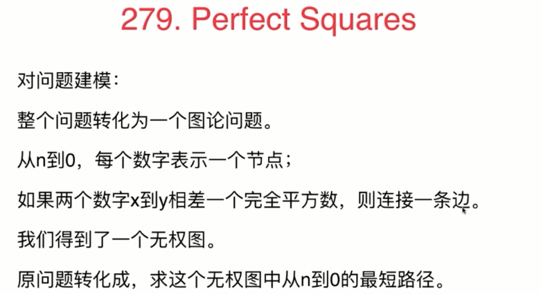
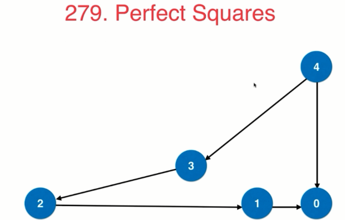
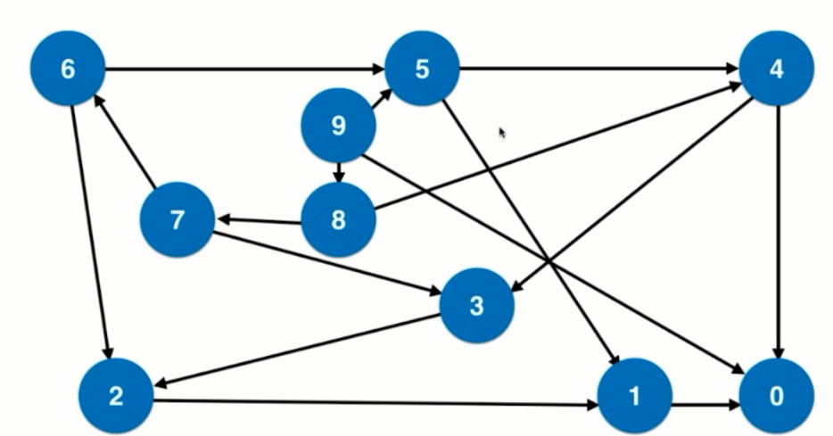

<!-- GFM-TOC -->
* [队列部分总结笔记](#队列部分总结笔记)
    * [队列的典型应用](#队列的典型应用)
    * [BFS和图的最短路径](#BFS和图的最短路径)
    * [优先队列](#优先队列)  
* [参考资料](#参考资料)
<!-- GFM-TOC -->

# 队列部分总结笔记
## 队列的典型应用
队列的基本应用-广度优先遍历

- 树：层序遍历


相关题目：
* [102](#102)
* [103](#103)
* [107](#107)
* [199](#199)

### 102
- 二叉树的层次遍历

给定一个二叉树，返回其按层次遍历的节点值。 （即逐层地，从左到右访问所有节点）。

例如:
给定二叉树: [3,9,20,null,null,15,7],

    3
   / \
  9  20
    /  \
   15   7
返回其层次遍历结果：

[
  [3],
  [9,20],
  [15,7]
]

- 分析：

二叉树的层序遍历的变式，为了处理层数，使用了Pair类（相当于一个元组）来处理。
队列中存放的是<node,level>，node：表示当前遍历的结点，level：表示当前遍历的层数,level从0开始。

当层数和结果的集合大小相等的时候，说明集合中还不存在这一层，所以需要新创建一个List。
随后分别将左右子树入队操作，注意此时level需要加1操作。
- 实现：
```java
public List<List<Integer>> levelOrder(TreeNode root) {
        List<List<Integer>> res=new ArrayList<>();
        if (root==null){
            return res;
        }
        Queue<Pair<TreeNode,Integer>> queue=new LinkedList<>();
        queue.add(new Pair<>(root,0));
        while (!queue.isEmpty()){
            Pair<TreeNode, Integer> poll = queue.poll();
            TreeNode node = poll.getKey();
            Integer level = poll.getValue();
            //当层数和结果的集合大小相等的时候，说明集合中还不存在这一层，所以需要新创建一个List
            if (level==res.size()){
                res.add(new ArrayList<Integer>());
            }
            res.get(level).add(node.val);
            //分别将左右子树入队
            if (node.left!=null){
                queue.offer(new Pair<>(node.left,level+1));
            }
            if (node.right!=null){
                queue.offer(new Pair<>(node.right,level+1));
            }

        }
        return res;
    }
```
### 103
### 107
### 199
给定一棵二叉树，想象自己站在它的右侧，按照从顶部到底部的顺序，返回从右侧所能看到的节点值。

示例:

输入: [1,2,3,null,5,null,4]

输出: [1, 3, 4]

解释:
```java

   1            <---
 /   \
2     3         <---
 \     \
  5     4       <---
```
- 分析：

使用队列实现广度遍历，在遍历每一层的时候只记录这一层的最右边的结点

- 实现：
```java
public List<Integer> rightSideView(TreeNode root) {
        List<Integer> res=new ArrayList<>();
        if (root==null){
            return res;
        }
        Queue<TreeNode> queue=new LinkedList<>();
        queue.offer(root);
        while (!queue.isEmpty()){
            //统计这一层的结点数
            int currentNum = queue.size();
            while (currentNum>0){
                TreeNode poll = queue.poll();
                currentNum--;
                //入队顺序必须保持从左到右
                if (poll.left!=null){
                    queue.offer(poll.left);
                }
                if (poll.right!=null){
                    queue.offer(poll.right);
                }
                //此时最后一个出队的元素则是每层最右边的结点
                if (currentNum==0){
                    res.add(poll.val);
                }
            }
        }
        return res;
    }
```
## BFS（无权图）和图的最短路径

相关题目：
* [279](#279)
* [127](#127)
* [126](#126)
### 279
- 完全平方数

给定正整数 n，找到若干个完全平方数（比如 1, 4, 9, 16, ...）使得它们的和等于 n。你需要让组成和的完全平方数的个数最少。

示例 1:

输入: n = 12
输出: 3 
解释: 12 = 4 + 4 + 4.
示例 2:

输入: n = 13
输出: 2
解释: 13 = 4 + 9.

- 分析：

这一题可以通过建模转化为一道图的广度遍历的题目，分析过程如下：








- 实现：
   
```java
//使用图论的解法
    public int numSquares(int n)  {
        //queue<<num,step>>,num:表示目标数字；step:表示达到目标数字的步数
        Queue<Pair<Integer,Integer>> queue=new LinkedList<>();
        //设置一个数组来标记目标数字是否被访问过
        boolean[] flagArray=new boolean[n+1];
        Arrays.fill(flagArray,false);
        queue.offer(new Pair<>(n,0));
        while (!queue.isEmpty()){
            Pair<Integer, Integer> poll = queue.poll();
            int num=poll.getKey();
            int step = poll.getValue();
            for (int i = 0; ; i++) {
                int a=num-i*i;  //每次移动都是完全平方数
                if (a<0) {
                    break;
                }
                if (a==0) {     //表示达到终点
                    return step + 1;
                }
                if (!flagArray[a]){     //若目标数字没有被访问过才将其入队操作
                    queue.offer(new Pair<>(a,step+1));
                    flagArray[num]=true;
                }

            }
        }
        return n;
    }
```
### 127

- 单词接龙

给定两个单词（beginWord 和 endWord）和一个字典，找到从 beginWord 到 endWord 的最短转换序列的长度。转换需遵循如下规则：

每次转换只能改变一个字母。
转换过程中的中间单词必须是字典中的单词。
说明:

如果不存在这样的转换序列，返回 0。
所有单词具有相同的长度。
所有单词只由小写字母组成。
字典中不存在重复的单词。
你可以假设 beginWord 和 endWord 是非空的，且二者不相同。
示例 1:

输入:
beginWord = "hit",
endWord = "cog",
wordList = ["hot","dot","dog","lot","log","cog"]

输出: 5

解释: 一个最短转换序列是 "hit" -> "hot" -> "dot" -> "dog" -> "cog",
     返回它的长度 5。
示例 2:

输入:
beginWord = "hit"
endWord = "cog"
wordList = ["hot","dot","dog","lot","log"]

输出: 0

解释: endWord "cog" 不在字典中，所以无法进行转换。

- 分析：

- 实现：
```java
//使用BFS（广度遍历）的方法
    public int ladderLength(String beginWord, String endWord, List<String> wordList) {
        Set<String> dict=new HashSet<>();
        for (String word : wordList) {
            dict.add(word);
        }
        if (!dict.contains(endWord)){
            return 0;
        }
        Queue<String> queue=new LinkedList<>();
        queue.offer(beginWord);
        int step=0;
        while (!queue.isEmpty()){
            step++;
            int size = queue.size();
            while (size-->0){
                String word = queue.poll();
                char[] chars = word.toCharArray();
                for (int i = 0; i < chars.length; i++) {
                    char ch = chars[i];
                    for (char c = 'a'; c <= 'z'; ++c) {
                        if (c == ch) continue;
                        chars[i] = c;
                        String t = new String(chars);
                        if (t.equals(endWord)) return step + 1;
                        if (dict.contains(t))
                        {
                        dict.remove(t);
                        queue.offer(t);
                        }
                    }
                    chars[i]=ch;
                }

            }
        }

        return 0;

    }
```
### 126
- 单词接龙（2）

给定两个单词（beginWord 和 endWord）和一个字典 wordList，找出所有从 beginWord 到 endWord 的最短转换序列。转换需遵循如下规则：

每次转换只能改变一个字母。
转换过程中的中间单词必须是字典中的单词。
说明:

如果不存在这样的转换序列，返回一个空列表。
所有单词具有相同的长度。
所有单词只由小写字母组成。
字典中不存在重复的单词。
你可以假设 beginWord 和 endWord 是非空的，且二者不相同。
示例 1:

输入:
beginWord = "hit",
endWord = "cog",
wordList = ["hot","dot","dog","lot","log","cog"]

输出:
[
  ["hit","hot","dot","dog","cog"],
  ["hit","hot","lot","log","cog"]
]
示例 2:

输入:
beginWord = "hit"
endWord = "cog"
wordList = ["hot","dot","dog","lot","log"]

输出: []

解释: endWord "cog" 不在字典中，所以不存在符合要求的转换序列。


## 优先队列

相关题目：

* [347](#347)
### 347
- 前K个高频元素
给定一个非空的整数数组，返回其中出现频率前 k 高的元素。

示例 1:

输入: nums = [1,1,1,2,2,3], k = 2
输出: [1,2]
示例 2:

输入: nums = [1], k = 1
输出: [1]
- 分析：


- 实现：
```java
private List<Integer> res=new ArrayList<>();

    private class PairComparator implements Comparator<Pair<Integer,Integer>>{
        @Override
        public int compare(Pair<Integer, Integer> p1, Pair<Integer, Integer> p2) {
            if (p1.getKey()!=p2.getKey()){
                return p1.getKey()-p2.getKey();
            }
            return p1.getValue()-p2.getValue();
        }
    }

    public List<Integer> topKFrequent(int[] nums, int k) {
        if (nums==null||nums.length==0){
            return res;
        }
        //统计每个元素出现的频率
        Map<Integer,Integer> freq=new HashMap<>();
        for (int i = 0; i < nums.length; i++) {
            freq.put(nums[i],freq.getOrDefault(nums[i],0)+1);
        }
        // 扫描freq,维护当前出现频率最高的k个元素
        // 在优先队列中,按照频率排序,所以数据对是 (频率,元素) 的形式
        Queue<Pair<Integer,Integer>> queue=new PriorityQueue<>(new PairComparator());
        for (Integer num:freq.keySet()) {
            Integer numFreq = freq.get(num);
            if (queue.size()==k){
                if (numFreq>queue.peek().getKey()){
                    queue.poll();
                    queue.offer(new Pair<>(numFreq,num));
                }
            }else {
                queue.offer(new Pair<>(numFreq,num));
            }
        }
        //遍历优先队列取出结果
        while (!queue.isEmpty()){
            res.add(queue.poll().getValue());
        }
        return res;

    }
```
# 参考资料
[玩儿转算法面试 - 课程官方代码仓](https://github.com/liuyubobobo/Play-with-Algorithm-Interview)


