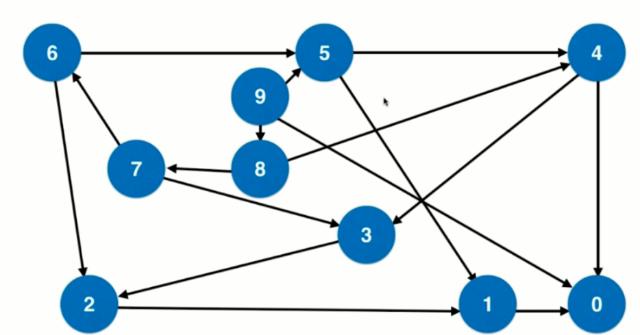
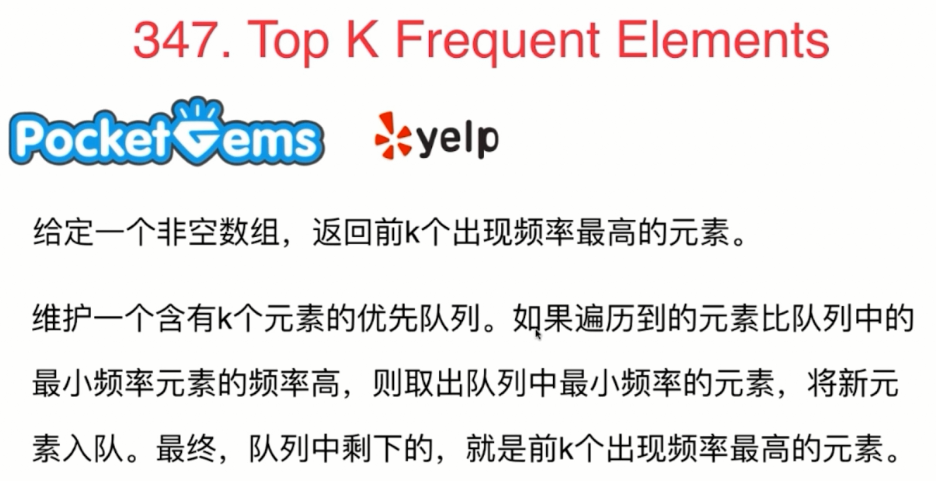

<!-- GFM-TOC -->
* [栈和队列部分总结笔记](#栈和队列部分总结笔记)
    * [栈和递归的紧密关系](#栈和递归的紧密关系)
   
* [参考资料](#参考资料)
<!-- GFM-TOC -->

# 栈和队列部分总结笔记

## 栈和递归的紧密关系
在递归调用的时候，系统中相当于有一个系统栈，系统栈中要推入信息来保存**递归调用前**的系统的执行情况。
### 递归算法
- 二叉树的算法

相关题目：

* [144](#144)
* [145]()
* [94]()
#### 144
二叉树的前序遍历
- 分析：
1. 解法一：

这题用递归来写十分简单，直接按照前序遍历的逻辑（中->左->右）来实现即可，在此就不赘述。
2. 解法二：

使用迭代式来实现，在这里我们会用到栈这个数据结构。在上文中有提到，递归调用相当于使用了系统栈的结构，那么我们在这里来模拟系统栈的过程来
实现二叉树的前序遍历。每次当函数递归的时候，便将未执行的操作逆序压入栈中，当执行完该操作便做弹栈操作。

递归调用的时候，模拟系统栈的情况如下，下面忽略了结点为null的情况：
>红色：已经遍历过；蓝色：未遍历
* 遍历根结点

<div align="center">


</div>

* 遍历左子树
<div align="center">


</div>

* 遍历右子树

<div align="center">


<div>

- 实现：
```java
/**
* 额外定义了一个操作类，用来模拟系统栈的操作过程
* 每次执行只有两种操作，一是将结点的值加入集合，二是继续遍历结点
*/
 class Command{
        int command;//0:表示继续遍历；1:表示加入集合
        TreeNode node;

        public Command(int command, TreeNode node) {
            this.command = command;
            this.node = node;
        }
    }
//迭代式
    public List<Integer> preorderTraversal(TreeNode root){
        if (root==null){
            return res;
        }
        Stack<Command> stack=new Stack<>();
        stack.push(new Command(0,root));
        while (!stack.empty()){
            Command command = stack.pop();
            if (command.command==1){
                res.add(command.node.val);
            }
            //以操作的逆序压入操作类
            else {
                if (command.node.right!=null){
                    stack.push(new Command(0,command.node.right));
                }
                if (command.node.left!=null){
                    stack.push(new Command(0,command.node.left));
                }
                stack.push(new Command(1,command.node));
            }
        }
        return res;

    }
```
>这样不管是二叉树的前序、中序还是后序遍历的实现，只需要和递归一样调换操作的次序就可以方便的转化，更便于理解。题144和94同理即可得，下面不赘述其过程。
## 队列
队列的基本应用-广度优先遍历

- 树：层序遍历


相关题目：
* [102]()
* [103]()
* [107]()
* [199]()

### 102
- 二叉树的层次遍历

给定一个二叉树，返回其按层次遍历的节点值。 （即逐层地，从左到右访问所有节点）。

例如:
给定二叉树: [3,9,20,null,null,15,7],

    3
   / \
  9  20
    /  \
   15   7
返回其层次遍历结果：

[
  [3],
  [9,20],
  [15,7]
]

- 分析：

二叉树的层序遍历的变式，为了处理层数，使用了Pair类（相当于一个元组）来处理。
队列中存放的是<node,level>，node：表示当前遍历的结点，level：表示当前遍历的层数。
当当层数和结果的集合大小相等的时候，说明集合中还不存在这一层，所以需要新创建一个List。
随后分别将左右子树入队操作，注意此时level需要加1操作。
- 实现：
```java
public List<List<Integer>> levelOrder(TreeNode root) {
        List<List<Integer>> res=new ArrayList<>();
        if (root==null){
            return res;
        }
        Queue<Pair<TreeNode,Integer>> queue=new LinkedList<>();
        queue.add(new Pair<>(root,0));
        while (!queue.isEmpty()){
            Pair<TreeNode, Integer> poll = queue.poll();
            TreeNode node = poll.getKey();
            Integer level = poll.getValue();
            //当层数和结果的集合大小相等的时候，说明集合中还不存在这一层，所以需要新创建一个List
            if (level==res.size()){
                res.add(new ArrayList<Integer>());
            }
            res.get(level).add(node.val);
            //分别将左右子树入队
            if (node.left!=null){
                queue.offer(new Pair<>(node.left,level+1));
            }
            if (node.right!=null){
                queue.offer(new Pair<>(node.right,level+1));
            }

        }
        return res;
    }
```
 - 图：无权图的最短路径
 
相关题目：
* [279](#279)
* [127]()
* [126]()
### 279
- 完全平方数

给定正整数 n，找到若干个完全平方数（比如 1, 4, 9, 16, ...）使得它们的和等于 n。你需要让组成和的完全平方数的个数最少。

示例 1:

输入: n = 12
输出: 3 
解释: 12 = 4 + 4 + 4.
示例 2:

输入: n = 13
输出: 2
解释: 13 = 4 + 9.

- 分析：

这一题可以通过建模转化为一道图的广度遍历的题目，分析过程如下：




- 实现：
```java
//使用图论的解法
    public int numSquares(int n)  {
        //queue<<num,step>>,num:表示目标数字；step:表示达到目标数字的步数
        Queue<Pair<Integer,Integer>> queue=new LinkedList<>();
        //设置一个数组来标记目标数字是否被访问过
        boolean[] flagArray=new boolean[n+1];
        Arrays.fill(flagArray,false);
        queue.offer(new Pair<>(n,0));
        while (!queue.isEmpty()){
            Pair<Integer, Integer> poll = queue.poll();
            int num=poll.getKey();
            int step = poll.getValue();
            for (int i = 0; ; i++) {
                int a=num-i*i;  //每次移动都是完全平方数
                if (a<0) {
                    break;
                }
                if (a==0) {     //表示达到终点
                    return step + 1;
                }
                if (!flagArray[a]){     //若目标数字没有被访问过才将其入队操作
                    queue.offer(new Pair<>(a,step+1));
                    flagArray[num]=true;
                }

            }
        }
        return n;
    }
```
- 优先队列
相关题目：

* [347](#347)
### 347
- 前K个高频元素
给定一个非空的整数数组，返回其中出现频率前 k 高的元素。

示例 1:

输入: nums = [1,1,1,2,2,3], k = 2
输出: [1,2]
示例 2:

输入: nums = [1], k = 1
输出: [1]
- 分析：


- 实现：
```java
private List<Integer> res=new ArrayList<>();

    private class PairComparator implements Comparator<Pair<Integer,Integer>>{
        @Override
        public int compare(Pair<Integer, Integer> p1, Pair<Integer, Integer> p2) {
            if (p1.getKey()!=p2.getKey()){
                return p1.getKey()-p2.getKey();
            }
            return p1.getValue()-p2.getValue();
        }
    }

    public List<Integer> topKFrequent(int[] nums, int k) {
        if (nums==null||nums.length==0){
            return res;
        }
        //统计每个元素出现的频率
        Map<Integer,Integer> freq=new HashMap<>();
        for (int i = 0; i < nums.length; i++) {
            freq.put(nums[i],freq.getOrDefault(nums[i],0)+1);
        }
        // 扫描freq,维护当前出现频率最高的k个元素
        // 在优先队列中,按照频率排序,所以数据对是 (频率,元素) 的形式
        Queue<Pair<Integer,Integer>> queue=new PriorityQueue<>(new PairComparator());
        for (Integer num:freq.keySet()) {
            Integer numFreq = freq.get(num);
            if (queue.size()==k){
                if (numFreq>queue.peek().getKey()){
                    queue.poll();
                    queue.offer(new Pair<>(numFreq,num));
                }
            }else {
                queue.offer(new Pair<>(numFreq,num));
            }
        }
        //遍历优先队列取出结果
        while (!queue.isEmpty()){
            res.add(queue.poll().getValue());
        }
        return res;

    }
```

# 参考资料
[玩儿转算法面试 - 课程官方代码仓](https://github.com/liuyubobobo/Play-with-Algorithm-Interview)

