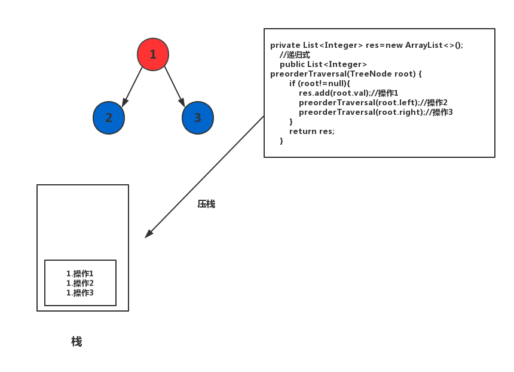
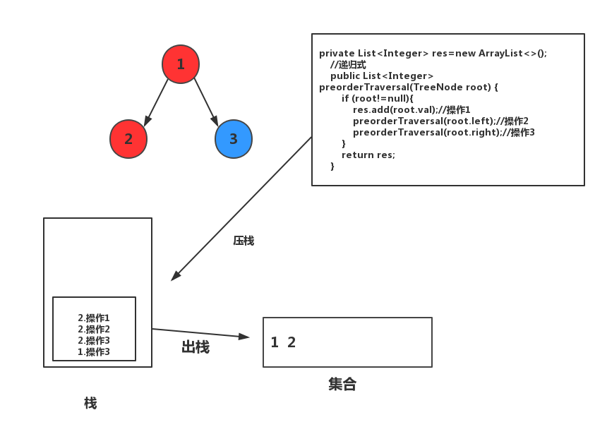

<!-- GFM-TOC -->
* [栈和队列部分总结笔记](#栈和队列部分总结笔记)
    * [栈和递归的紧密关系](#栈和递归的紧密关系) 
    * [更多栈的题目](#更多栈的题目)
* [参考资料](#参考资料)
<!-- GFM-TOC -->

# 栈和队列部分总结笔记

## 栈和递归的紧密关系
在递归调用的时候，系统中相当于有一个系统栈，系统栈中要推入信息来保存**递归调用前**的系统的执行情况。
### 递归算法
- 二叉树的算法

相关题目：

* [144](#144)
* [145]()
* [94]()
#### 144
二叉树的前序遍历
- 分析：
1. 解法一：

这题用递归来写十分简单，直接按照前序遍历的逻辑（中->左->右）来实现即可，在此就不赘述。
2. 解法二：

使用迭代式来实现，在这里我们会用到栈这个数据结构。在上文中有提到，递归调用相当于使用了系统栈的结构，那么我们在这里来模拟系统栈的过程来
实现二叉树的前序遍历。每次当函数递归的时候，便将未执行的操作逆序压入栈中，当执行完该操作便做弹栈操作。

递归调用的时候，模拟系统栈的情况如下，下面忽略了结点为null的情况：
>红色：已经遍历过；蓝色：未遍历
* 遍历根结点





* 遍历左子树




</div>

* 遍历右子树


- 实现：
```java
/**
* 额外定义了一个操作类，用来模拟系统栈的操作过程
* 每次执行只有两种操作，一是将结点的值加入集合，二是继续遍历结点
*/
 class Command{
        int command;//0:表示继续遍历；1:表示加入集合
        TreeNode node;

        public Command(int command, TreeNode node) {
            this.command = command;
            this.node = node;
        }
    }
//迭代式
    public List<Integer> preorderTraversal(TreeNode root){
        if (root==null){
            return res;
        }
        Stack<Command> stack=new Stack<>();
        stack.push(new Command(0,root));
        while (!stack.empty()){
            Command command = stack.pop();
            if (command.command==1){
                res.add(command.node.val);
            }
            //以操作的逆序压入操作类
            else {
                if (command.node.right!=null){
                    stack.push(new Command(0,command.node.right));
                }
                if (command.node.left!=null){
                    stack.push(new Command(0,command.node.left));
                }
                stack.push(new Command(1,command.node));
            }
        }
        return res;

    }
```
>这样不管是二叉树的前序、中序还是后序遍历的实现，只需要和递归一样调换操作的次序就可以方便的转化，更便于理解。题144和94同理即可得，下面不赘述其过程。
### 145
二叉树的后序遍历

给定一个二叉树，返回它的 后序 遍历。

示例:
```java


输入: [1,null,2,3]  
   1
    \
     2
    /
   3 

输出: [3,2,1]

```
进阶: 递归算法很简单，你可以通过迭代算法完成吗？

- 实现：
递归解法：
```java
private List<Integer> res=new ArrayList<>();
    //递归式
    public List<Integer> postorderTraversal(TreeNode root) {
        if (root!=null){
            postorderTraversal(root.left);
            postorderTraversal(root.right);
            res.add(root.val);
        }
        return res;
    }
```
非递归解法：
```java
    class Command{
        int command;//0:表示继续遍历；1:表示加入集合
        TreeNode node;

        public Command(int command, TreeNode node) {
            this.command = command;
            this.node = node;
        }
    }

//迭代式
    private List<Integer> res=new ArrayList<>();
    public List<Integer> postorderTraversal(TreeNode root){
        if (root==null){
            return res;
        }
        Stack<Command> stack=new Stack<>();
        stack.push(new Command(0,root));
        while (!stack.empty()){
            Command command = stack.pop();
            if (command.command==1){
                res.add(command.node.val);
            }else {
                stack.push(new Command(1,command.node));
                if (command.node.right!=null){
                    stack.push(new Command(0,command.node.right));
                }
                if (command.node.left!=null){
                    stack.push(new Command(0,command.node.left));
                }
            }
        }
        return res;

    }
```

##更多栈的题目

相关题目：
   * [20.](#20)            
   * [71.]()
   * [84.]()
   * [133.]()
   * [150.]()            
   * [227.]()
   * [856.]()
   * [901.]()
### 20
给定一个只包括 '('，')'，'{'，'}'，'['，']' 的字符串，判断字符串是否有效。

有效字符串需满足：

左括号必须用相同类型的右括号闭合。
左括号必须以正确的顺序闭合。
注意空字符串可被认为是有效字符串。

示例 1:

输入: "()"
输出: true

示例 2:

输入: "()[]{}"
输出: true

- 分析：
使用一个栈，从头遍历这个字符串，当遍历到左括号的时候，将其入栈；而当遍历到右括号的时候，将栈顶出栈，
如果当前的栈为空表示右括号没有可以匹配的左括号，当栈顶元素与当前的括号不匹配的时候（这里指的是括号的一对一的关系，大，中，小括号，左右的一对一关系），
则表明当前字符串无效。如果遍历结束，栈为空，此时说明每一个括号都是匹配的，则返回true。

- 实现：
```java
public boolean isValid(String s) {
        if (s==null||s.length()==0){
            return true;
        }
        char[] chars = s.toCharArray();
        Stack<Character> stack=new Stack<>();
        for (char c : chars) {
            if (c=='('||c=='['||c=='{'){
                stack.push(c);
            }else {
                if (stack.empty()){
                    return false;
                }
                Character match = stack.pop();
                switch (match){
                    case '(':match=')';break;
                    case '[':match=']';break;
                    case '{':match='}';break;
                }
                if (c!=match){
                    return false;
                }
            }
        }
        if (!stack.empty()){
            return false;
        }
        return true;

    }
```

### 71

### 84

### 133

### 150

### 227

### 856

### 901
    
    

# 参考资料
[玩儿转算法面试 - 课程官方代码仓](https://github.com/liuyubobobo/Play-with-Algorithm-Interview)

